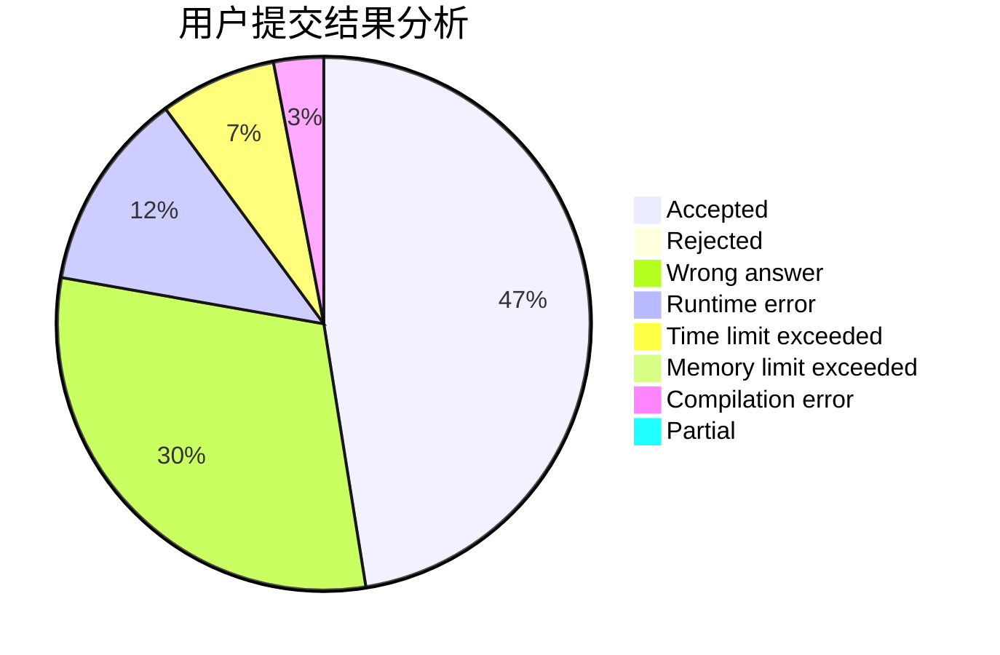
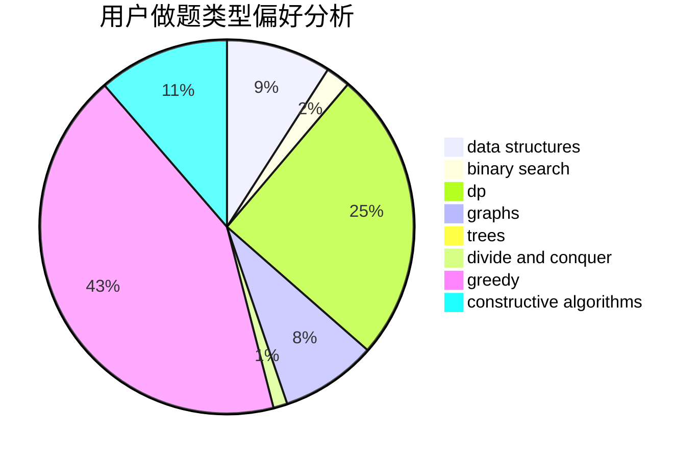
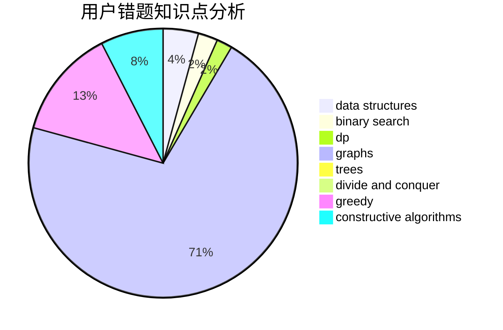

# TheROT13

<!-- tabs:start -->

#### **用户提交结果分析**

#### **用户做题类型偏好分析**

#### **用户错题知识点分析**

<!-- tabs:end -->
# 推荐题目
[351E](https://codeforces.com/contest/351/problem/E)		greedy		  
[80A](https://codeforces.com/contest/80/problem/A)		brute force		  
[274C](https://codeforces.com/contest/274/problem/C)		brute force,
                        geometry		  
[743E](https://codeforces.com/contest/743/problem/E)		binary search,
                        bitmasks,
                        brute force,
                        dp		  
[995B](https://codeforces.com/contest/995/problem/B)		greedy,
                        implementation,
                        math		  
[1300E](https://codeforces.com/contest/1300/problem/E)		dsu,graphs,sortings,trees		  
[871E](https://codeforces.com/contest/871/problem/E)		graphs,
                        greedy,
                        trees		  
[32A](https://codeforces.com/contest/32/problem/A)		brute force		  
[268A](https://codeforces.com/contest/268/problem/A)		brute force		  
[801D](https://codeforces.com/contest/801/problem/D)		dsu,graphs,sortings,trees		  
