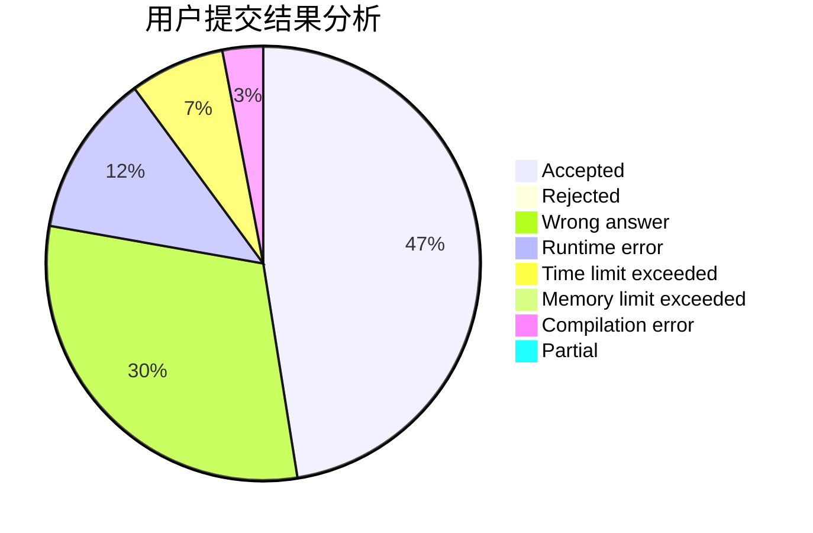
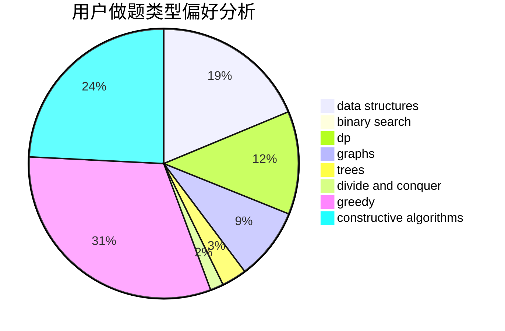
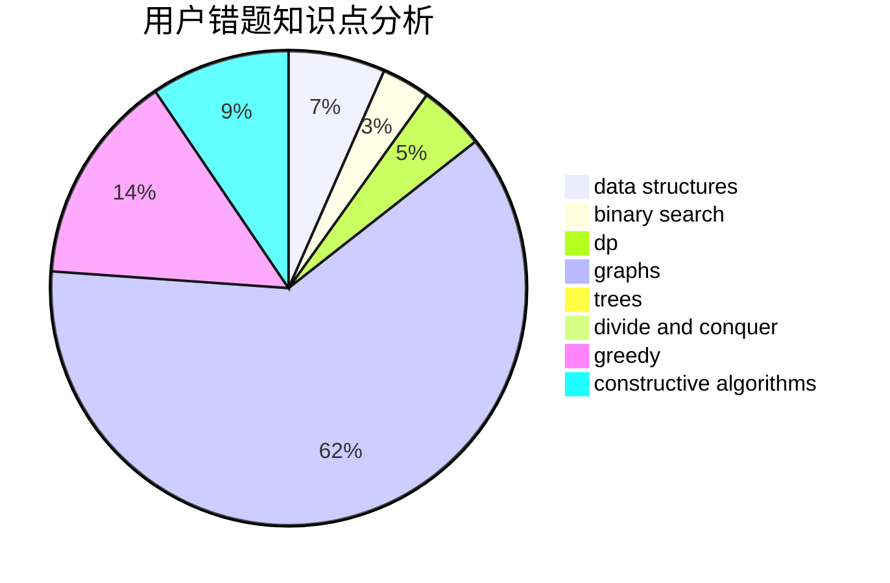

# TheROT13

<!-- tabs:start -->

#### **用户提交结果分析**

#### **用户做题类型偏好分析**

#### **用户错题知识点分析**

<!-- tabs:end -->
# 推荐题目
[321A](https://codeforces.com/contest/321/problem/A)		binary search,
                        implementation,
                        math		  
[794G](https://codeforces.com/contest/794/problem/G)		combinatorics,
                        dp,
                        math		  
[256D](https://codeforces.com/contest/256/problem/D)		dp		  
[725E](https://codeforces.com/contest/725/problem/E)		brute force,
                        greedy		  
[97E](https://codeforces.com/contest/97/problem/E)		dfs and similar,
                        dsu,
                        graphs,
                        trees		  
[1294C](https://codeforces.com/contest/1294/problem/C)		greedy,
                        math,
                        number theory		  
[853C](https://codeforces.com/contest/853/problem/C)		data structures		  
[309B](https://codeforces.com/contest/309/problem/B)		dp,
                        two pointers		  
[246E](https://codeforces.com/contest/246/problem/E)		binary search,
                        data structures,
                        dfs and similar,
                        dp,
                        sortings		  
[784D](https://codeforces.com/contest/784/problem/D)		*special problem,
                        implementation		  
