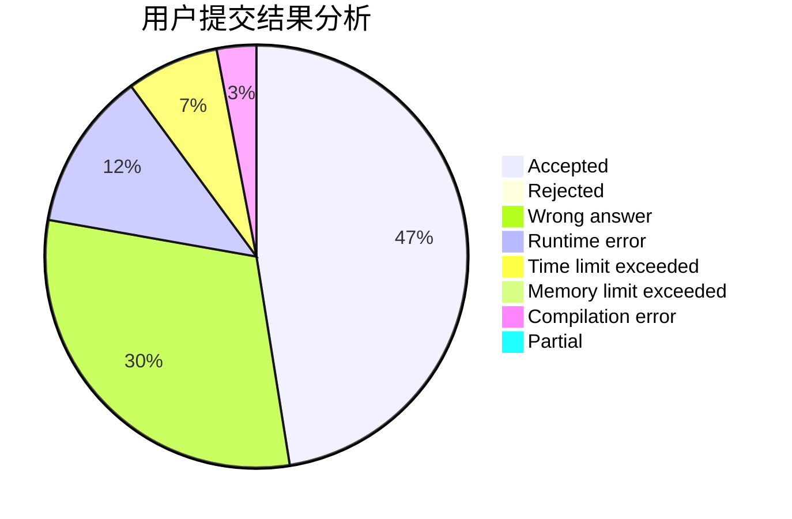
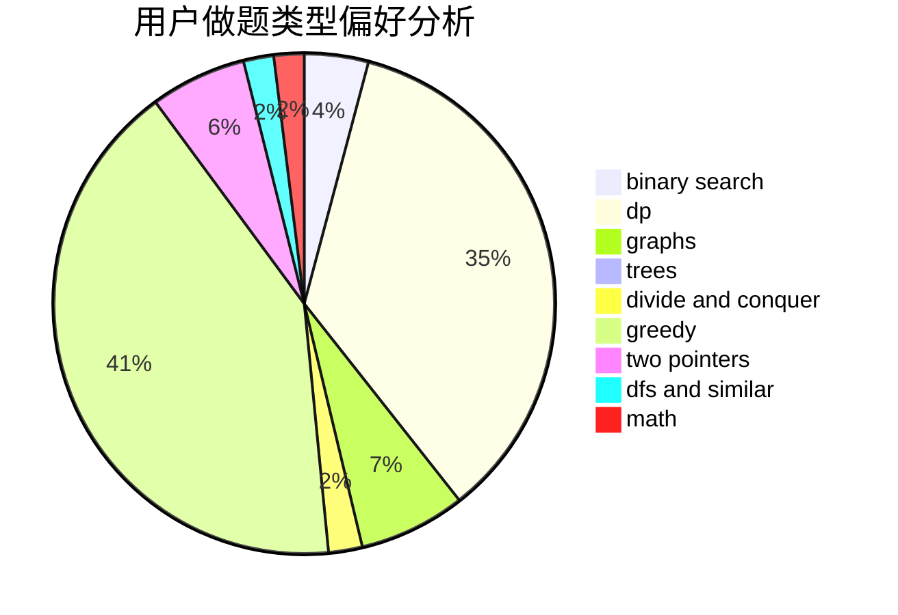

# TheROT13

<!-- tabs:start -->

#### **用户提交结果分析**

#### **用户做题类型偏好分析**

<!-- tabs:end -->
# 推荐题目
[351E](https://codeforces.com/contest/351/problem/E)
[80A](https://codeforces.com/contest/80/problem/A)
[274C](https://codeforces.com/contest/274/problem/C)
[743E](https://codeforces.com/contest/743/problem/E)
[995B](https://codeforces.com/contest/995/problem/B)
[1300E](https://codeforces.com/contest/1300/problem/E)
[871E](https://codeforces.com/contest/871/problem/E)
[32A](https://codeforces.com/contest/32/problem/A)
[268A](https://codeforces.com/contest/268/problem/A)
[801D](https://codeforces.com/contest/801/problem/D)
