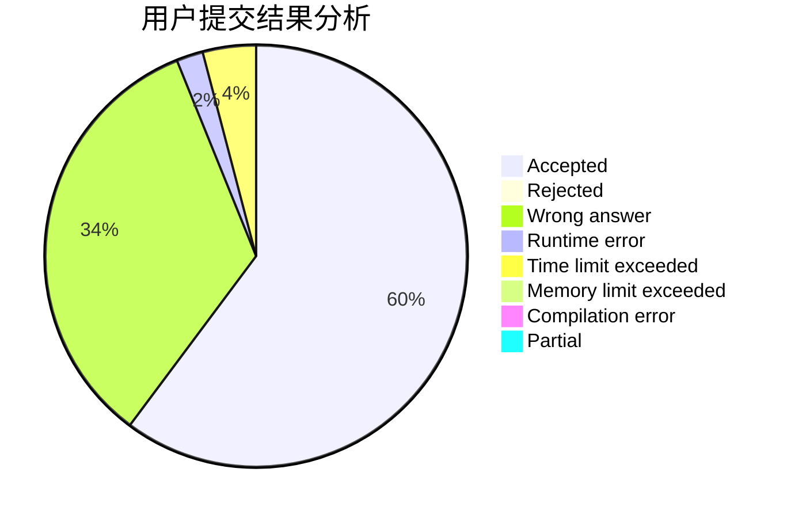
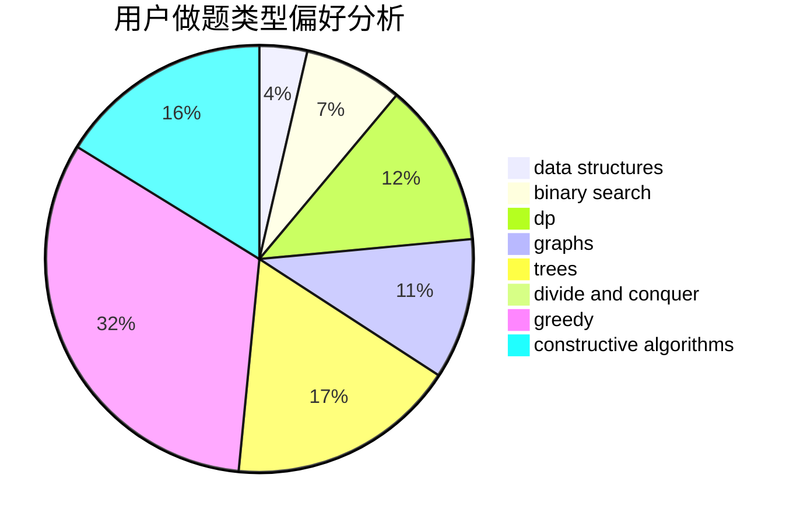
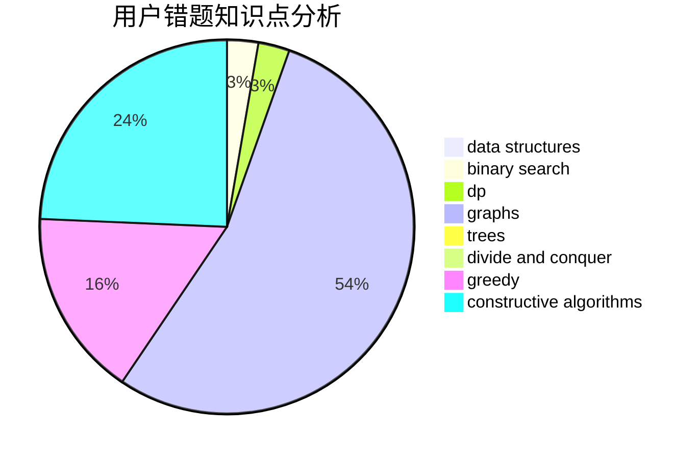

# TheVan

<!-- tabs:start -->

#### **用户提交结果分析**

#### **用户做题类型偏好分析**

#### **用户错题知识点分析**

<!-- tabs:end -->
# 推荐题目
[483D](https://codeforces.com/contest/483/problem/D)		dsu,graphs,sortings,trees		  
[1281C](https://codeforces.com/contest/1281/problem/C)		dsu,graphs,sortings,trees		  
[1475C](https://codeforces.com/contest/1475/problem/C)		combinatorics,
                        graphs,
                        math		  
[638C](https://codeforces.com/contest/638/problem/C)		*special problem,
                        dfs and similar,
                        graphs,
                        greedy,
                        trees		  
[1157F](https://codeforces.com/contest/1157/problem/F)		constructive algorithms,
                        dp,
                        greedy,
                        two pointers		  
[1493E](https://codeforces.com/contest/1493/problem/E)		bitmasks,
                        constructive algorithms,
                        greedy,
                        math,
                        strings,
                        two pointers		  
[916E](https://codeforces.com/contest/916/problem/E)		data structures,
                        trees		  
[1287C](https://codeforces.com/contest/1287/problem/C)		dsu,graphs,sortings,trees		  
[1322D](https://codeforces.com/contest/1322/problem/D)		bitmasks,
                        dp		  
[585B](https://codeforces.com/contest/585/problem/B)		dfs and similar,
                        graphs,
                        shortest paths		  
