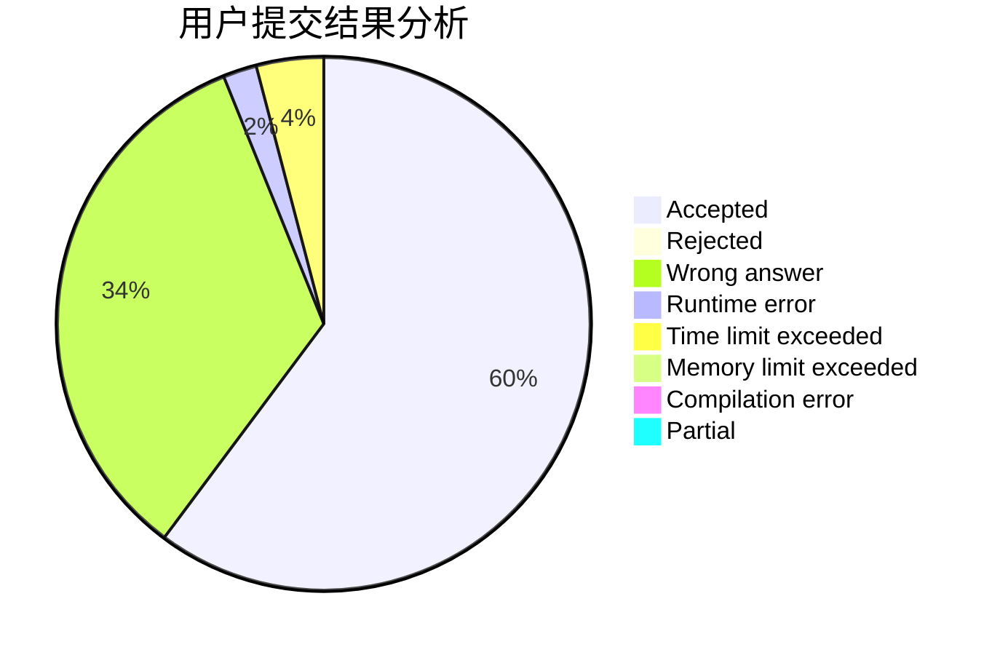
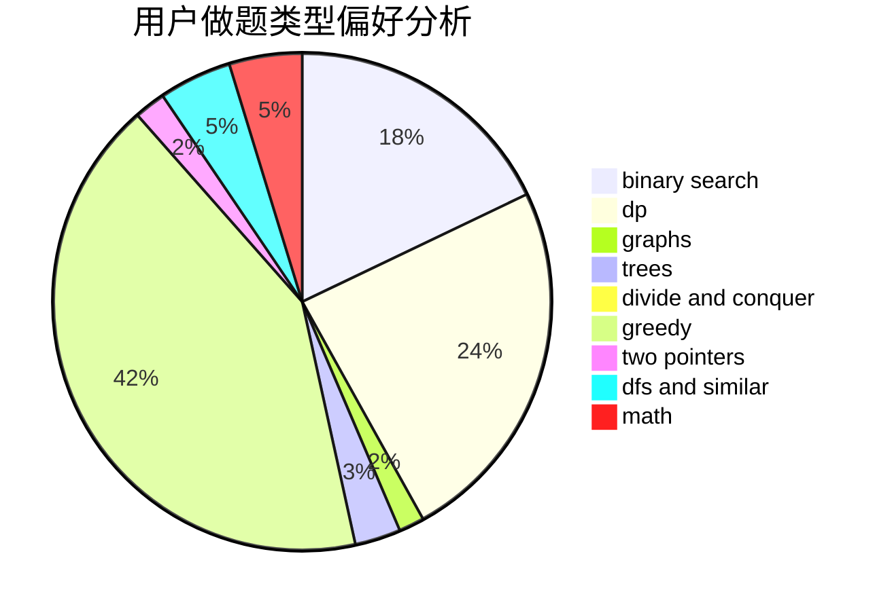

# TheVan

<!-- tabs:start -->

#### **用户提交结果分析**

#### **用户做题类型偏好分析**

<!-- tabs:end -->
# 推荐题目
[504E](https://codeforces.com/contest/504/problem/E)
[1287C](https://codeforces.com/contest/1287/problem/C)
[1483F](https://codeforces.com/contest/1483/problem/F)
[668C](https://codeforces.com/contest/668/problem/C)
[115B](https://codeforces.com/contest/115/problem/B)
[1501E](https://codeforces.com/contest/1501/problem/E)
[937A](https://codeforces.com/contest/937/problem/A)
[1294F](https://codeforces.com/contest/1294/problem/F)
[1329C](https://codeforces.com/contest/1329/problem/C)
[605C](https://codeforces.com/contest/605/problem/C)
