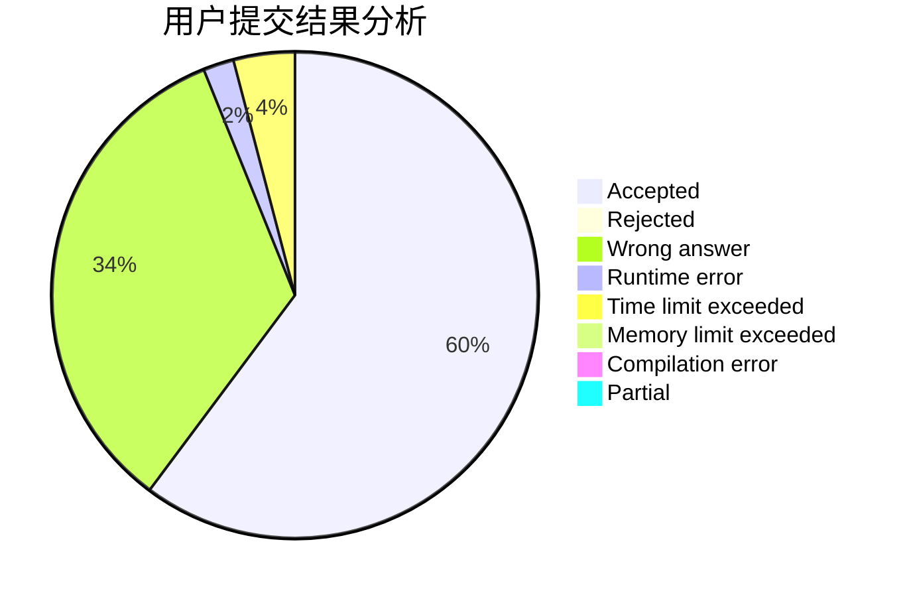
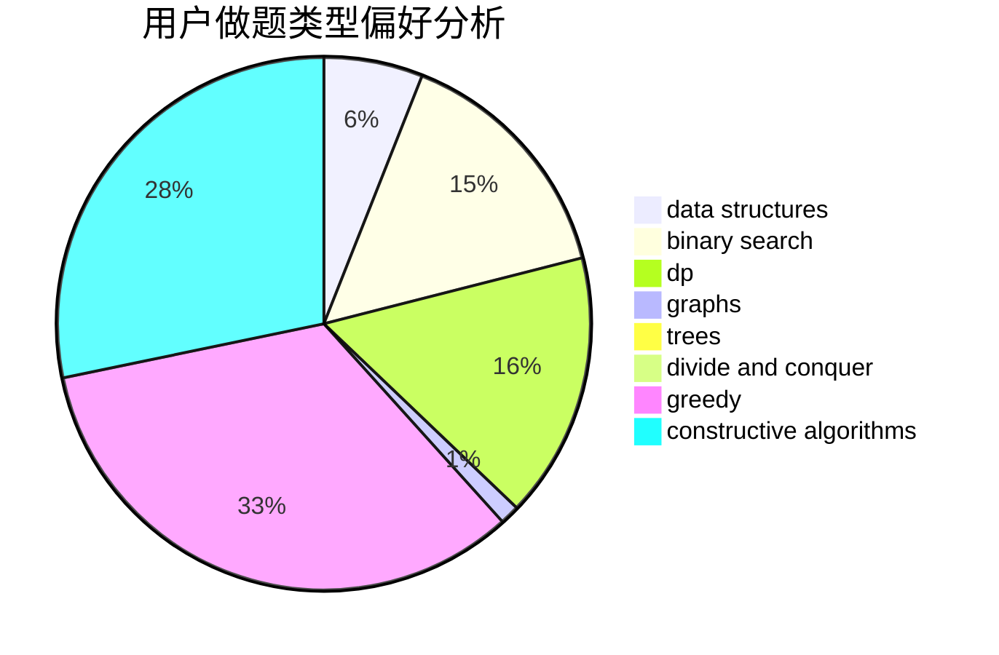
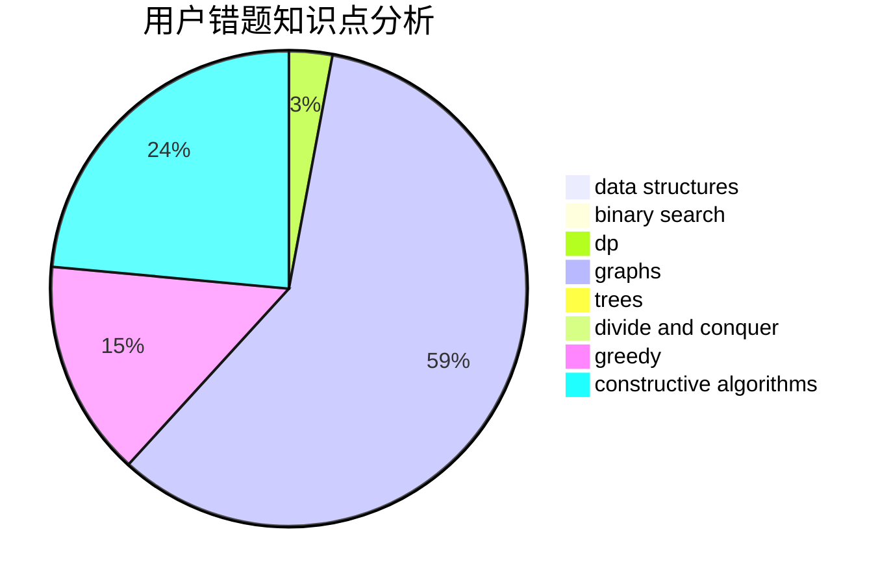

# TheVan

<!-- tabs:start -->

#### **用户提交结果分析**

#### **用户做题类型偏好分析**

#### **用户错题知识点分析**

<!-- tabs:end -->
# 推荐题目
[504E](https://codeforces.com/contest/504/problem/E)		binary search,
                        dfs and similar,
                        hashing,
                        string suffix structures,
                        trees		  
[1287C](https://codeforces.com/contest/1287/problem/C)		dsu,graphs,sortings,trees		  
[1483F](https://codeforces.com/contest/1483/problem/F)		dsu,graphs,sortings,trees		  
[668C](https://codeforces.com/contest/668/problem/C)		dsu,graphs,sortings,trees		  
[115B](https://codeforces.com/contest/115/problem/B)		greedy,
                        sortings		  
[1501E](https://codeforces.com/contest/1501/problem/E)		dsu,graphs,sortings,trees		  
[937A](https://codeforces.com/contest/937/problem/A)		implementation,
                        sortings		  
[1294F](https://codeforces.com/contest/1294/problem/F)		dfs and similar,
                        dp,
                        greedy,
                        trees		  
[1329C](https://codeforces.com/contest/1329/problem/C)		constructive algorithms,
                        data structures,
                        greedy,
                        implementation		  
[605C](https://codeforces.com/contest/605/problem/C)		geometry		  
