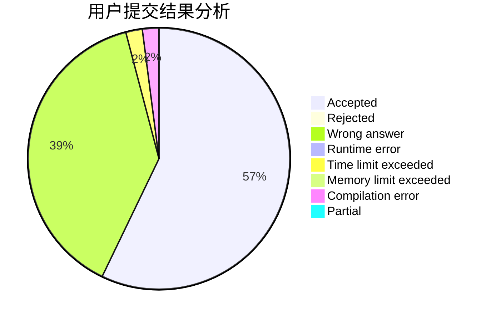
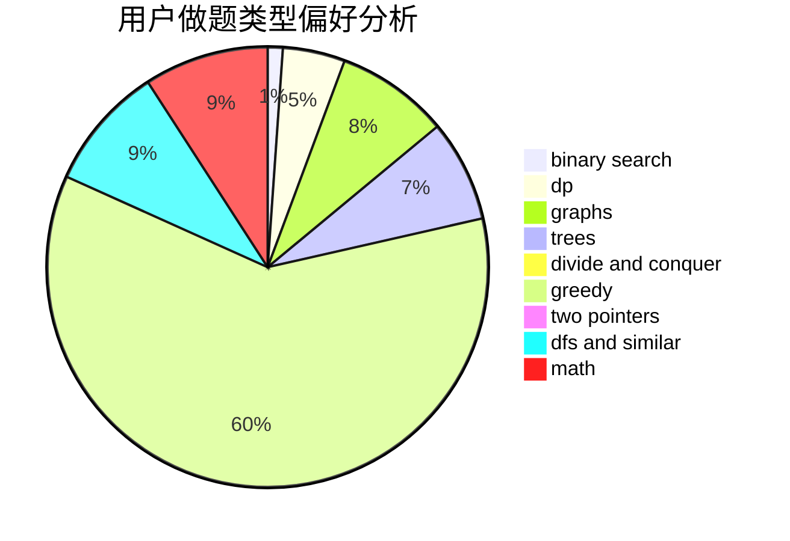

# The_Cai

<!-- tabs:start -->

#### **用户提交结果分析**

#### **用户做题类型偏好分析**

<!-- tabs:end -->
# 推荐题目
[1498A](https://codeforces.com/contest/1498/problem/A)
[1483C](https://codeforces.com/contest/1483/problem/C)
[839D](https://codeforces.com/contest/839/problem/D)
[705A](https://codeforces.com/contest/705/problem/A)
[915D](https://codeforces.com/contest/915/problem/D)
[1415E](https://codeforces.com/contest/1415/problem/E)
[1182B](https://codeforces.com/contest/1182/problem/B)
[1436F](https://codeforces.com/contest/1436/problem/F)
[1251C](https://codeforces.com/contest/1251/problem/C)
[37D](https://codeforces.com/contest/37/problem/D)
