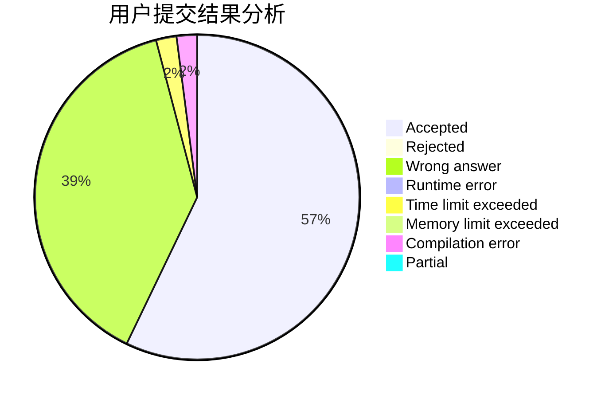
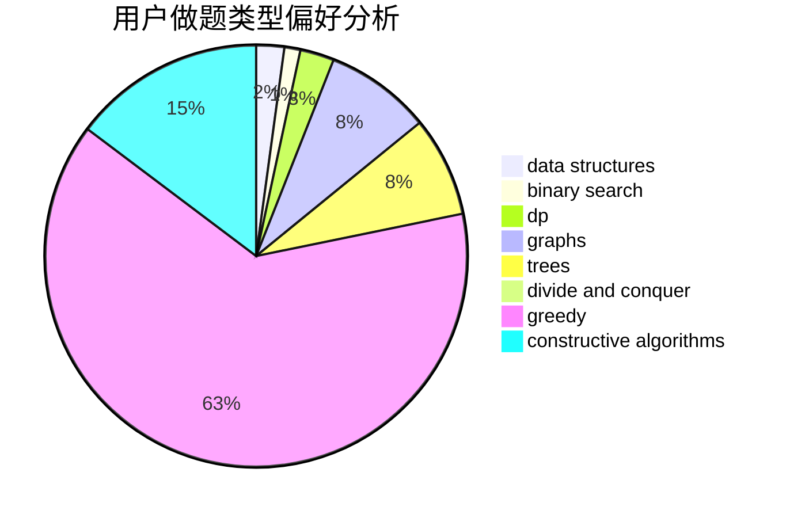
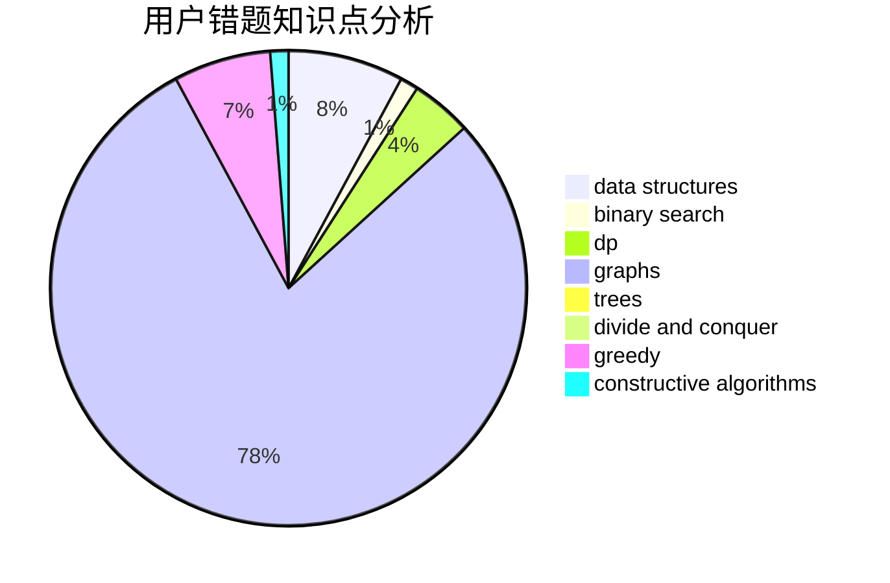

# The_Cai

<!-- tabs:start -->

#### **用户提交结果分析**

#### **用户做题类型偏好分析**

#### **用户错题知识点分析**

<!-- tabs:end -->
# 推荐题目
[1498A](https://codeforces.com/contest/1498/problem/A)		brute force,
                        math		  
[1483C](https://codeforces.com/contest/1483/problem/C)		dsu,graphs,sortings,trees		  
[839D](https://codeforces.com/contest/839/problem/D)		combinatorics,
                        dp,
                        math,
                        number theory		  
[705A](https://codeforces.com/contest/705/problem/A)		implementation		  
[915D](https://codeforces.com/contest/915/problem/D)		dfs and similar,
                        graphs		  
[1415E](https://codeforces.com/contest/1415/problem/E)		constructive algorithms,
                        greedy,
                        math		  
[1182B](https://codeforces.com/contest/1182/problem/B)		dfs and similar,
                        implementation,
                        strings		  
[1436F](https://codeforces.com/contest/1436/problem/F)		combinatorics,
                        math,
                        number theory		  
[1251C](https://codeforces.com/contest/1251/problem/C)		greedy,
                        two pointers		  
[37D](https://codeforces.com/contest/37/problem/D)		combinatorics,
                        dp,
                        math		  
