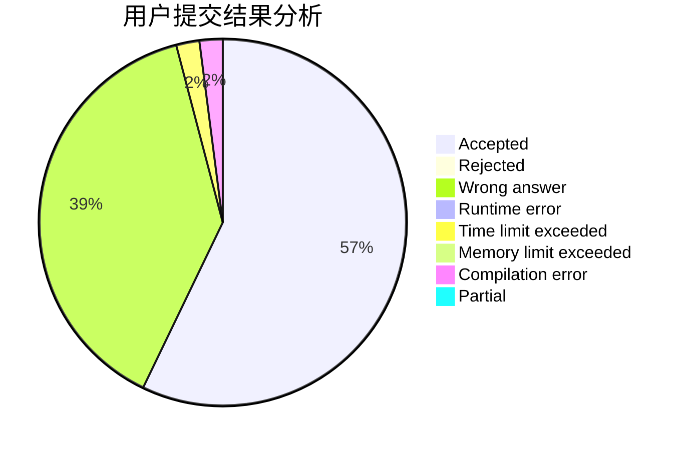
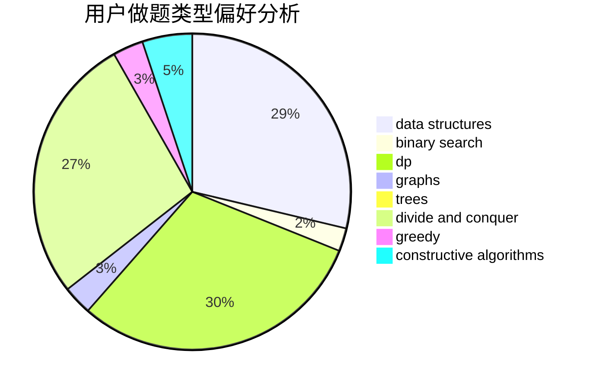
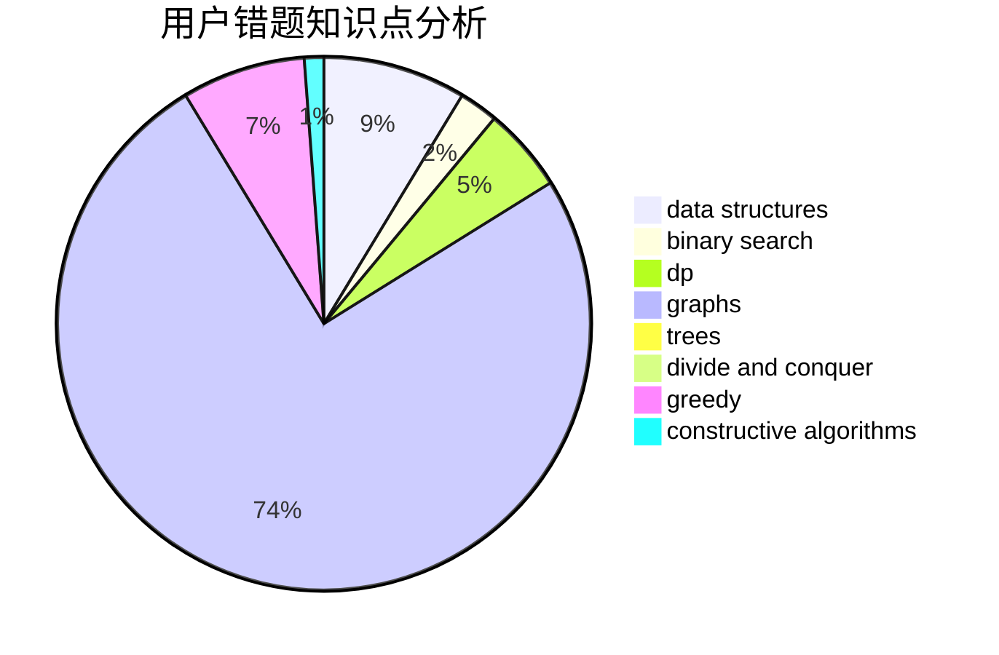

# The_Cai

<!-- tabs:start -->

#### **用户提交结果分析**

#### **用户做题类型偏好分析**

#### **用户错题知识点分析**

<!-- tabs:end -->
# 推荐题目
[1489F](https://codeforces.com/contest/1489/problem/F)		dsu,graphs,sortings,trees		  
[1474F](https://codeforces.com/contest/1474/problem/F)		dp,
                        math,
                        matrices		  
[819E](https://codeforces.com/contest/819/problem/E)		constructive algorithms,
                        graphs		  
[681B](https://codeforces.com/contest/681/problem/B)		brute force		  
[899D](https://codeforces.com/contest/899/problem/D)		constructive algorithms,
                        math		  
[1404C](https://codeforces.com/contest/1404/problem/C)		binary search,
                        constructive algorithms,
                        data structures,
                        greedy,
                        two pointers		  
[1179C](https://codeforces.com/contest/1179/problem/C)		binary search,
                        data structures,
                        graph matchings,
                        greedy,
                        implementation,
                        math,
                        trees		  
[1427H](https://codeforces.com/contest/1427/problem/H)		binary search,
                        games,
                        geometry,
                        ternary search		  
[1247D](https://codeforces.com/contest/1247/problem/D)		dsu,graphs,sortings,trees		  
[354A](https://codeforces.com/contest/354/problem/A)		brute force,
                        greedy,
                        math		  
