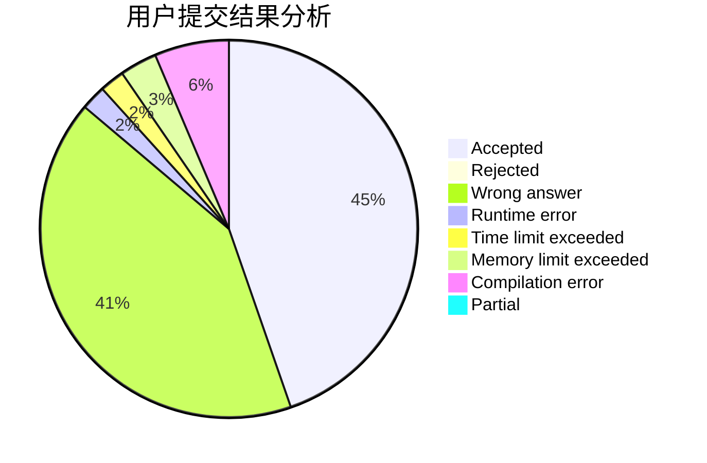
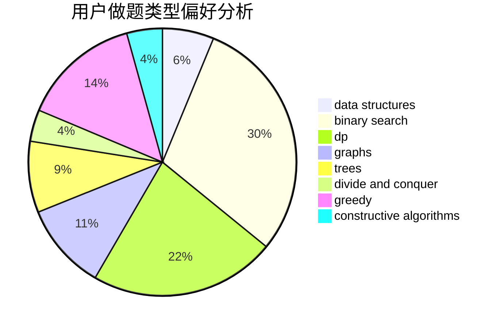
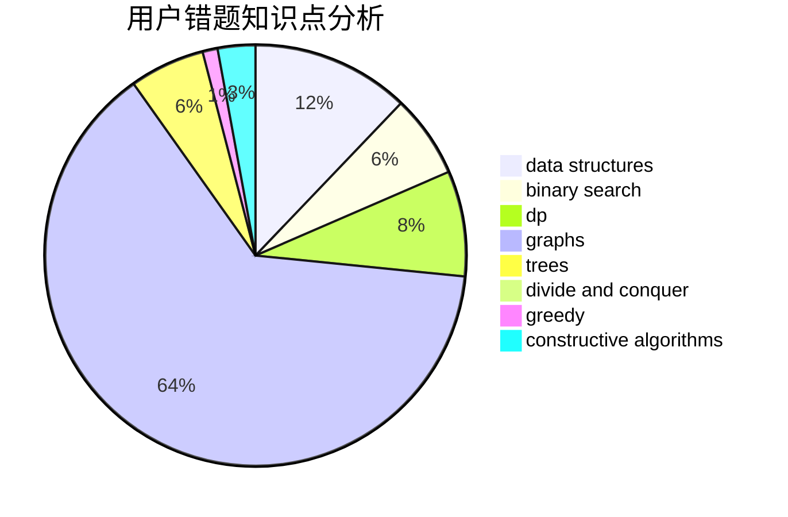

# Tian_Xing

<!-- tabs:start -->

#### **用户提交结果分析**

#### **用户做题类型偏好分析**

#### **用户错题知识点分析**

<!-- tabs:end -->
# 推荐题目
[466A](https://codeforces.com/contest/466/problem/A)		implementation		  
[232B](https://codeforces.com/contest/232/problem/B)		bitmasks,
                        combinatorics,
                        dp,
                        math		  
[747B](https://codeforces.com/contest/747/problem/B)		implementation,
                        strings		  
[257D](https://codeforces.com/contest/257/problem/D)		greedy,
                        math		  
[1213C](https://codeforces.com/contest/1213/problem/C)		math		  
[523A](https://codeforces.com/contest/523/problem/A)		*special problem,
                        implementation		  
[960F](https://codeforces.com/contest/960/problem/F)		data structures,
                        dp,
                        graphs		  
[1227D2](https://codeforces.com/contest/1227D/problem/2)		data structures,
                        greedy		  
[975A](https://codeforces.com/contest/975/problem/A)		implementation,
                        strings		  
[1055A](https://codeforces.com/contest/1055/problem/A)		graphs		  
