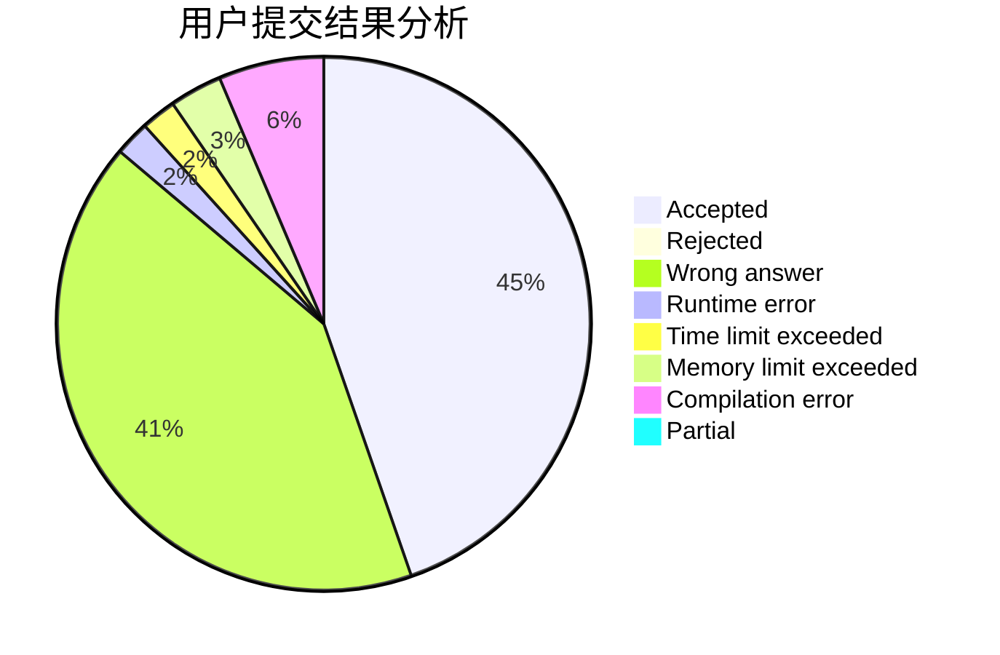
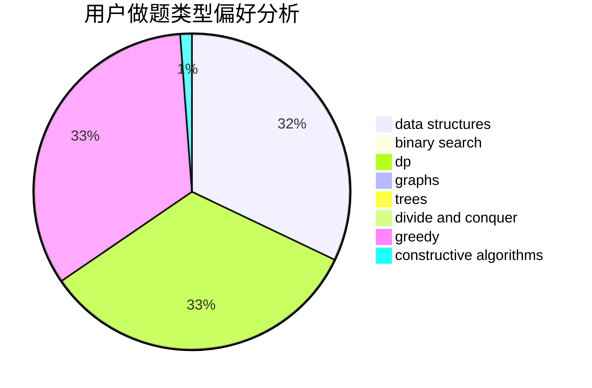
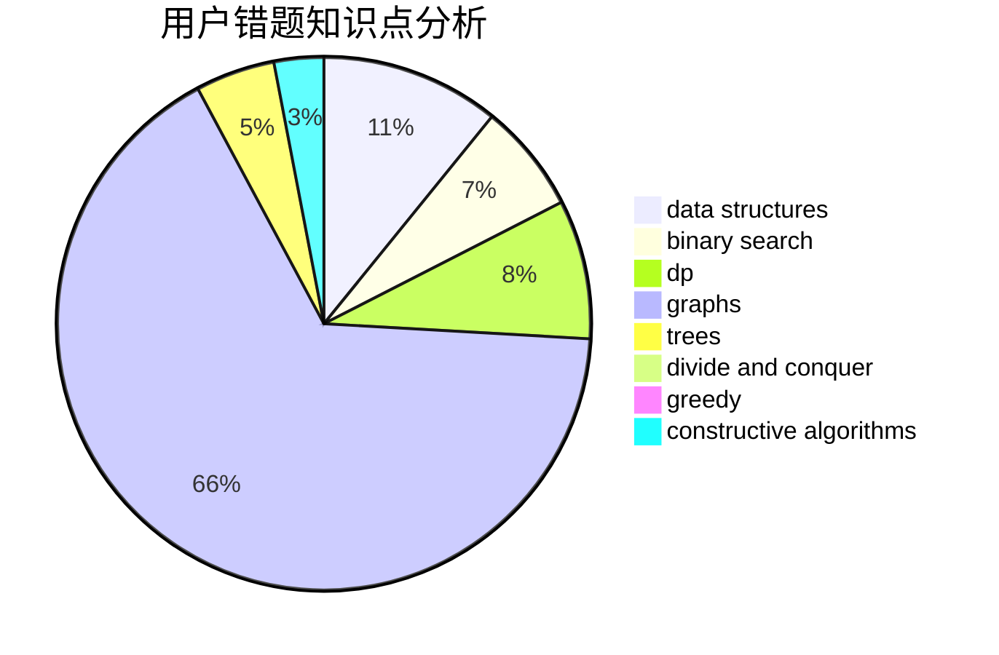

# Tian_Xing

<!-- tabs:start -->

#### **用户提交结果分析**

#### **用户做题类型偏好分析**

#### **用户错题知识点分析**

<!-- tabs:end -->
# 推荐题目
[485A](https://codeforces.com/contest/485/problem/A)		implementation,
                        math,
                        matrices		  
[254A](https://codeforces.com/contest/254/problem/A)		constructive algorithms,
                        sortings		  
[766E](https://codeforces.com/contest/766/problem/E)		bitmasks,
                        constructive algorithms,
                        data structures,
                        dfs and similar,
                        dp,
                        math,
                        trees		  
[274D](https://codeforces.com/contest/274/problem/D)		dfs and similar,
                        graphs,
                        greedy,
                        sortings		  
[1217E](https://codeforces.com/contest/1217/problem/E)		data structures,
                        greedy,
                        implementation,
                        math		  
[548B](https://codeforces.com/contest/548/problem/B)		brute force,
                        dp,
                        greedy,
                        implementation		  
[982E](https://codeforces.com/contest/982/problem/E)		geometry,
                        number theory		  
[1236B](https://codeforces.com/contest/1236/problem/B)		combinatorics,
                        math		  
[989E](https://codeforces.com/contest/989/problem/E)		dp,
                        geometry,
                        matrices,
                        probabilities		  
[1055D](https://codeforces.com/contest/1055/problem/D)		greedy,
                        implementation,
                        strings		  
