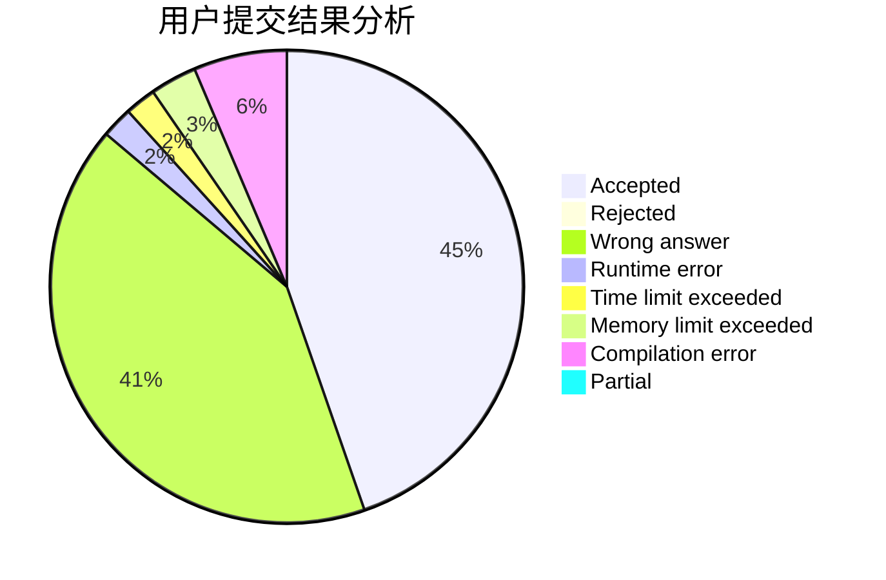
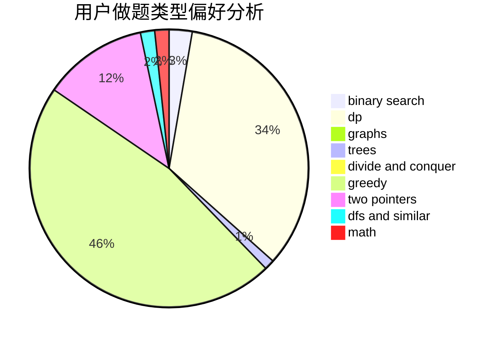

# Tian_Xing

<!-- tabs:start -->

#### **用户提交结果分析**

#### **用户做题类型偏好分析**

<!-- tabs:end -->
# 推荐题目
[485A](https://codeforces.com/contest/485/problem/A)
[254A](https://codeforces.com/contest/254/problem/A)
[766E](https://codeforces.com/contest/766/problem/E)
[274D](https://codeforces.com/contest/274/problem/D)
[1217E](https://codeforces.com/contest/1217/problem/E)
[548B](https://codeforces.com/contest/548/problem/B)
[982E](https://codeforces.com/contest/982/problem/E)
[1236B](https://codeforces.com/contest/1236/problem/B)
[989E](https://codeforces.com/contest/989/problem/E)
[1055D](https://codeforces.com/contest/1055/problem/D)
