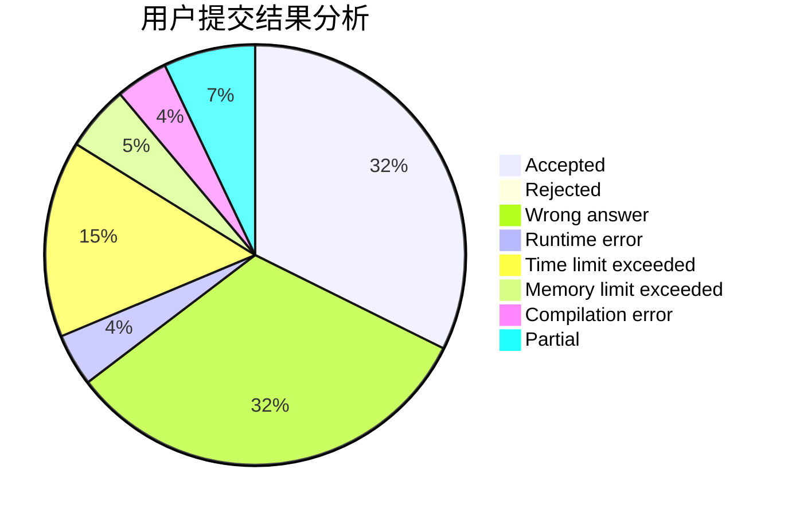
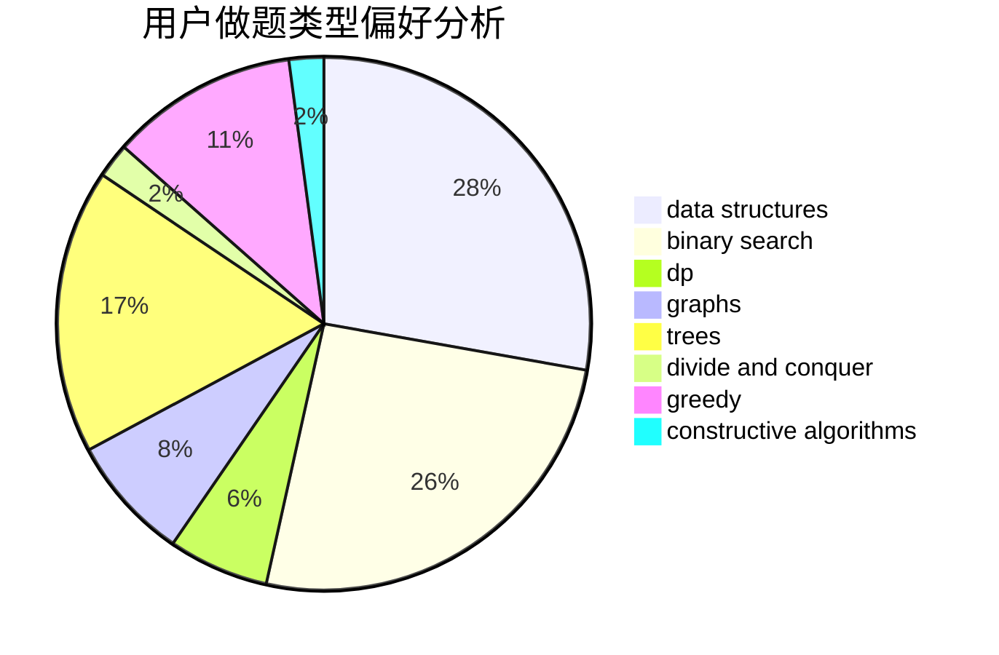
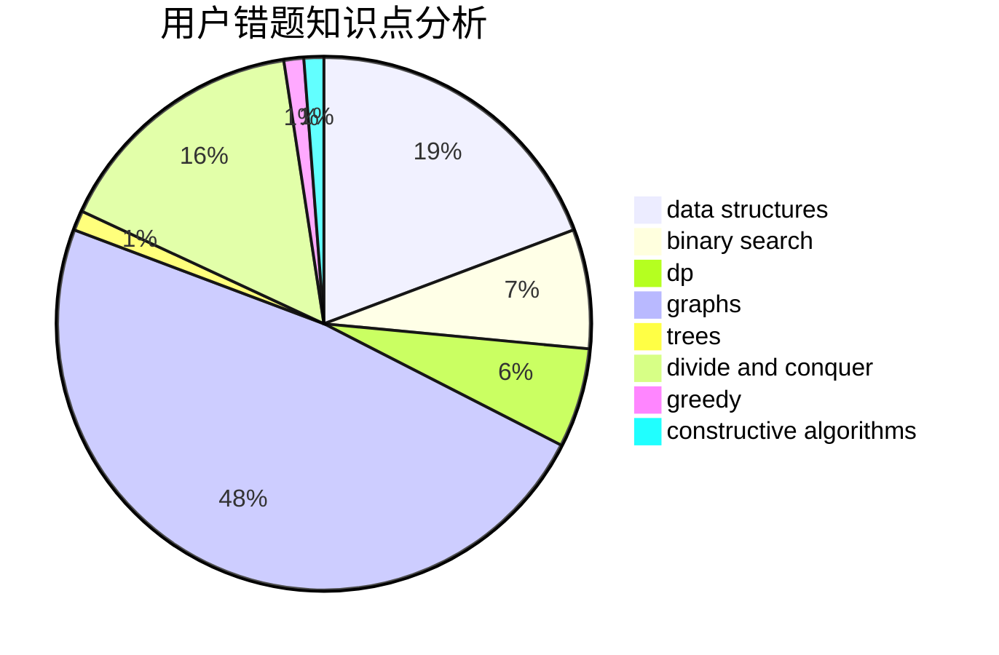

# TianyiQ

<!-- tabs:start -->

#### **用户提交结果分析**

#### **用户做题类型偏好分析**

#### **用户错题知识点分析**

<!-- tabs:end -->
# 推荐题目
[1489D](https://codeforces.com/contest/1489/problem/D)		dsu,graphs,sortings,trees		  
[1246A](https://codeforces.com/contest/1246/problem/A)		dsu,graphs,sortings,trees		  
[432D](https://codeforces.com/contest/432/problem/D)		dp,
                        string suffix structures,
                        strings,
                        two pointers		  
[1179D](https://codeforces.com/contest/1179/problem/D)		data structures,
                        dp,
                        trees		  
[547D](https://codeforces.com/contest/547/problem/D)		constructive algorithms,
                        dfs and similar,
                        graphs		  
[377A](https://codeforces.com/contest/377/problem/A)		dfs and similar		  
[388C](https://codeforces.com/contest/388/problem/C)		games,
                        greedy,
                        sortings		  
[1104B](https://codeforces.com/contest/1104/problem/B)		data structures,
                        implementation,
                        math		  
[798E](https://codeforces.com/contest/798/problem/E)		constructive algorithms,
                        data structures,
                        graphs,
                        sortings		  
[1003C](https://codeforces.com/contest/1003/problem/C)		brute force,
                        implementation,
                        math		  
