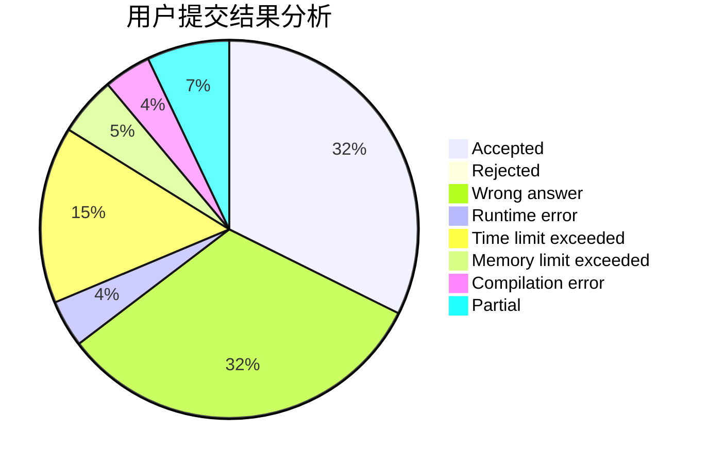
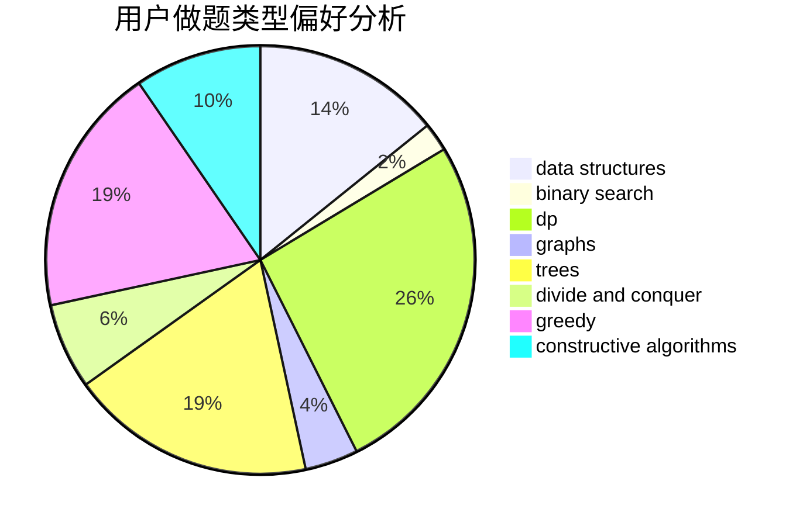
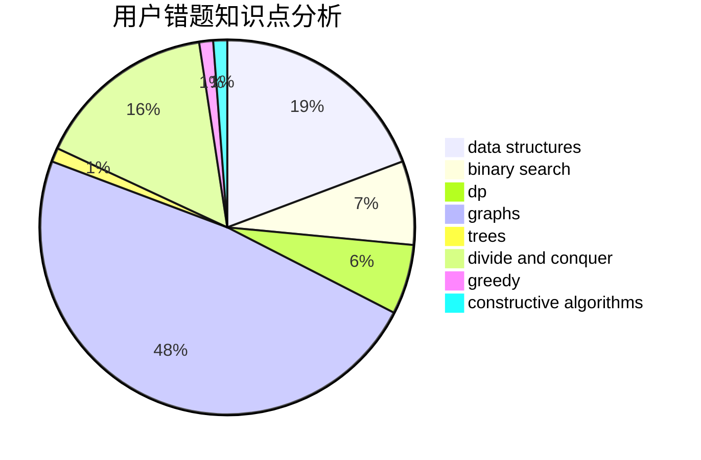

# TianyiQ

<!-- tabs:start -->

#### **用户提交结果分析**

#### **用户做题类型偏好分析**

#### **用户错题知识点分析**

<!-- tabs:end -->
# 推荐题目
[1497B](https://codeforces.com/contest/1497/problem/B)		constructive algorithms,
                        greedy,
                        math		  
[1250I](https://codeforces.com/contest/1250/problem/I)		binary search,
                        brute force,
                        greedy,
                        shortest paths		  
[453D](https://codeforces.com/contest/453/problem/D)		dp,
                        matrices		  
[1182C](https://codeforces.com/contest/1182/problem/C)		data structures,
                        greedy,
                        strings		  
[572A](https://codeforces.com/contest/572/problem/A)		sortings		  
[405B](https://codeforces.com/contest/405/problem/B)		nan		  
[417E](https://codeforces.com/contest/417/problem/E)		constructive algorithms,
                        math,
                        probabilities		  
[1104E](https://codeforces.com/contest/1104/problem/E)		dsu,graphs,sortings,trees		  
[813A](https://codeforces.com/contest/813/problem/A)		implementation		  
[1003F](https://codeforces.com/contest/1003/problem/F)		dp,
                        hashing,
                        strings		  
