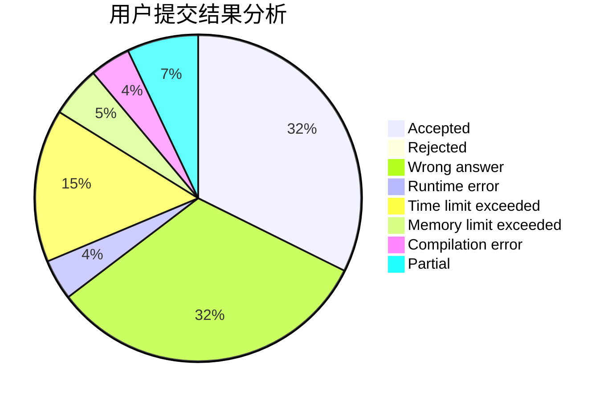
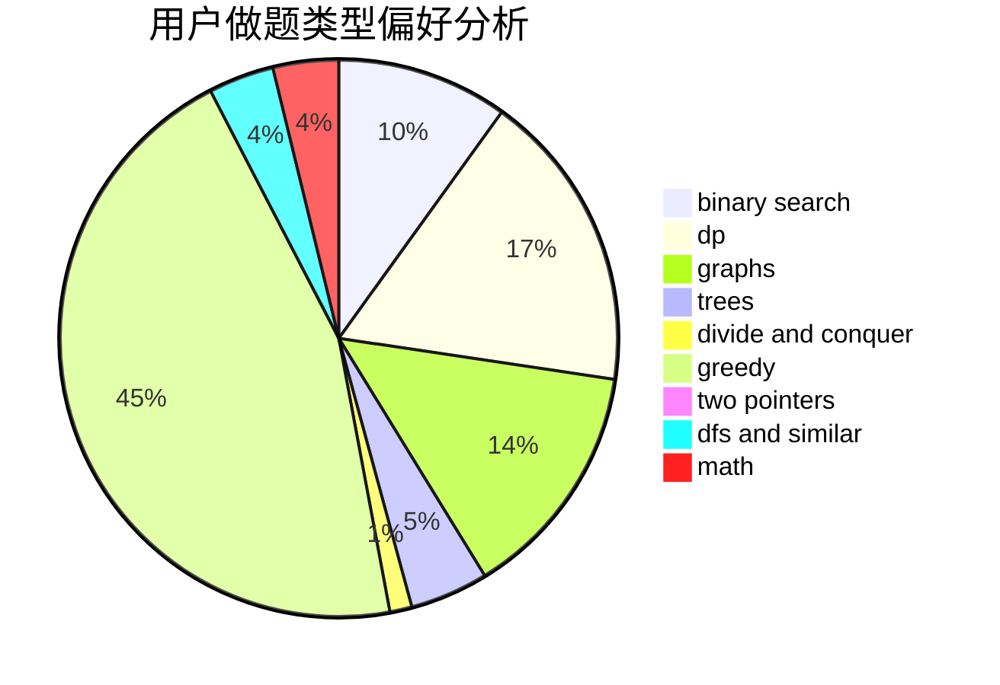

# TianyiQ

<!-- tabs:start -->

#### **用户提交结果分析**

#### **用户做题类型偏好分析**

<!-- tabs:end -->
# 推荐题目
[1497B](https://codeforces.com/contest/1497/problem/B)
[1250I](https://codeforces.com/contest/1250/problem/I)
[453D](https://codeforces.com/contest/453/problem/D)
[1182C](https://codeforces.com/contest/1182/problem/C)
[572A](https://codeforces.com/contest/572/problem/A)
[405B](https://codeforces.com/contest/405/problem/B)
[417E](https://codeforces.com/contest/417/problem/E)
[1104E](https://codeforces.com/contest/1104/problem/E)
[813A](https://codeforces.com/contest/813/problem/A)
[1003F](https://codeforces.com/contest/1003/problem/F)
