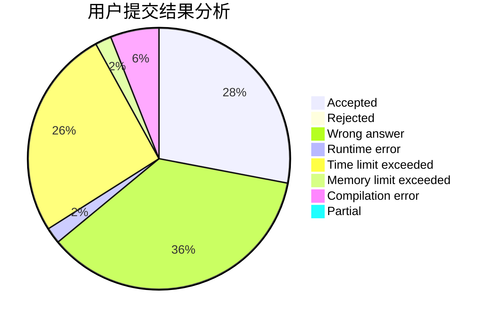
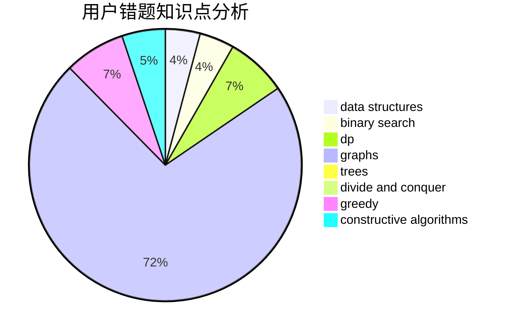

# Tiger3018

<!-- tabs:start -->

#### **用户提交结果分析**

#### **用户做题类型偏好分析**

#### **用户错题知识点分析**

<!-- tabs:end -->
# 推荐题目
[331C1](https://codeforces.com/contest/331C/problem/1)		dp		  
[1473F](https://codeforces.com/contest/1473/problem/F)		flows,
                        math		  
[754D](https://codeforces.com/contest/754/problem/D)		binary search,
                        data structures,
                        greedy,
                        sortings		  
[165C](https://codeforces.com/contest/165/problem/C)		binary search,
                        brute force,
                        dp,
                        math,
                        strings,
                        two pointers		  
[24D](https://codeforces.com/contest/24/problem/D)		dp,
                        math,
                        probabilities		  
[1510D](https://codeforces.com/contest/1510/problem/D)		dp,
                        math,
                        number theory		  
[1139E](https://codeforces.com/contest/1139/problem/E)		flows,
                        graph matchings,
                        graphs		  
[620B](https://codeforces.com/contest/620/problem/B)		implementation		  
[394C](https://codeforces.com/contest/394/problem/C)		constructive algorithms,
                        greedy		  
[656F](https://codeforces.com/contest/656/problem/F)		*special problem		  
