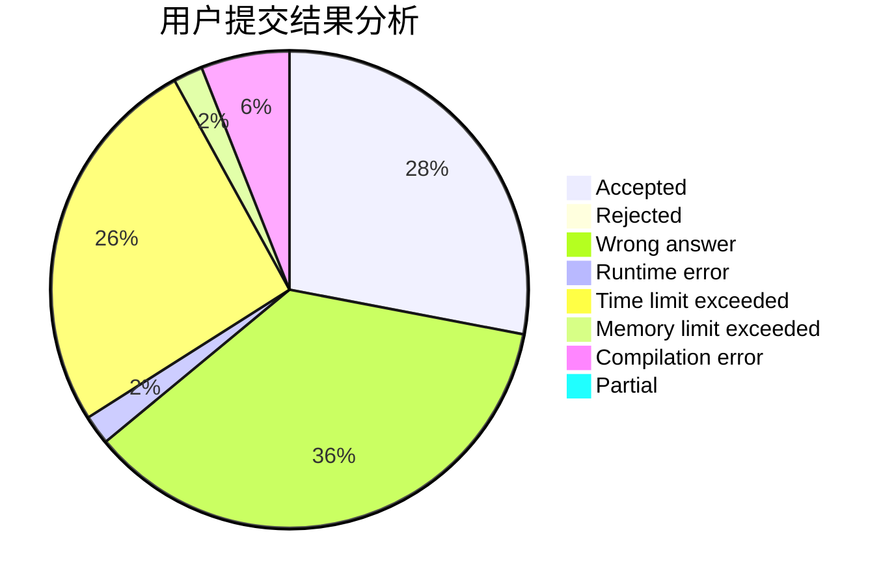
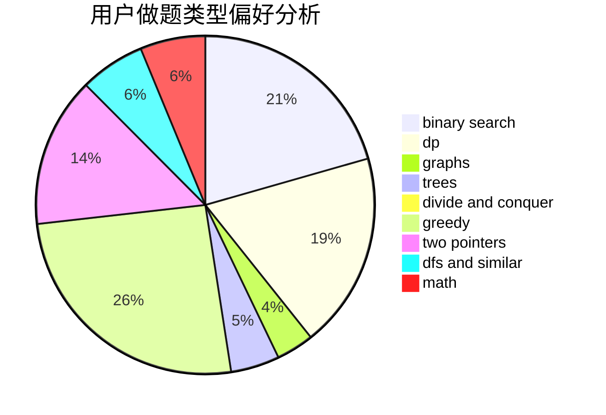

# Tiger3018

<!-- tabs:start -->

#### **用户提交结果分析**

#### **用户做题类型偏好分析**

<!-- tabs:end -->
# 推荐题目
[359B](https://codeforces.com/contest/359/problem/B)
[1482C](https://codeforces.com/contest/1482/problem/C)
[772E](https://codeforces.com/contest/772/problem/E)
[18E](https://codeforces.com/contest/18/problem/E)
[268E](https://codeforces.com/contest/268/problem/E)
[164C](https://codeforces.com/contest/164/problem/C)
[11412](https://codeforces.com/contest/1141/problem/2)
[643E](https://codeforces.com/contest/643/problem/E)
[424A](https://codeforces.com/contest/424/problem/A)
[678F](https://codeforces.com/contest/678/problem/F)
