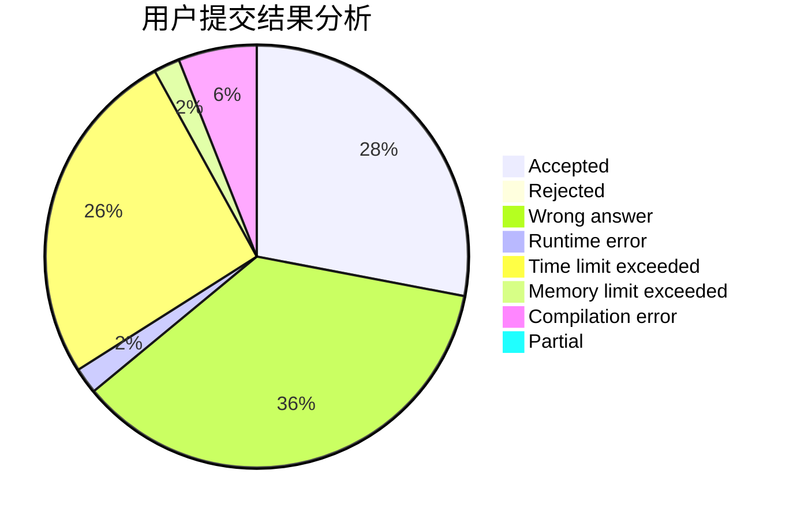
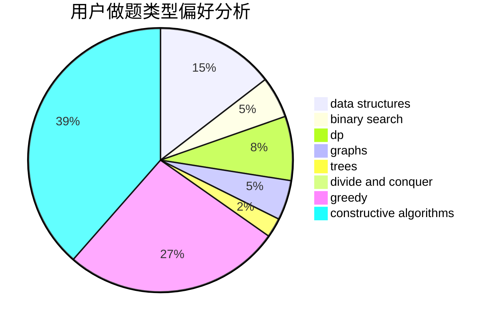
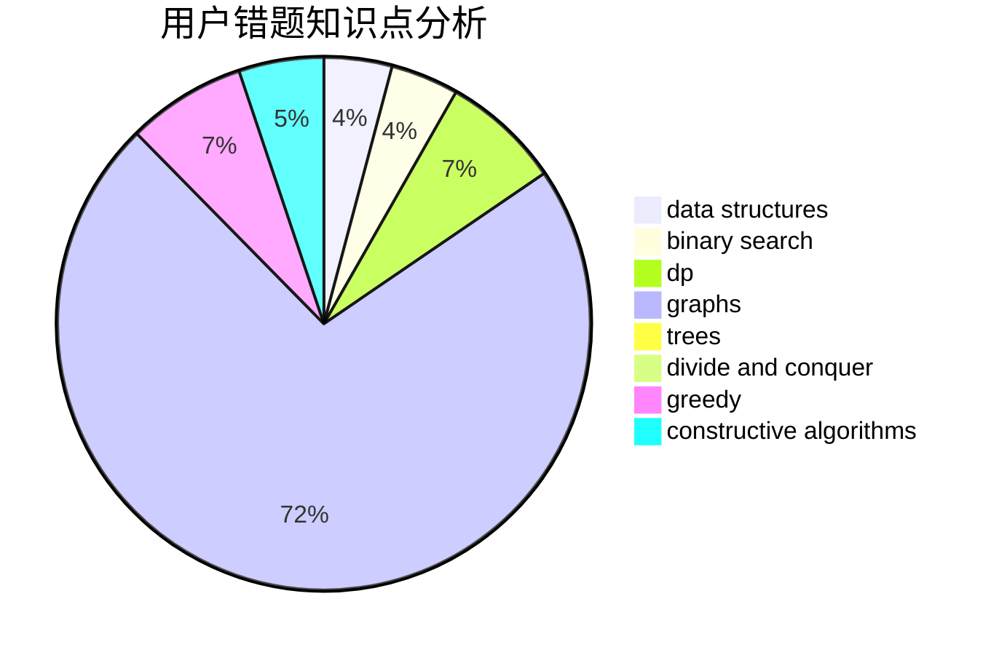

# Tiger3018

<!-- tabs:start -->

#### **用户提交结果分析**

#### **用户做题类型偏好分析**

#### **用户错题知识点分析**

<!-- tabs:end -->
# 推荐题目
[359B](https://codeforces.com/contest/359/problem/B)		constructive algorithms,
                        dp,
                        math		  
[1482C](https://codeforces.com/contest/1482/problem/C)		brute force,
                        constructive algorithms,
                        greedy,
                        implementation		  
[772E](https://codeforces.com/contest/772/problem/E)		binary search,
                        divide and conquer,
                        interactive,
                        trees		  
[18E](https://codeforces.com/contest/18/problem/E)		dp		  
[268E](https://codeforces.com/contest/268/problem/E)		math,
                        probabilities,
                        sortings		  
[164C](https://codeforces.com/contest/164/problem/C)		flows,
                        graphs		  
[11412](https://codeforces.com/contest/1141/problem/2)		dsu,graphs,sortings,trees		  
[643E](https://codeforces.com/contest/643/problem/E)		dp,
                        math,
                        probabilities,
                        trees		  
[424A](https://codeforces.com/contest/424/problem/A)		implementation		  
[678F](https://codeforces.com/contest/678/problem/F)		data structures,
                        divide and conquer,
                        geometry		  
