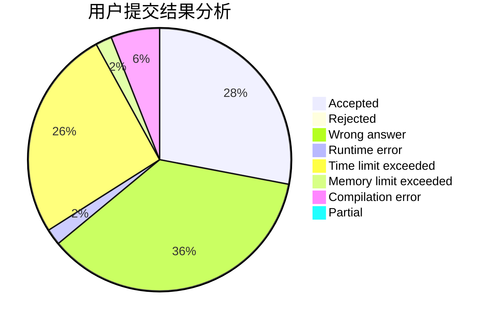
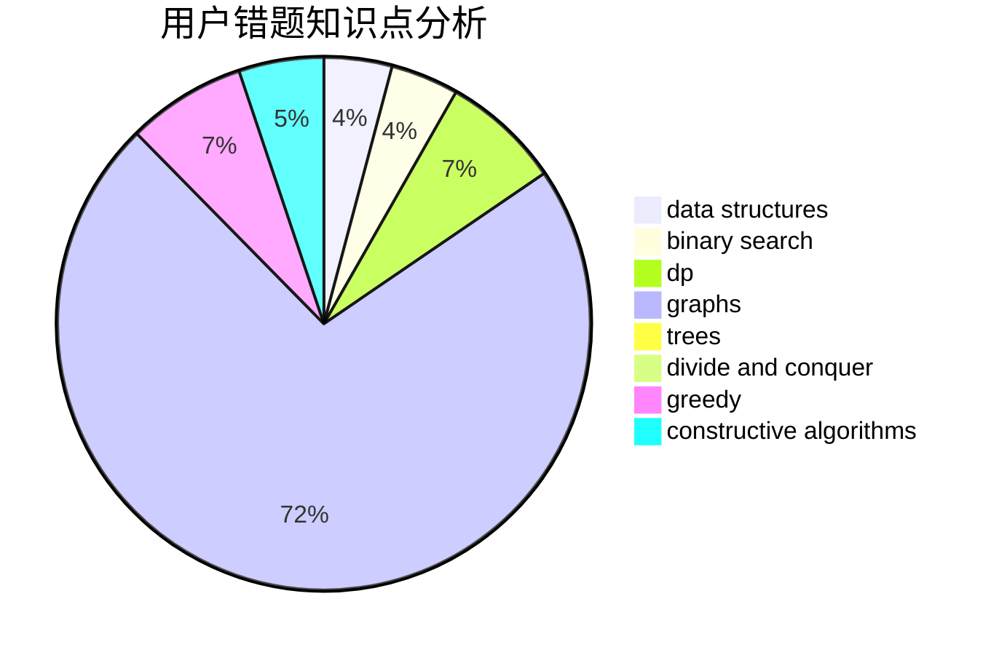

# Tiger3018
<!-- tabs:start -->
#### **用户提交结果分析**

#### **用户做题类型偏好分析**

#### **用户错题知识点分析**

<!-- tabs:end -->
# 推荐题目
[The Great Julya Calendar](http://codeforces.com/problemset/problem/331/C1)		dp		  
[Alyona and towers](http://codeforces.com/problemset/problem/739/C)		data structures		  
[Mister B and Astronomers](http://codeforces.com/problemset/problem/819/D)		number theory		  
[Fedor and coupons](http://codeforces.com/problemset/problem/754/D)		binary search,
                        data structures,
                        greedy,
                        sortings		  
[Another Problem on Strings](http://codeforces.com/problemset/problem/165/C)		binary search,
                        brute force,
                        dp,
                        math,
                        strings,
                        two pointers		  
[Ace It!](http://codeforces.com/problemset/problem/656/F)		*special problem		  
[Maximize Mex](http://codeforces.com/problemset/problem/1139/E)		flows,
                        graph matchings,
                        graphs		  
[Chat room](http://codeforces.com/problemset/problem/58/A)		greedy,
                        strings		  
[Strange Set](http://codeforces.com/problemset/problem/1473/F)		flows,
                        math		  
[Iron Man](http://codeforces.com/problemset/problem/704/E)		data structures,
                        geometry,
                        trees		  
<!-- tabs:start -->
#### **data structures**
[The Great Julya Calendar](http://codeforces.com/problemset/problem/739/C)		data structures		  
[Alyona and towers](http://codeforces.com/problemset/problem/754/D)		binary search,
                        data structures,
                        greedy,
                        sortings		  
[Mister B and Astronomers](http://codeforces.com/problemset/problem/704/E)		data structures,
                        geometry,
                        trees		  
[Fedor and coupons](http://codeforces.com/problemset/problem/158/C)		*special problem,
                        data structures,
                        implementation		  
[Another Problem on Strings](https://codeforces.com/contest/1298/problem/E)		binary search,
                        data structures,
                        implementation		  
[Ace It!](https://codeforces.com/contest/956/problem/C)		data structures,
                        dp,
                        greedy		  
[Maximize Mex](http://codeforces.com/problemset/problem/263/E)		brute force,
                        data structures,
                        dp		  
[Chat room](https://codeforces.com/contest/1483/problem/B)		data structures,
                        dsu,
                        implementation,
                        shortest paths		  
[Strange Set](http://codeforces.com/problemset/problem/1349/A)		data structures,
                        math,
                        number theory		  
[Iron Man](http://codeforces.com/problemset/problem/1234/B2)		data structures,
                        implementation		  
#### **binary search**
[The Great Julya Calendar](http://codeforces.com/problemset/problem/754/D)		binary search,
                        data structures,
                        greedy,
                        sortings		  
[Alyona and towers](http://codeforces.com/problemset/problem/165/C)		binary search,
                        brute force,
                        dp,
                        math,
                        strings,
                        two pointers		  
[Mister B and Astronomers](https://codeforces.com/contest/1298/problem/E)		binary search,
                        data structures,
                        implementation		  
[Fedor and coupons](http://codeforces.com/problemset/problem/1494/C)		binary search,
                        dp,
                        greedy,
                        implementation,
                        two pointers		  
[Another Problem on Strings](http://codeforces.com/problemset/problem/1492/C)		binary search,
                        data structures,
                        dp,
                        greedy,
                        two pointers		  
[Ace It!](http://codeforces.com/problemset/problem/1463/D)		binary search,
                        constructive algorithms,
                        greedy,
                        two pointers		  
[Maximize Mex](http://codeforces.com/problemset/problem/1490/G)		binary search,
                        data structures,
                        math		  
[Chat room](http://codeforces.com/problemset/problem/1479/D)		binary search,
                        bitmasks,
                        brute force,
                        data structures,
                        probabilities,
                        trees		  
[Strange Set](http://codeforces.com/problemset/problem/1436/E)		binary search,
                        data structures,
                        two pointers		  
[Iron Man](http://codeforces.com/problemset/problem/1461/D)		binary search,
                        brute force,
                        data structures,
                        divide and conquer,
                        implementation,
                        sortings		  
#### **dp**
[The Great Julya Calendar](http://codeforces.com/problemset/problem/331/C1)		dp		  
[Alyona and towers](http://codeforces.com/problemset/problem/165/C)		binary search,
                        brute force,
                        dp,
                        math,
                        strings,
                        two pointers		  
[Mister B and Astronomers](https://codeforces.com/contest/480/problem/C)		combinatorics,
                        dp		  
[Fedor and coupons](https://codeforces.com/contest/956/problem/C)		data structures,
                        dp,
                        greedy		  
[Another Problem on Strings](http://codeforces.com/problemset/problem/1510/D)		dp,
                        math,
                        number theory		  
[Ace It!](http://codeforces.com/problemset/problem/263/E)		brute force,
                        data structures,
                        dp		  
[Maximize Mex](https://codeforces.com/contest/438/problem/C)		dp,
                        geometry		  
[Chat room](http://codeforces.com/problemset/problem/24/D)		dp,
                        math,
                        probabilities		  
[Strange Set](http://codeforces.com/problemset/problem/908/D)		dp,
                        math,
                        probabilities		  
[Iron Man](http://codeforces.com/problemset/problem/1494/C)		binary search,
                        dp,
                        greedy,
                        implementation,
                        two pointers		  
#### **graph**
[The Great Julya Calendar](http://codeforces.com/problemset/problem/1139/E)		flows,
                        graph matchings,
                        graphs		  
[Alyona and towers](http://codeforces.com/problemset/problem/1343/E)		brute force,
                        graphs,
                        greedy,
                        shortest paths,
                        sortings		  
[Mister B and Astronomers](http://codeforces.com/problemset/problem/228/E)		2-sat,
                        dfs and similar,
                        dsu,
                        graphs		  
[Fedor and coupons](http://codeforces.com/problemset/problem/1242/B)		dfs and similar,
                        dsu,
                        graphs,
                        sortings		  
[Another Problem on Strings](http://codeforces.com/problemset/problem/1250/E)		graphs,
                        implementation		  
[Ace It!](http://codeforces.com/problemset/problem/1487/C)		brute force,
                        constructive algorithms,
                        dfs and similar,
                        graphs,
                        greedy,
                        implementation,
                        math		  
[Maximize Mex](http://codeforces.com/problemset/problem/1437/C)		dp,
                        flows,
                        graph matchings,
                        greedy,
                        math,
                        sortings		  
[Chat room](http://codeforces.com/problemset/problem/1470/D)		constructive algorithms,
                        dfs and similar,
                        graph matchings,
                        graphs,
                        greedy		  
[Strange Set](http://codeforces.com/problemset/problem/1476/C)		dp,
                        graphs,
                        greedy		  
[Iron Man](http://codeforces.com/problemset/problem/1304/D)		constructive algorithms,
                        graphs,
                        greedy,
                        two pointers		  
#### **trees**
[The Great Julya Calendar](http://codeforces.com/problemset/problem/704/E)		data structures,
                        geometry,
                        trees		  
[Alyona and towers](http://codeforces.com/problemset/problem/452/B)		brute force,
                        constructive algorithms,
                        geometry,
                        trees		  
[Mister B and Astronomers](http://codeforces.com/problemset/problem/812/E)		games,
                        trees		  
[Fedor and coupons](http://codeforces.com/problemset/problem/29/D)		constructive algorithms,
                        dfs and similar,
                        trees		  
[Another Problem on Strings](http://codeforces.com/problemset/problem/1118/F1)		dfs and similar,
                        trees		  
[Ace It!](http://codeforces.com/problemset/problem/1479/D)		binary search,
                        bitmasks,
                        brute force,
                        data structures,
                        probabilities,
                        trees		  
[Maximize Mex](http://codeforces.com/problemset/problem/1511/C)		brute force,
                        data structures,
                        implementation,
                        trees		  
[Chat room](http://codeforces.com/problemset/problem/1499/F)		combinatorics,
                        dfs and similar,
                        dp,
                        trees		  
[Strange Set](http://codeforces.com/problemset/problem/1491/E)		brute force,
                        dfs and similar,
                        divide and conquer,
                        number theory,
                        trees		  
[Iron Man](http://codeforces.com/problemset/problem/1466/D)		data structures,
                        greedy,
                        sortings,
                        trees		  
#### **divide and conquer**
[The Great Julya Calendar](http://codeforces.com/problemset/problem/1461/D)		binary search,
                        brute force,
                        data structures,
                        divide and conquer,
                        implementation,
                        sortings		  
[Alyona and towers](http://codeforces.com/problemset/problem/1466/G)		combinatorics,
                        divide and conquer,
                        hashing,
                        math,
                        string suffix structures,
                        strings		  
[Mister B and Astronomers](http://codeforces.com/problemset/problem/1490/D)		dfs and similar,
                        divide and conquer,
                        implementation		  
[Fedor and coupons](https://codeforces.com/contest/1483/problem/C)		data structures,
                        divide and conquer,
                        dp		  
[Another Problem on Strings](http://codeforces.com/problemset/problem/1491/E)		brute force,
                        dfs and similar,
                        divide and conquer,
                        number theory,
                        trees		  
[Ace It!](http://codeforces.com/problemset/problem/1303/G)		data structures,
                        divide and conquer,
                        geometry,
                        trees		  
[Maximize Mex](http://codeforces.com/problemset/problem/1494/D)		constructive algorithms,
                        data structures,
                        dfs and similar,
                        divide and conquer,
                        dsu,
                        greedy,
                        sortings,
                        trees		  
[Chat room](http://codeforces.com/problemset/problem/1482/E)		data structures,
                        divide and conquer,
                        dp		  
[Strange Set](http://codeforces.com/problemset/problem/566/C)		dfs and similar,
                        divide and conquer,
                        trees		  
[Iron Man](http://codeforces.com/problemset/problem/1428/F)		binary search,
                        data structures,
                        divide and conquer,
                        dp,
                        two pointers		  
#### **greedy**
[The Great Julya Calendar](http://codeforces.com/problemset/problem/754/D)		binary search,
                        data structures,
                        greedy,
                        sortings		  
[Alyona and towers](http://codeforces.com/problemset/problem/58/A)		greedy,
                        strings		  
[Mister B and Astronomers](http://codeforces.com/problemset/problem/515/C)		greedy,
                        math,
                        sortings		  
[Fedor and coupons](http://codeforces.com/problemset/problem/394/C)		constructive algorithms,
                        greedy		  
[Another Problem on Strings](http://codeforces.com/problemset/problem/1083/B)		greedy,
                        strings		  
[Ace It!](https://codeforces.com/contest/956/problem/C)		data structures,
                        dp,
                        greedy		  
[Maximize Mex](http://codeforces.com/problemset/problem/1343/E)		brute force,
                        graphs,
                        greedy,
                        shortest paths,
                        sortings		  
[Chat room](http://codeforces.com/problemset/problem/1151/D)		greedy,
                        math,
                        sortings		  
[Strange Set](http://codeforces.com/problemset/problem/1332/B)		brute force,
                        constructive algorithms,
                        greedy,
                        math,
                        number theory		  
[Iron Man](http://codeforces.com/problemset/problem/1494/C)		binary search,
                        dp,
                        greedy,
                        implementation,
                        two pointers		  
#### **constructive algorithms**
[The Great Julya Calendar](http://codeforces.com/problemset/problem/394/C)		constructive algorithms,
                        greedy		  
[Alyona and towers](http://codeforces.com/problemset/problem/452/B)		brute force,
                        constructive algorithms,
                        geometry,
                        trees		  
[Mister B and Astronomers](http://codeforces.com/problemset/problem/29/D)		constructive algorithms,
                        dfs and similar,
                        trees		  
[Fedor and coupons](http://codeforces.com/problemset/problem/1270/D)		constructive algorithms,
                        interactive,
                        math,
                        sortings		  
[Another Problem on Strings](http://codeforces.com/problemset/problem/1332/B)		brute force,
                        constructive algorithms,
                        greedy,
                        math,
                        number theory		  
[Ace It!](http://codeforces.com/problemset/problem/1493/A)		constructive algorithms,
                        greedy		  
[Maximize Mex](http://codeforces.com/problemset/problem/1463/D)		binary search,
                        constructive algorithms,
                        greedy,
                        two pointers		  
[Chat room](https://codeforces.com/contest/1456/problem/B)		bitmasks,
                        brute force,
                        constructive algorithms		  
[Strange Set](http://codeforces.com/problemset/problem/1492/D)		bitmasks,
                        constructive algorithms,
                        greedy,
                        math		  
[Iron Man](https://codeforces.com/contest/1504/problem/D)		constructive algorithms,
                        games,
                        interactive		  
#### **sortings**
[The Great Julya Calendar](http://codeforces.com/problemset/problem/754/D)		binary search,
                        data structures,
                        greedy,
                        sortings		  
[Alyona and towers](http://codeforces.com/problemset/problem/515/C)		greedy,
                        math,
                        sortings		  
[Mister B and Astronomers](http://codeforces.com/problemset/problem/1343/E)		brute force,
                        graphs,
                        greedy,
                        shortest paths,
                        sortings		  
[Fedor and coupons](http://codeforces.com/problemset/problem/1151/D)		greedy,
                        math,
                        sortings		  
[Another Problem on Strings](http://codeforces.com/problemset/problem/1270/D)		constructive algorithms,
                        interactive,
                        math,
                        sortings		  
[Ace It!](http://codeforces.com/problemset/problem/1242/B)		dfs and similar,
                        dsu,
                        graphs,
                        sortings		  
[Maximize Mex](https://codeforces.com/contest/1496/problem/C)		geometry,
                        greedy,
                        math,
                        sortings		  
[Chat room](http://codeforces.com/problemset/problem/1495/A)		geometry,
                        greedy,
                        math,
                        sortings		  
[Strange Set](http://codeforces.com/problemset/problem/1497/A)		brute force,
                        data structures,
                        greedy,
                        sortings		  
[Iron Man](http://codeforces.com/problemset/problem/1427/A)		math,
                        sortings		  
<!-- tabs:end -->
