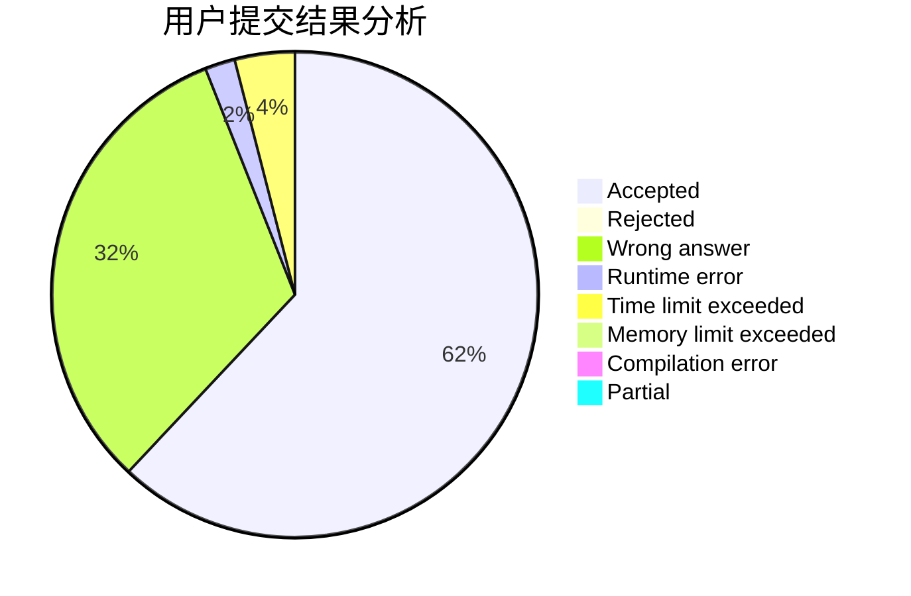
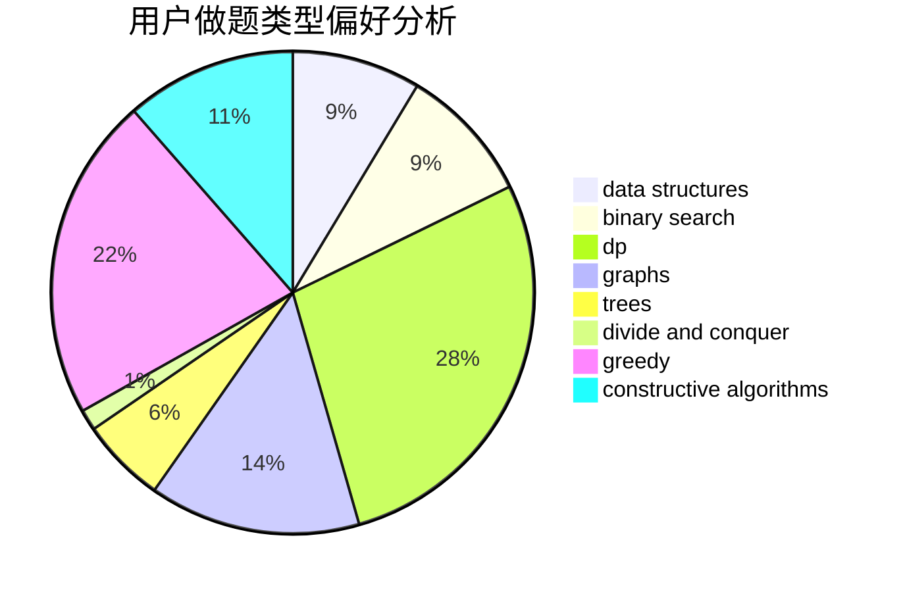
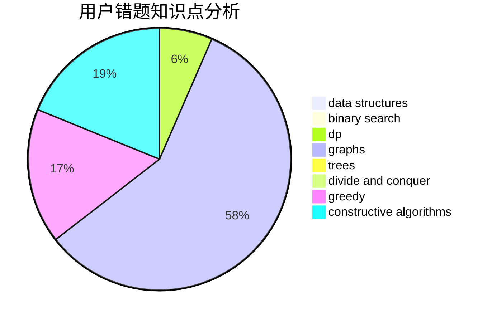

# TimWang

<!-- tabs:start -->

#### **用户提交结果分析**

#### **用户做题类型偏好分析**

#### **用户错题知识点分析**

<!-- tabs:end -->
# 推荐题目
[730A](https://codeforces.com/contest/730/problem/A)		greedy,
                        implementation		  
[1220D](https://codeforces.com/contest/1220/problem/D)		bitmasks,
                        math,
                        number theory		  
[919F](https://codeforces.com/contest/919/problem/F)		games,
                        graphs,
                        shortest paths		  
[1221F](https://codeforces.com/contest/1221/problem/F)		binary search,
                        data structures,
                        sortings		  
[1220C](https://codeforces.com/contest/1220/problem/C)		games,
                        greedy,
                        strings		  
[739A](https://codeforces.com/contest/739/problem/A)		constructive algorithms,
                        greedy		  
[809B](https://codeforces.com/contest/809/problem/B)		binary search,
                        interactive		  
[41D](https://codeforces.com/contest/41/problem/D)		dp		  
[1145B](https://codeforces.com/contest/1145/problem/B)		brute force		  
[566A](https://codeforces.com/contest/566/problem/A)		dfs and similar,
                        strings,
                        trees		  
