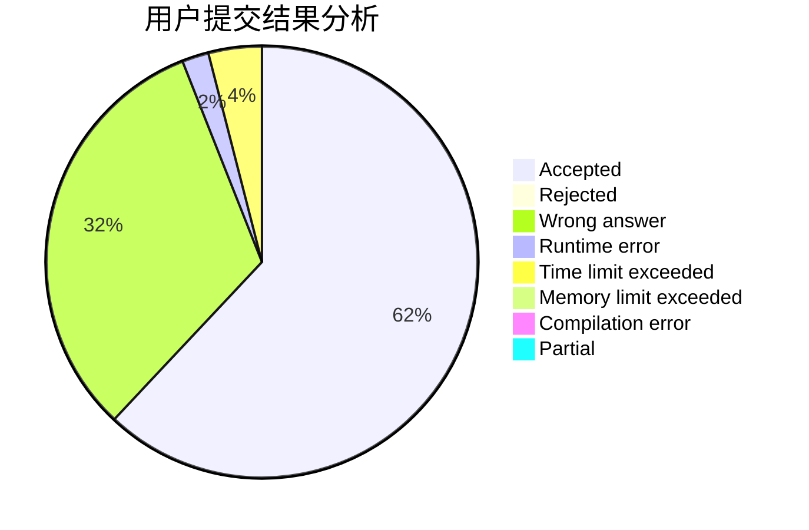
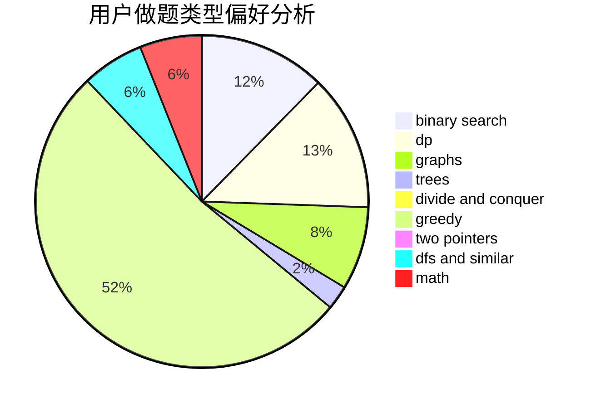

# TimWang

<!-- tabs:start -->

#### **用户提交结果分析**

#### **用户做题类型偏好分析**

<!-- tabs:end -->
# 推荐题目
[746G](https://codeforces.com/contest/746/problem/G)
[1228D](https://codeforces.com/contest/1228/problem/D)
[93A](https://codeforces.com/contest/93/problem/A)
[122B](https://codeforces.com/contest/122/problem/B)
[1228C](https://codeforces.com/contest/1228/problem/C)
[759E](https://codeforces.com/contest/759/problem/E)
[827A](https://codeforces.com/contest/827/problem/A)
[445B](https://codeforces.com/contest/445/problem/B)
[1147C](https://codeforces.com/contest/1147/problem/C)
[584E](https://codeforces.com/contest/584/problem/E)
