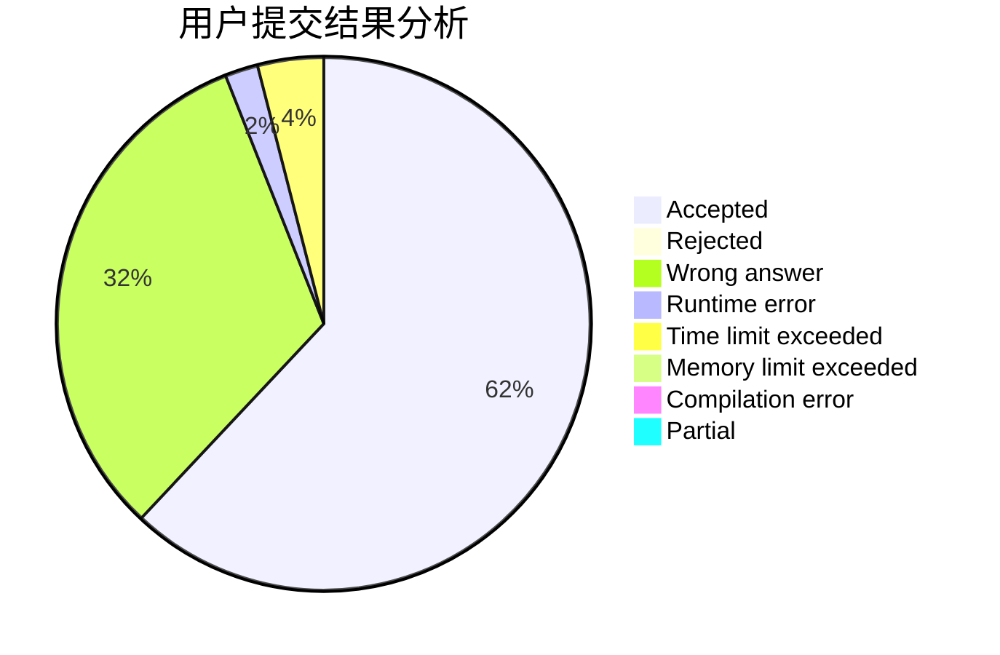
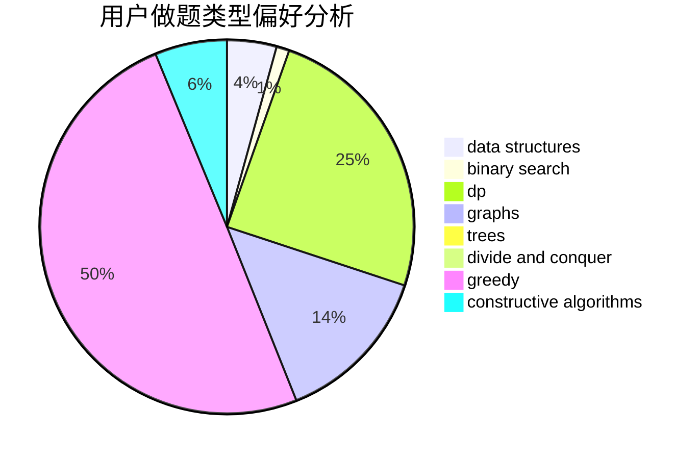
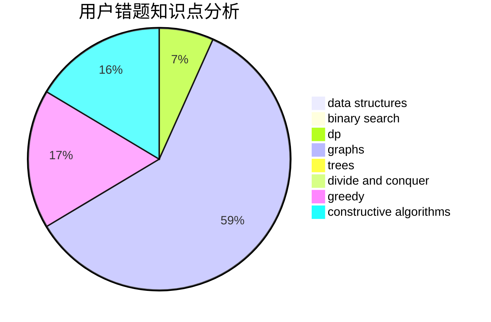

# TimWang

<!-- tabs:start -->

#### **用户提交结果分析**

#### **用户做题类型偏好分析**

#### **用户错题知识点分析**

<!-- tabs:end -->
# 推荐题目
[746G](https://codeforces.com/contest/746/problem/G)		constructive algorithms,
                        graphs,
                        trees		  
[1228D](https://codeforces.com/contest/1228/problem/D)		brute force,
                        constructive algorithms,
                        graphs,
                        hashing,
                        implementation		  
[93A](https://codeforces.com/contest/93/problem/A)		implementation		  
[122B](https://codeforces.com/contest/122/problem/B)		brute force,
                        implementation		  
[1228C](https://codeforces.com/contest/1228/problem/C)		math,
                        number theory		  
[759E](https://codeforces.com/contest/759/problem/E)		dsu,graphs,sortings,trees		  
[827A](https://codeforces.com/contest/827/problem/A)		data structures,
                        greedy,
                        sortings,
                        strings		  
[445B](https://codeforces.com/contest/445/problem/B)		dfs and similar,
                        dsu,
                        greedy		  
[1147C](https://codeforces.com/contest/1147/problem/C)		games		  
[584E](https://codeforces.com/contest/584/problem/E)		constructive algorithms,
                        greedy,
                        math		  
