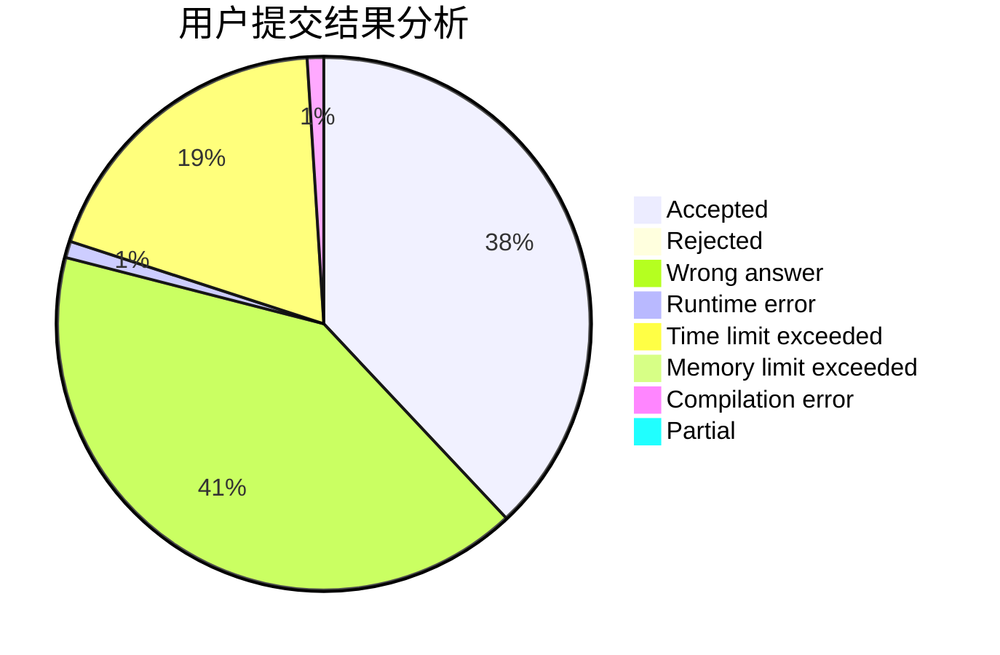
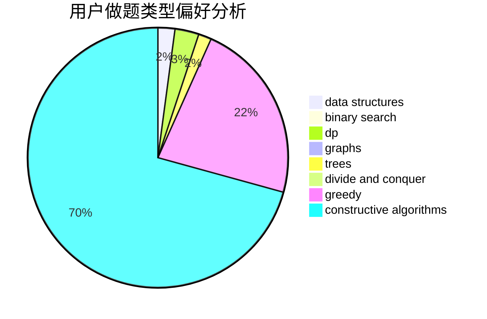
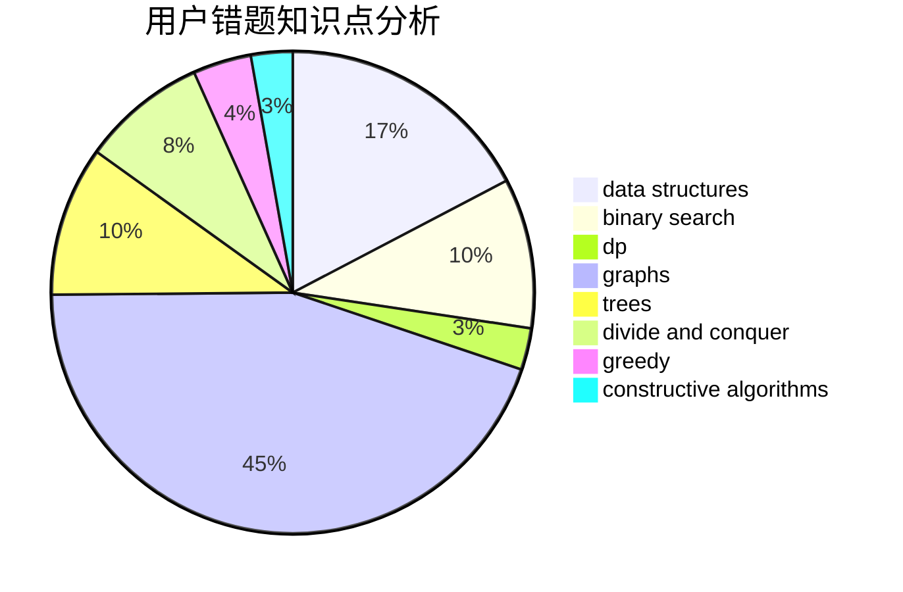

# Time_JYF

<!-- tabs:start -->

#### **用户提交结果分析**

#### **用户做题类型偏好分析**

#### **用户错题知识点分析**

<!-- tabs:end -->
# 推荐题目
[269D](https://codeforces.com/contest/269/problem/D)		data structures,
                        dp,
                        graphs,
                        sortings		  
[253D](https://codeforces.com/contest/253/problem/D)		brute force,
                        two pointers		  
[1282D](https://codeforces.com/contest/1282/problem/D)		constructive algorithms,
                        interactive,
                        strings		  
[521D](https://codeforces.com/contest/521/problem/D)		greedy		  
[852A](https://codeforces.com/contest/852/problem/A)		brute force,
                        implementation,
                        math		  
[312A](https://codeforces.com/contest/312/problem/A)		implementation,
                        strings		  
[782D](https://codeforces.com/contest/782/problem/D)		dsu,graphs,sortings,trees		  
[735D](https://codeforces.com/contest/735/problem/D)		math,
                        number theory		  
[810D](https://codeforces.com/contest/810/problem/D)		dsu,graphs,sortings,trees		  
[1031D](https://codeforces.com/contest/1031/problem/D)		greedy		  
