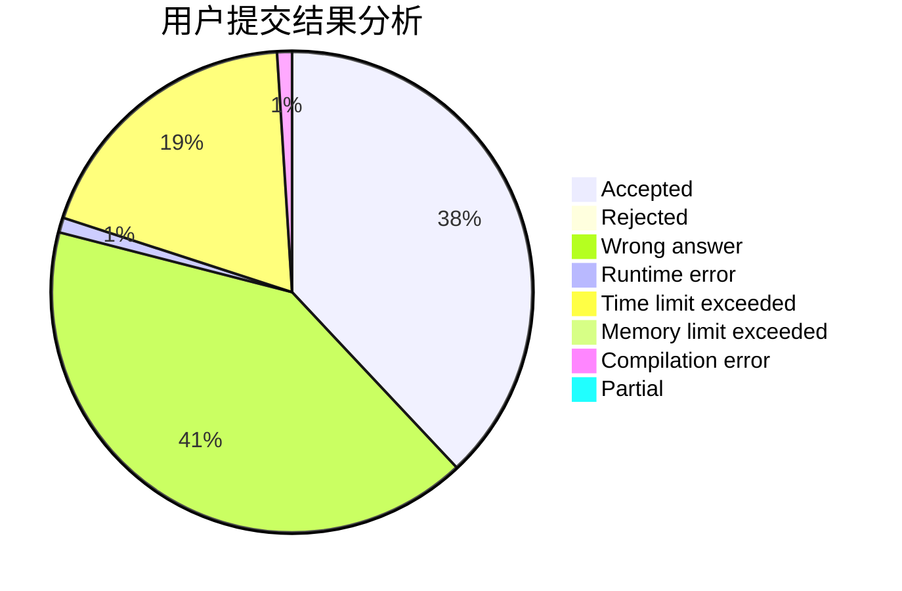
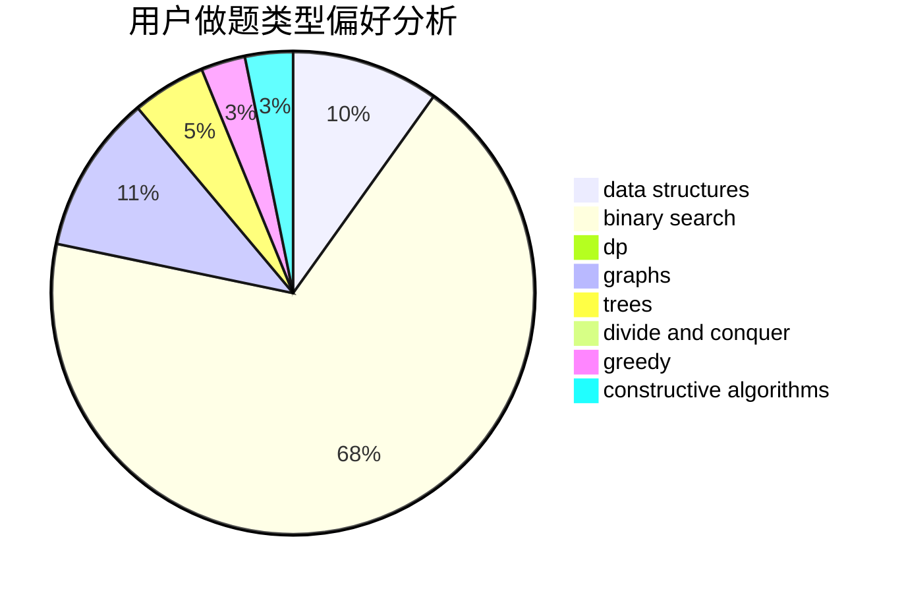
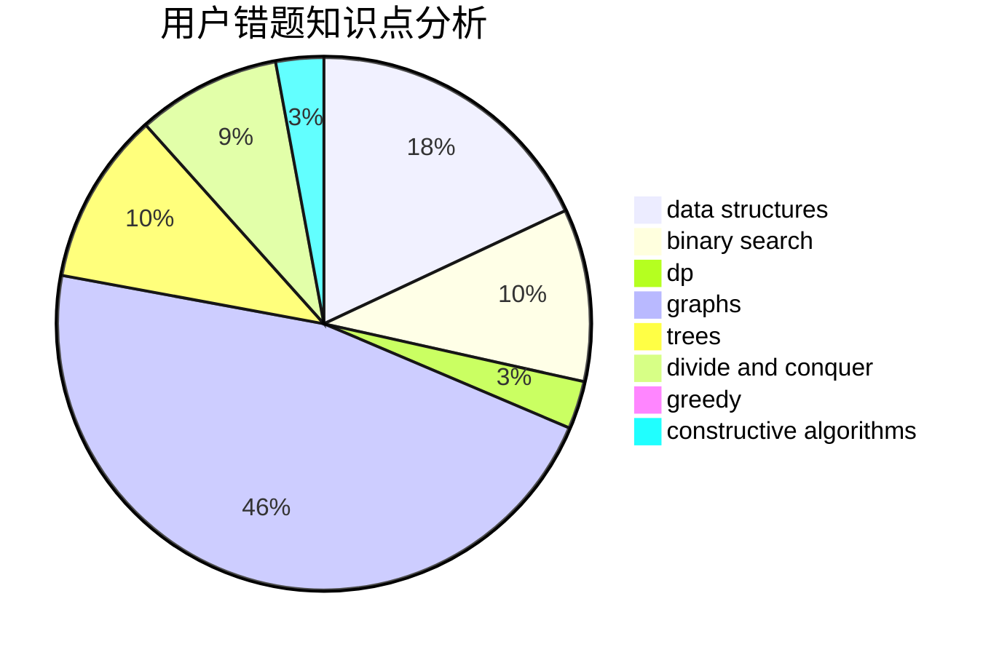

# Time_JYF

<!-- tabs:start -->

#### **用户提交结果分析**

#### **用户做题类型偏好分析**

#### **用户错题知识点分析**

<!-- tabs:end -->
# 推荐题目
[285E](https://codeforces.com/contest/285/problem/E)		combinatorics,
                        dp,
                        math		  
[271D](https://codeforces.com/contest/271/problem/D)		data structures,
                        strings		  
[128B](https://codeforces.com/contest/128/problem/B)		brute force,
                        constructive algorithms,
                        hashing,
                        implementation,
                        string suffix structures,
                        strings		  
[547C](https://codeforces.com/contest/547/problem/C)		bitmasks,
                        combinatorics,
                        dp,
                        math,
                        number theory		  
[870B](https://codeforces.com/contest/870/problem/B)		greedy		  
[335F](https://codeforces.com/contest/335/problem/F)		dp,
                        greedy		  
[800C](https://codeforces.com/contest/800/problem/C)		dsu,graphs,sortings,trees		  
[757B](https://codeforces.com/contest/757/problem/B)		greedy,
                        math,
                        number theory		  
[828D](https://codeforces.com/contest/828/problem/D)		dsu,graphs,sortings,trees		  
[1032F](https://codeforces.com/contest/1032/problem/F)		dp,
                        trees		  
