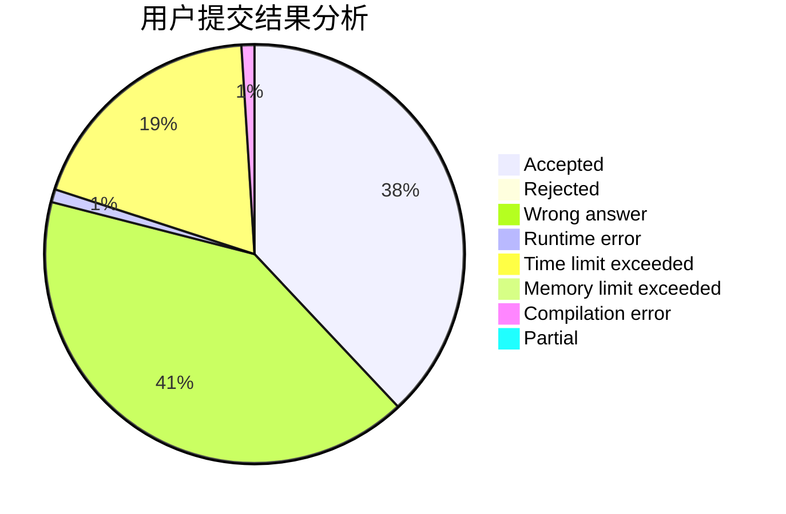
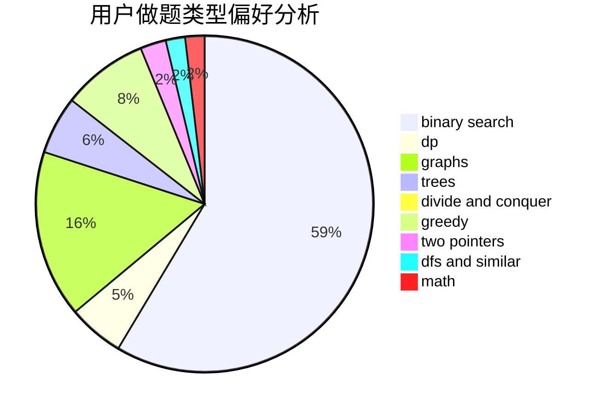

# Time_JYF

<!-- tabs:start -->

#### **用户提交结果分析**

#### **用户做题类型偏好分析**

<!-- tabs:end -->
# 推荐题目
[285E](https://codeforces.com/contest/285/problem/E)
[271D](https://codeforces.com/contest/271/problem/D)
[128B](https://codeforces.com/contest/128/problem/B)
[547C](https://codeforces.com/contest/547/problem/C)
[870B](https://codeforces.com/contest/870/problem/B)
[335F](https://codeforces.com/contest/335/problem/F)
[800C](https://codeforces.com/contest/800/problem/C)
[757B](https://codeforces.com/contest/757/problem/B)
[828D](https://codeforces.com/contest/828/problem/D)
[1032F](https://codeforces.com/contest/1032/problem/F)
