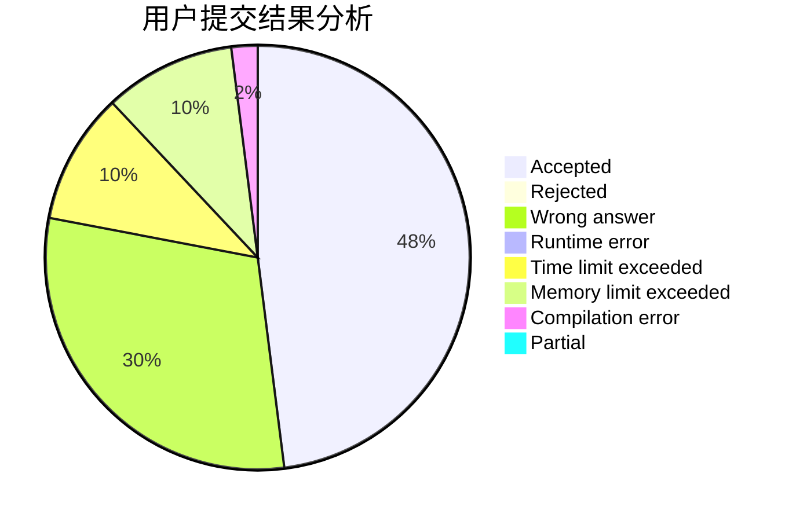
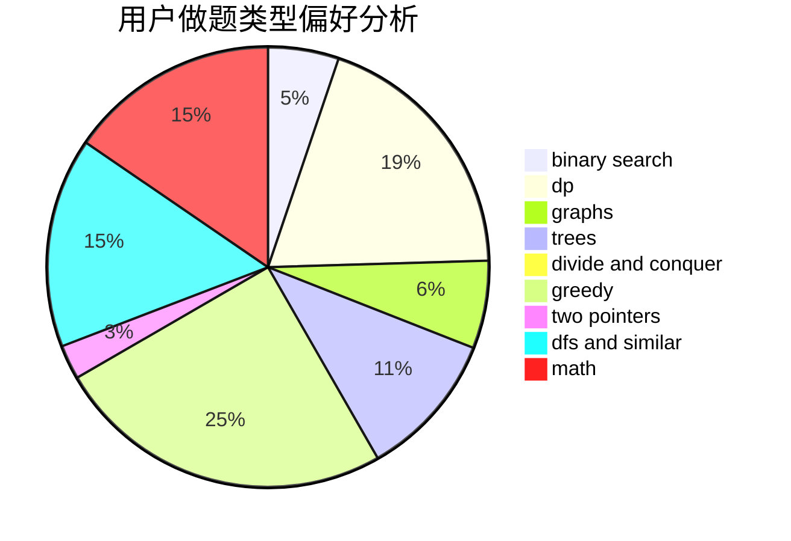

# Aconacon

<!-- tabs:start -->

#### **用户提交结果分析**

#### **用户做题类型偏好分析**

<!-- tabs:end -->
# 推荐题目
[198C](https://codeforces.com/contest/198/problem/C)
[198B](https://codeforces.com/contest/198/problem/B)
[1129D](https://codeforces.com/contest/1129/problem/D)
[1009C](https://codeforces.com/contest/1009/problem/C)
[1346F](https://codeforces.com/contest/1346/problem/F)
[1190E](https://codeforces.com/contest/1190/problem/E)
[1466H](https://codeforces.com/contest/1466/problem/H)
[199D](https://codeforces.com/contest/199/problem/D)
[1252F](https://codeforces.com/contest/1252/problem/F)
[1175D](https://codeforces.com/contest/1175/problem/D)
