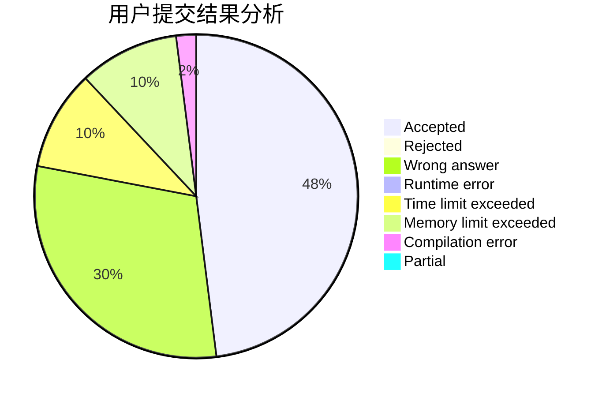
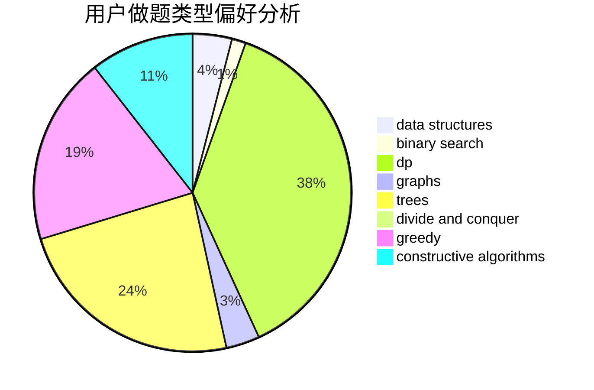
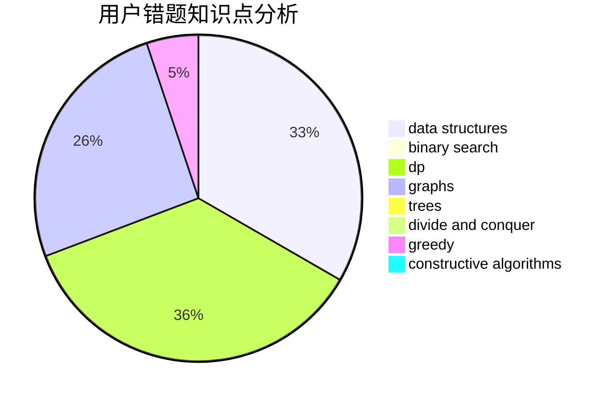

# Aconacon

<!-- tabs:start -->

#### **用户提交结果分析**

#### **用户做题类型偏好分析**

#### **用户错题知识点分析**

<!-- tabs:end -->
# 推荐题目
[198C](https://codeforces.com/contest/198/problem/C)		binary search,
                        geometry		  
[198B](https://codeforces.com/contest/198/problem/B)		shortest paths		  
[1129D](https://codeforces.com/contest/1129/problem/D)		data structures,
                        dp		  
[1009C](https://codeforces.com/contest/1009/problem/C)		greedy,
                        math		  
[1346F](https://codeforces.com/contest/1346/problem/F)		*special problem,
                        data structures,
                        greedy,
                        math		  
[1190E](https://codeforces.com/contest/1190/problem/E)		binary search,
                        greedy		  
[1466H](https://codeforces.com/contest/1466/problem/H)		combinatorics,
                        dp,
                        graphs,
                        greedy,
                        math		  
[199D](https://codeforces.com/contest/199/problem/D)		dsu,graphs,sortings,trees		  
[1252F](https://codeforces.com/contest/1252/problem/F)		hashing,
                        trees		  
[1175D](https://codeforces.com/contest/1175/problem/D)		greedy,
                        sortings		  
