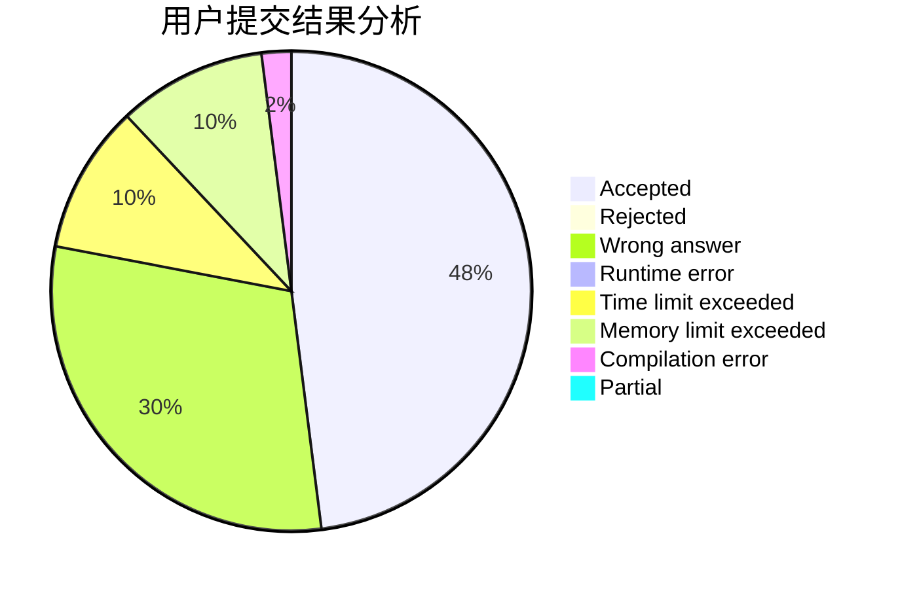
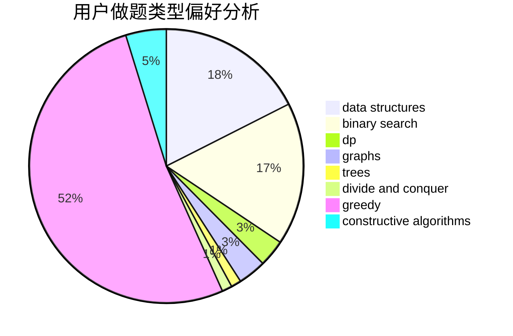
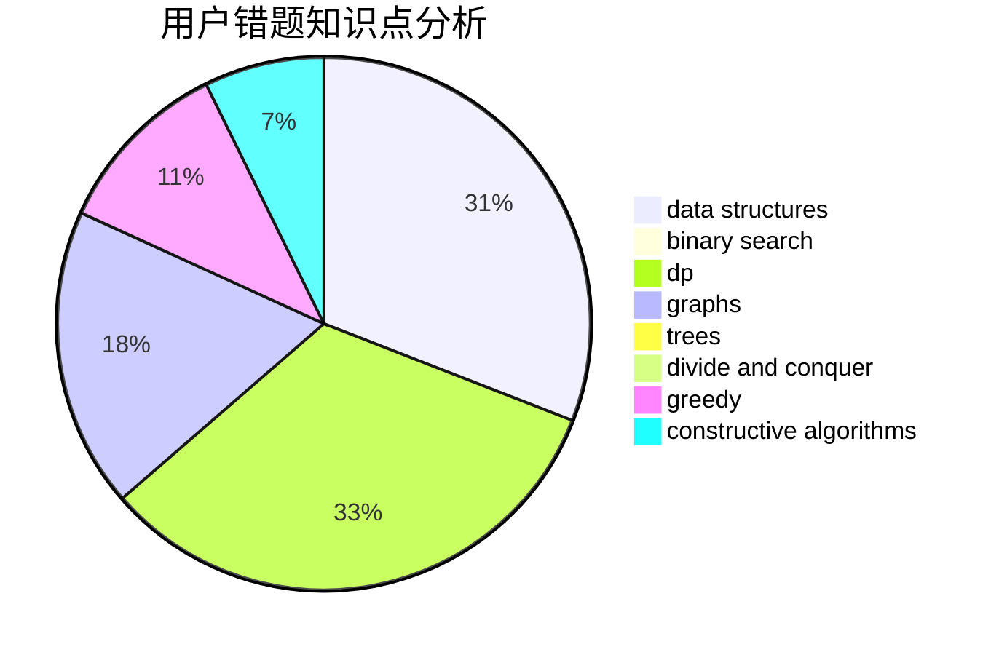

# Aconacon

<!-- tabs:start -->

#### **用户提交结果分析**

#### **用户做题类型偏好分析**

#### **用户错题知识点分析**

<!-- tabs:end -->
# 推荐题目
[171C](https://codeforces.com/contest/171/problem/C)		*special problem,
                        implementation		  
[171B](https://codeforces.com/contest/171/problem/B)		*special problem,
                        combinatorics		  
[1119H](https://codeforces.com/contest/1119/problem/H)		fft,
                        math		  
[1008E](https://codeforces.com/contest/1008/problem/E)		dsu,graphs,sortings,trees		  
[1340A](https://codeforces.com/contest/1340/problem/A)		brute force,
                        data structures,
                        greedy,
                        implementation		  
[1187C](https://codeforces.com/contest/1187/problem/C)		constructive algorithms,
                        greedy,
                        implementation		  
[1457E](https://codeforces.com/contest/1457/problem/E)		dsu,graphs,sortings,trees		  
[171F](https://codeforces.com/contest/171/problem/F)		*special problem,
                        brute force,
                        implementation,
                        number theory		  
[1248D2](https://codeforces.com/contest/1248D/problem/2)		dsu,graphs,sortings,trees		  
[1173A](https://codeforces.com/contest/1173/problem/A)		greedy		  
