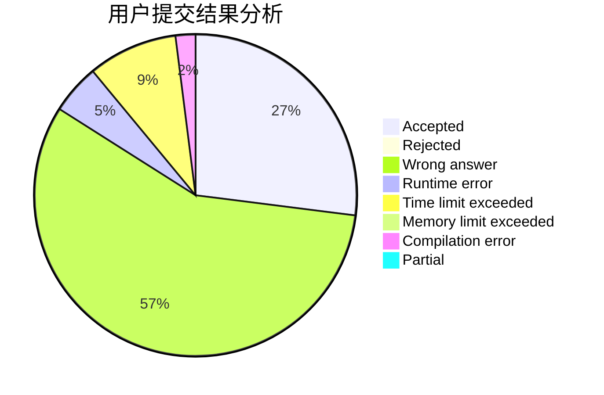
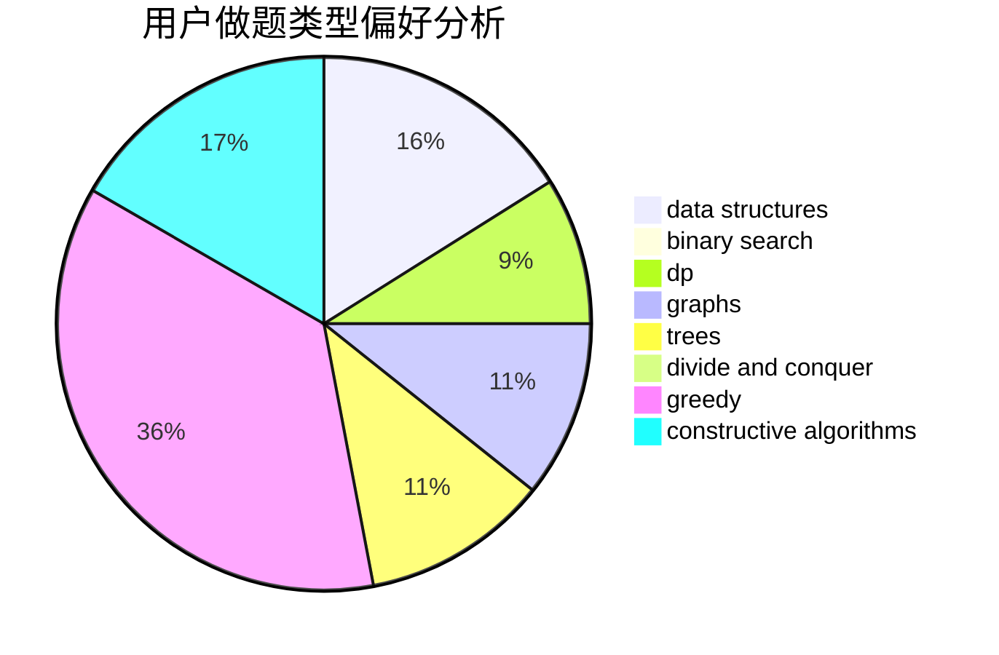

# Time_tears

<!-- tabs:start -->

#### **用户提交结果分析**

#### **用户做题类型偏好分析**

#### **用户错题知识点分析**

<!-- tabs:end -->
# 推荐题目
[828C](https://codeforces.com/contest/828/problem/C)		dsu,graphs,sortings,trees		  
[1227A](https://codeforces.com/contest/1227/problem/A)		math		  
[152B](https://codeforces.com/contest/152/problem/B)		binary search,
                        implementation		  
[1118B](https://codeforces.com/contest/1118/problem/B)		implementation		  
[670F](https://codeforces.com/contest/670/problem/F)		brute force,
                        constructive algorithms,
                        strings		  
[939F](https://codeforces.com/contest/939/problem/F)		data structures,
                        dp		  
[1070K](https://codeforces.com/contest/1070/problem/K)		implementation		  
[13931](https://codeforces.com/contest/1393/problem/1)		dsu,graphs,sortings,trees		  
[215B](https://codeforces.com/contest/215/problem/B)		greedy,
                        math		  
[1068A](https://codeforces.com/contest/1068/problem/A)		math		  
