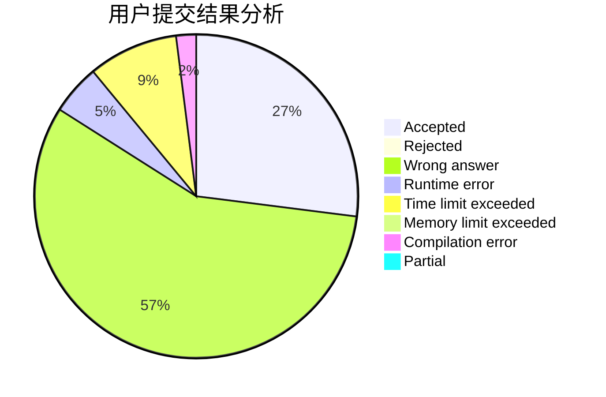
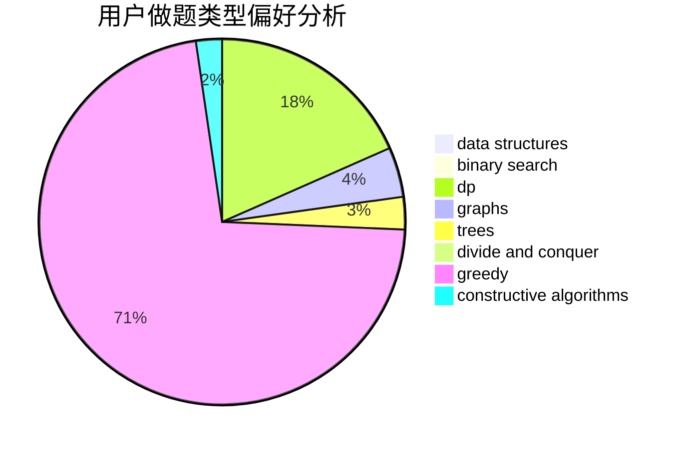

# Time_tears

<!-- tabs:start -->

#### **用户提交结果分析**

#### **用户做题类型偏好分析**

#### **用户错题知识点分析**

<!-- tabs:end -->
# 推荐题目
[810C](https://codeforces.com/contest/810/problem/C)		dsu,graphs,sortings,trees		  
[121C](https://codeforces.com/contest/121/problem/C)		brute force,
                        combinatorics,
                        number theory		  
[1505B](https://codeforces.com/contest/1505/problem/B)		implementation,
                        number theory		  
[1116D2](https://codeforces.com/contest/1116D/problem/2)		nan		  
[643F](https://codeforces.com/contest/643/problem/F)		dp,
                        math,
                        meet-in-the-middle		  
[919E](https://codeforces.com/contest/919/problem/E)		chinese remainder theorem,
                        math,
                        number theory		  
[1070H](https://codeforces.com/contest/1070/problem/H)		brute force,
                        implementation		  
[1383B](https://codeforces.com/contest/1383/problem/B)		bitmasks,
                        constructive algorithms,
                        dp,
                        games,
                        greedy,
                        math		  
[18C](https://codeforces.com/contest/18/problem/C)		data structures,
                        implementation		  
[1067C](https://codeforces.com/contest/1067/problem/C)		constructive algorithms		  
