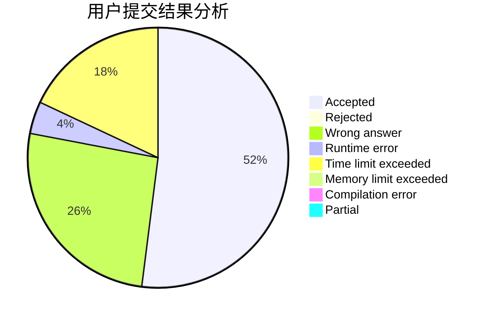
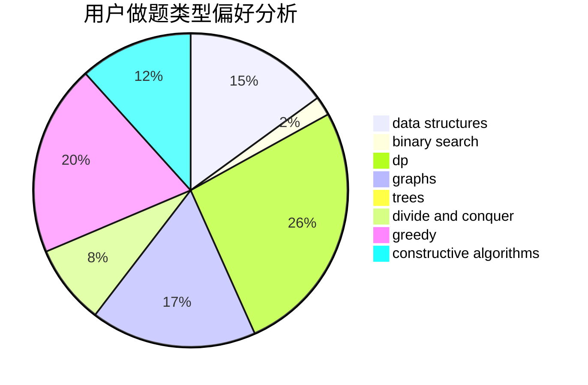
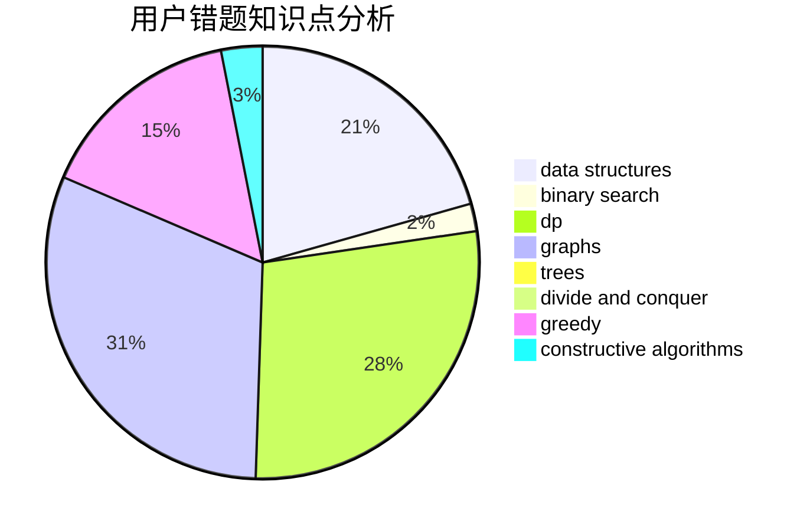

# TinkerKing

<!-- tabs:start -->

#### **用户提交结果分析**

#### **用户做题类型偏好分析**

#### **用户错题知识点分析**

<!-- tabs:end -->
# 推荐题目
[843A](https://codeforces.com/contest/843/problem/A)		dfs and similar,
                        dsu,
                        implementation,
                        math,
                        sortings		  
[1139A](https://codeforces.com/contest/1139/problem/A)		implementation,
                        strings		  
[1065G](https://codeforces.com/contest/1065/problem/G)		strings		  
[893C](https://codeforces.com/contest/893/problem/C)		dfs and similar,
                        graphs,
                        greedy		  
[902B](https://codeforces.com/contest/902/problem/B)		dfs and similar,
                        dsu,
                        greedy		  
[233A](https://codeforces.com/contest/233/problem/A)		implementation,
                        math		  
[1121B](https://codeforces.com/contest/1121/problem/B)		brute force,
                        implementation		  
[723E](https://codeforces.com/contest/723/problem/E)		constructive algorithms,
                        dfs and similar,
                        flows,
                        graphs,
                        greedy		  
[559B](https://codeforces.com/contest/559/problem/B)		divide and conquer,
                        hashing,
                        sortings,
                        strings		  
[1083B](https://codeforces.com/contest/1083/problem/B)		greedy,
                        strings		  
