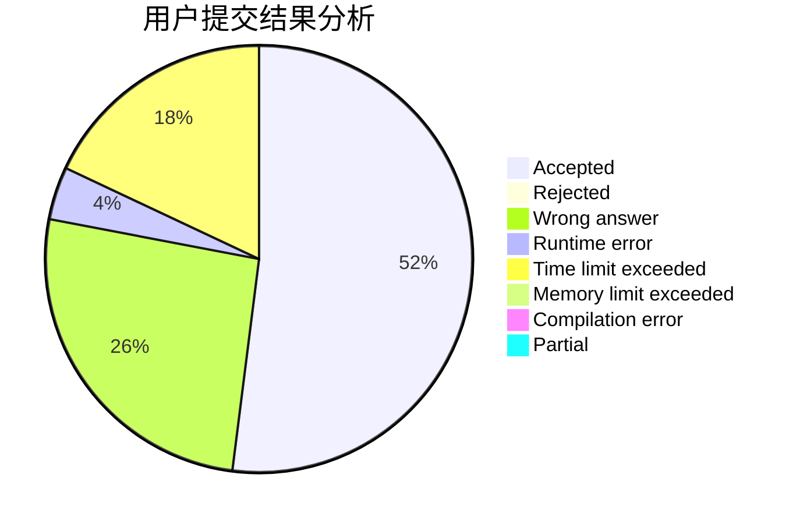
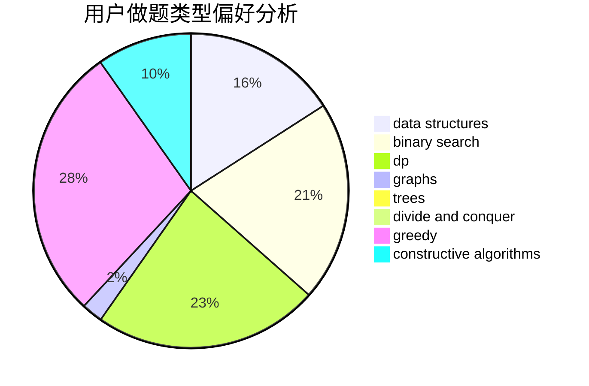
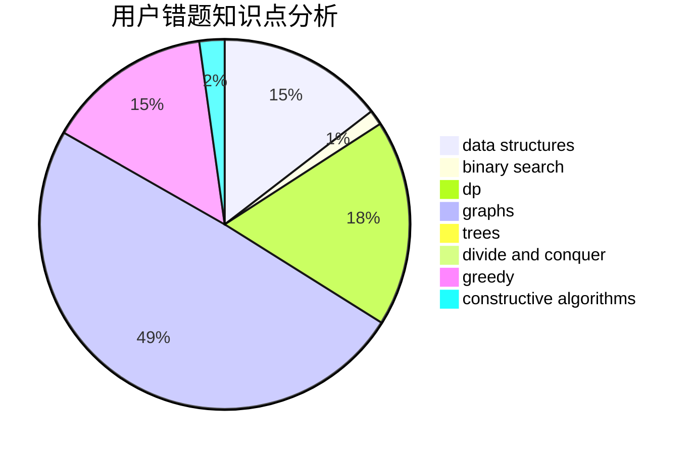

# TinkerKing

<!-- tabs:start -->

#### **用户提交结果分析**

#### **用户做题类型偏好分析**

#### **用户错题知识点分析**

<!-- tabs:end -->
# 推荐题目
[825A](https://codeforces.com/contest/825/problem/A)		implementation		  
[1136E](https://codeforces.com/contest/1136/problem/E)		binary search,
                        data structures		  
[1065C](https://codeforces.com/contest/1065/problem/C)		greedy		  
[872A](https://codeforces.com/contest/872/problem/A)		dsu,graphs,sortings,trees		  
[884A](https://codeforces.com/contest/884/problem/A)		implementation		  
[213E](https://codeforces.com/contest/213/problem/E)		data structures,
                        hashing,
                        strings		  
[1119B](https://codeforces.com/contest/1119/problem/B)		binary search,
                        flows,
                        greedy,
                        sortings		  
[704E](https://codeforces.com/contest/704/problem/E)		data structures,
                        geometry,
                        trees		  
[538A](https://codeforces.com/contest/538/problem/A)		brute force,
                        implementation		  
[1082F](https://codeforces.com/contest/1082/problem/F)		dp,
                        strings,
                        trees		  
