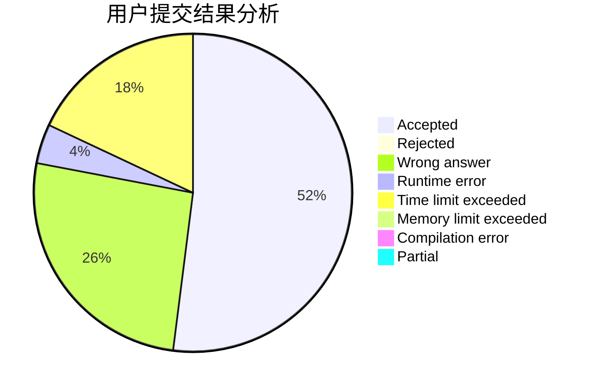
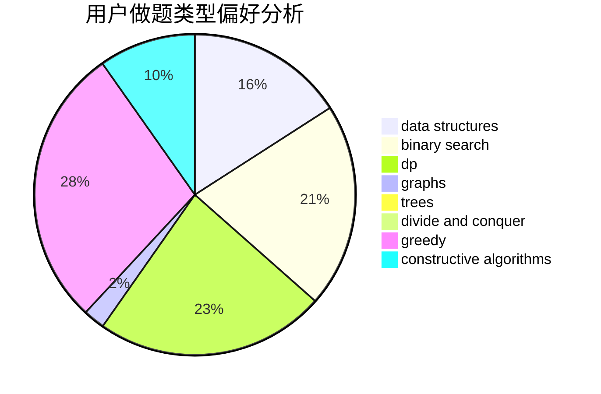
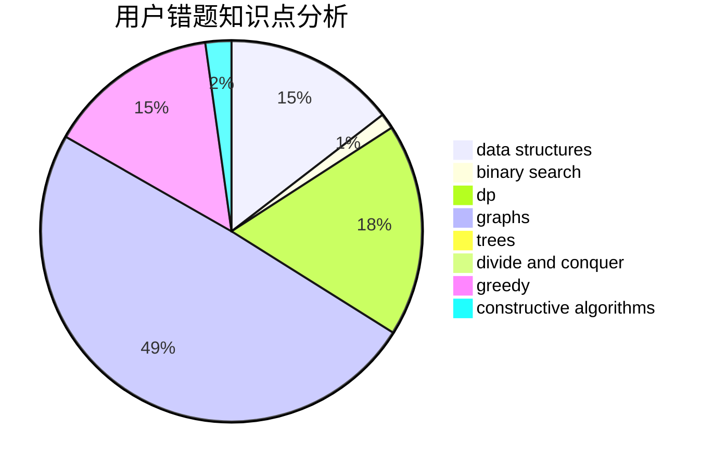

# TinkerKing
<!-- tabs:start -->
#### **用户提交结果分析**

#### **用户做题类型偏好分析**

#### **用户错题知识点分析**

<!-- tabs:end -->
# 推荐题目
[Binary Protocol](http://codeforces.com/problemset/problem/825/A)		implementation		  
[Make It Equal](http://codeforces.com/problemset/problem/1065/C)		greedy		  
[Nastya Hasn't Written a Legend](http://codeforces.com/problemset/problem/1136/E)		binary search,
                        data structures		  
[Cards](http://codeforces.com/problemset/problem/398/A)		constructive algorithms,
                        implementation		  
[Dominated Subarray](http://codeforces.com/problemset/problem/1257/C)		greedy,
                        implementation,
                        sortings,
                        strings,
                        two pointers		  
[Search for Pretty Integers](https://codeforces.com/contest/872/problem/A)		brute force,
                        implementation		  
[Speed Dial](http://codeforces.com/problemset/problem/1082/F)		dp,
                        strings,
                        trees		  
[Cutting Banner](http://codeforces.com/problemset/problem/538/A)		brute force,
                        implementation		  
[Nauuo and Pictures (hard version)](https://codeforces.com/contest/1173/problem/E2)		dp,
                        probabilities		  
[Iron Man](http://codeforces.com/problemset/problem/704/E)		data structures,
                        geometry,
                        trees		  
<!-- tabs:start -->
#### **data structures**
[Binary Protocol](http://codeforces.com/problemset/problem/1136/E)		binary search,
                        data structures		  
[Make It Equal](http://codeforces.com/problemset/problem/704/E)		data structures,
                        geometry,
                        trees		  
[Nastya Hasn't Written a Legend](http://codeforces.com/problemset/problem/213/E)		data structures,
                        hashing,
                        strings		  
[Cards](https://codeforces.com/contest/956/problem/C)		data structures,
                        dp,
                        greedy		  
[Dominated Subarray](https://codeforces.com/contest/634/problem/D)		data structures,
                        divide and conquer,
                        greedy		  
[Search for Pretty Integers](http://codeforces.com/problemset/problem/1492/C)		binary search,
                        data structures,
                        dp,
                        greedy,
                        two pointers		  
[Speed Dial](http://codeforces.com/problemset/problem/1490/G)		binary search,
                        data structures,
                        math		  
[Cutting Banner](http://codeforces.com/problemset/problem/1479/D)		binary search,
                        bitmasks,
                        brute force,
                        data structures,
                        probabilities,
                        trees		  
[Nauuo and Pictures (hard version)](http://codeforces.com/problemset/problem/1497/A)		brute force,
                        data structures,
                        greedy,
                        sortings		  
[Iron Man](http://codeforces.com/problemset/problem/1491/C)		brute force,
                        data structures,
                        dp,
                        greedy,
                        implementation		  
#### **binary search**
[Binary Protocol](http://codeforces.com/problemset/problem/1136/E)		binary search,
                        data structures		  
[Make It Equal](http://codeforces.com/problemset/problem/1119/B)		binary search,
                        flows,
                        greedy,
                        sortings		  
[Nastya Hasn't Written a Legend](https://codeforces.com/contest/967/problem/D)		binary search,
                        implementation,
                        sortings		  
[Cards](http://codeforces.com/problemset/problem/21/C)		binary search,
                        dp,
                        sortings		  
[Dominated Subarray](http://codeforces.com/problemset/problem/360/B)		binary search,
                        dp		  
[Search for Pretty Integers](http://codeforces.com/problemset/problem/1336/B)		binary search,
                        greedy,
                        math,
                        sortings,
                        two pointers		  
[Speed Dial](http://codeforces.com/problemset/problem/1355/E)		binary search,
                        greedy,
                        math,
                        sortings,
                        ternary search		  
[Cutting Banner](http://codeforces.com/problemset/problem/1492/C)		binary search,
                        data structures,
                        dp,
                        greedy,
                        two pointers		  
[Nauuo and Pictures (hard version)](http://codeforces.com/problemset/problem/1463/D)		binary search,
                        constructive algorithms,
                        greedy,
                        two pointers		  
[Iron Man](http://codeforces.com/problemset/problem/1490/G)		binary search,
                        data structures,
                        math		  
#### **dp**
[Binary Protocol](http://codeforces.com/problemset/problem/1082/F)		dp,
                        strings,
                        trees		  
[Make It Equal](https://codeforces.com/contest/1173/problem/E2)		dp,
                        probabilities		  
[Nastya Hasn't Written a Legend](http://codeforces.com/problemset/problem/21/C)		binary search,
                        dp,
                        sortings		  
[Cards](http://codeforces.com/problemset/problem/360/B)		binary search,
                        dp		  
[Dominated Subarray](http://codeforces.com/problemset/problem/550/C)		brute force,
                        dp,
                        math		  
[Search for Pretty Integers](https://codeforces.com/contest/956/problem/C)		data structures,
                        dp,
                        greedy		  
[Speed Dial](http://codeforces.com/problemset/problem/1174/E)		combinatorics,
                        dp,
                        math,
                        number theory		  
[Cutting Banner](https://codeforces.com/contest/1173/problem/D)		combinatorics,
                        dfs and similar,
                        dp,
                        trees		  
[Nauuo and Pictures (hard version)](http://codeforces.com/problemset/problem/482/C)		bitmasks,
                        dp,
                        probabilities		  
[Iron Man](http://codeforces.com/problemset/problem/837/D)		dp,
                        math		  
#### **graph**
[Binary Protocol](https://codeforces.com/contest/1013/problem/D)		constructive algorithms,
                        dfs and similar,
                        dsu,
                        graphs,
                        matrices		  
[Make It Equal](http://codeforces.com/problemset/problem/811/D)		constructive algorithms,
                        dfs and similar,
                        graphs,
                        interactive		  
[Nastya Hasn't Written a Legend](http://codeforces.com/problemset/problem/1487/C)		brute force,
                        constructive algorithms,
                        dfs and similar,
                        graphs,
                        greedy,
                        implementation,
                        math		  
[Cards](http://codeforces.com/problemset/problem/1437/C)		dp,
                        flows,
                        graph matchings,
                        greedy,
                        math,
                        sortings		  
[Dominated Subarray](http://codeforces.com/problemset/problem/1470/D)		constructive algorithms,
                        dfs and similar,
                        graph matchings,
                        graphs,
                        greedy		  
[Search for Pretty Integers](http://codeforces.com/problemset/problem/1476/C)		dp,
                        graphs,
                        greedy		  
[Speed Dial](http://codeforces.com/problemset/problem/1304/D)		constructive algorithms,
                        graphs,
                        greedy,
                        two pointers		  
[Cutting Banner](http://codeforces.com/problemset/problem/1475/C)		combinatorics,
                        graphs,
                        math		  
[Nauuo and Pictures (hard version)](http://codeforces.com/problemset/problem/553/E)		dp,
                        fft,
                        graphs,
                        math,
                        probabilities		  
[Iron Man](http://codeforces.com/problemset/problem/1495/C)		constructive algorithms,
                        graphs		  
#### **trees**
[Binary Protocol](http://codeforces.com/problemset/problem/1082/F)		dp,
                        strings,
                        trees		  
[Make It Equal](http://codeforces.com/problemset/problem/704/E)		data structures,
                        geometry,
                        trees		  
[Nastya Hasn't Written a Legend](http://codeforces.com/problemset/problem/321/C)		constructive algorithms,
                        dfs and similar,
                        divide and conquer,
                        greedy,
                        trees		  
[Cards](https://codeforces.com/contest/1173/problem/D)		combinatorics,
                        dfs and similar,
                        dp,
                        trees		  
[Dominated Subarray](http://codeforces.com/problemset/problem/1479/D)		binary search,
                        bitmasks,
                        brute force,
                        data structures,
                        probabilities,
                        trees		  
[Search for Pretty Integers](http://codeforces.com/problemset/problem/1511/C)		brute force,
                        data structures,
                        implementation,
                        trees		  
[Speed Dial](http://codeforces.com/problemset/problem/1499/F)		combinatorics,
                        dfs and similar,
                        dp,
                        trees		  
[Cutting Banner](http://codeforces.com/problemset/problem/1491/E)		brute force,
                        dfs and similar,
                        divide and conquer,
                        number theory,
                        trees		  
[Nauuo and Pictures (hard version)](http://codeforces.com/problemset/problem/1466/D)		data structures,
                        greedy,
                        sortings,
                        trees		  
[Iron Man](http://codeforces.com/problemset/problem/1495/D)		combinatorics,
                        dfs and similar,
                        graphs,
                        math,
                        shortest paths,
                        trees		  
#### **divide and conquer**
[Binary Protocol](http://codeforces.com/problemset/problem/321/C)		constructive algorithms,
                        dfs and similar,
                        divide and conquer,
                        greedy,
                        trees		  
[Make It Equal](https://codeforces.com/contest/634/problem/D)		data structures,
                        divide and conquer,
                        greedy		  
[Nastya Hasn't Written a Legend](http://codeforces.com/problemset/problem/438/E)		combinatorics,
                        divide and conquer,
                        fft,
                        number theory		  
[Cards](http://codeforces.com/problemset/problem/120/J)		divide and conquer,
                        geometry,
                        sortings		  
[Dominated Subarray](http://codeforces.com/problemset/problem/1461/D)		binary search,
                        brute force,
                        data structures,
                        divide and conquer,
                        implementation,
                        sortings		  
[Search for Pretty Integers](http://codeforces.com/problemset/problem/1466/G)		combinatorics,
                        divide and conquer,
                        hashing,
                        math,
                        string suffix structures,
                        strings		  
[Speed Dial](http://codeforces.com/problemset/problem/1490/D)		dfs and similar,
                        divide and conquer,
                        implementation		  
[Cutting Banner](https://codeforces.com/contest/1483/problem/C)		data structures,
                        divide and conquer,
                        dp		  
[Nauuo and Pictures (hard version)](http://codeforces.com/problemset/problem/1491/E)		brute force,
                        dfs and similar,
                        divide and conquer,
                        number theory,
                        trees		  
[Iron Man](http://codeforces.com/problemset/problem/1303/G)		data structures,
                        divide and conquer,
                        geometry,
                        trees		  
#### **greedy**
[Binary Protocol](http://codeforces.com/problemset/problem/1065/C)		greedy		  
[Make It Equal](http://codeforces.com/problemset/problem/1257/C)		greedy,
                        implementation,
                        sortings,
                        strings,
                        two pointers		  
[Nastya Hasn't Written a Legend](http://codeforces.com/problemset/problem/609/A)		greedy,
                        implementation,
                        sortings		  
[Cards](http://codeforces.com/problemset/problem/1119/B)		binary search,
                        flows,
                        greedy,
                        sortings		  
[Dominated Subarray](http://codeforces.com/problemset/problem/1500/C)		bitmasks,
                        brute force,
                        constructive algorithms,
                        greedy,
                        two pointers		  
[Search for Pretty Integers](http://codeforces.com/problemset/problem/321/C)		constructive algorithms,
                        dfs and similar,
                        divide and conquer,
                        greedy,
                        trees		  
[Speed Dial](http://codeforces.com/problemset/problem/670/A)		brute force,
                        constructive algorithms,
                        greedy,
                        math		  
[Cutting Banner](https://codeforces.com/contest/1465/problem/E)		bitmasks,
                        greedy,
                        math,
                        strings		  
[Nauuo and Pictures (hard version)](http://codeforces.com/problemset/problem/1054/D)		greedy,
                        implementation		  
[Iron Man](http://codeforces.com/problemset/problem/1189/B)		greedy,
                        math,
                        sortings		  
#### **constructive algorithms**
[Binary Protocol](http://codeforces.com/problemset/problem/398/A)		constructive algorithms,
                        implementation		  
[Make It Equal](http://codeforces.com/problemset/problem/347/A)		constructive algorithms,
                        implementation,
                        sortings		  
[Nastya Hasn't Written a Legend](https://codeforces.com/contest/1130/problem/E)		constructive algorithms		  
[Cards](http://codeforces.com/problemset/problem/1500/C)		bitmasks,
                        brute force,
                        constructive algorithms,
                        greedy,
                        two pointers		  
[Dominated Subarray](http://codeforces.com/problemset/problem/321/C)		constructive algorithms,
                        dfs and similar,
                        divide and conquer,
                        greedy,
                        trees		  
[Search for Pretty Integers](http://codeforces.com/problemset/problem/670/A)		brute force,
                        constructive algorithms,
                        greedy,
                        math		  
[Speed Dial](https://codeforces.com/contest/1013/problem/D)		constructive algorithms,
                        dfs and similar,
                        dsu,
                        graphs,
                        matrices		  
[Cutting Banner](http://codeforces.com/problemset/problem/811/D)		constructive algorithms,
                        dfs and similar,
                        graphs,
                        interactive		  
[Nauuo and Pictures (hard version)](http://codeforces.com/problemset/problem/1493/A)		constructive algorithms,
                        greedy		  
[Iron Man](http://codeforces.com/problemset/problem/1463/D)		binary search,
                        constructive algorithms,
                        greedy,
                        two pointers		  
#### **sortings**
[Binary Protocol](http://codeforces.com/problemset/problem/1257/C)		greedy,
                        implementation,
                        sortings,
                        strings,
                        two pointers		  
[Make It Equal](http://codeforces.com/problemset/problem/609/A)		greedy,
                        implementation,
                        sortings		  
[Nastya Hasn't Written a Legend](http://codeforces.com/problemset/problem/1119/B)		binary search,
                        flows,
                        greedy,
                        sortings		  
[Cards](https://codeforces.com/contest/967/problem/D)		binary search,
                        implementation,
                        sortings		  
[Dominated Subarray](http://codeforces.com/problemset/problem/347/A)		constructive algorithms,
                        implementation,
                        sortings		  
[Search for Pretty Integers](http://codeforces.com/problemset/problem/21/C)		binary search,
                        dp,
                        sortings		  
[Speed Dial](http://codeforces.com/problemset/problem/1189/B)		greedy,
                        math,
                        sortings		  
[Cutting Banner](http://codeforces.com/problemset/problem/1336/B)		binary search,
                        greedy,
                        math,
                        sortings,
                        two pointers		  
[Nauuo and Pictures (hard version)](http://codeforces.com/problemset/problem/1272/A)		brute force,
                        greedy,
                        math,
                        sortings		  
[Iron Man](http://codeforces.com/problemset/problem/1355/E)		binary search,
                        greedy,
                        math,
                        sortings,
                        ternary search		  
<!-- tabs:end -->
