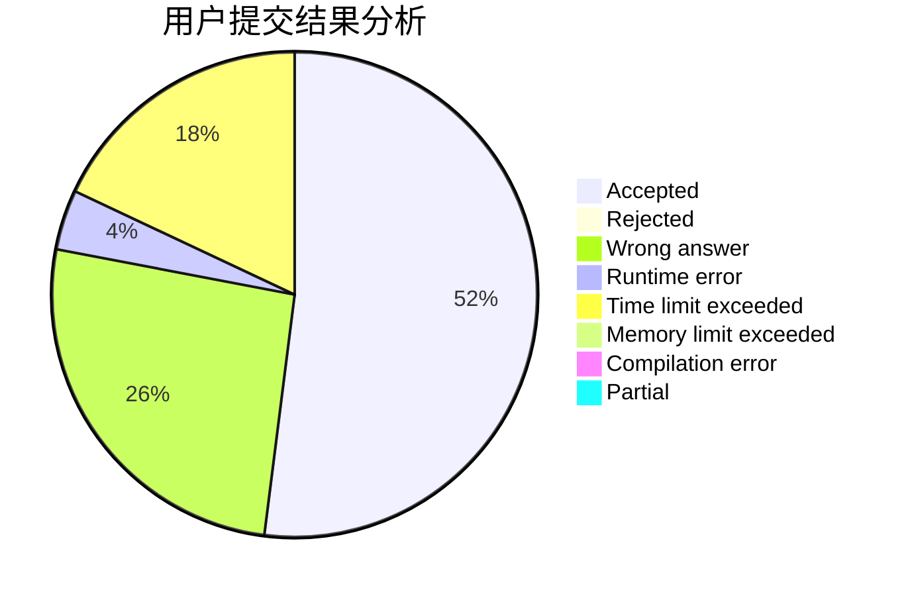
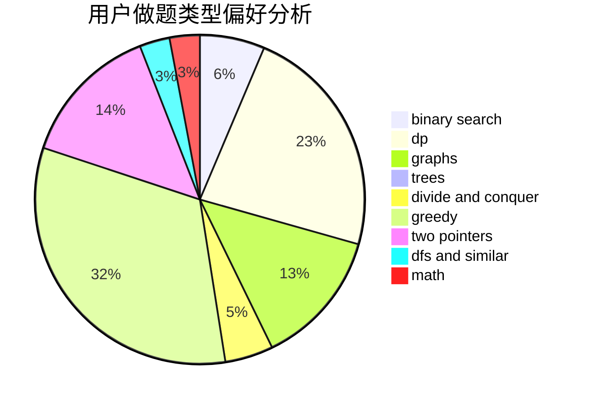

# TinkerKing

<!-- tabs:start -->

#### **用户提交结果分析**

#### **用户做题类型偏好分析**

<!-- tabs:end -->
# 推荐题目
[843A](https://codeforces.com/contest/843/problem/A)
[1139A](https://codeforces.com/contest/1139/problem/A)
[1065G](https://codeforces.com/contest/1065/problem/G)
[893C](https://codeforces.com/contest/893/problem/C)
[902B](https://codeforces.com/contest/902/problem/B)
[233A](https://codeforces.com/contest/233/problem/A)
[1121B](https://codeforces.com/contest/1121/problem/B)
[723E](https://codeforces.com/contest/723/problem/E)
[559B](https://codeforces.com/contest/559/problem/B)
[1083B](https://codeforces.com/contest/1083/problem/B)
