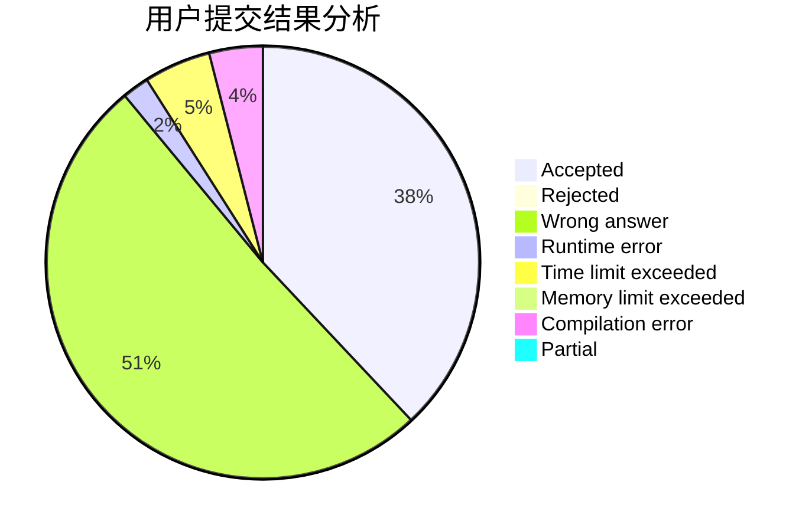
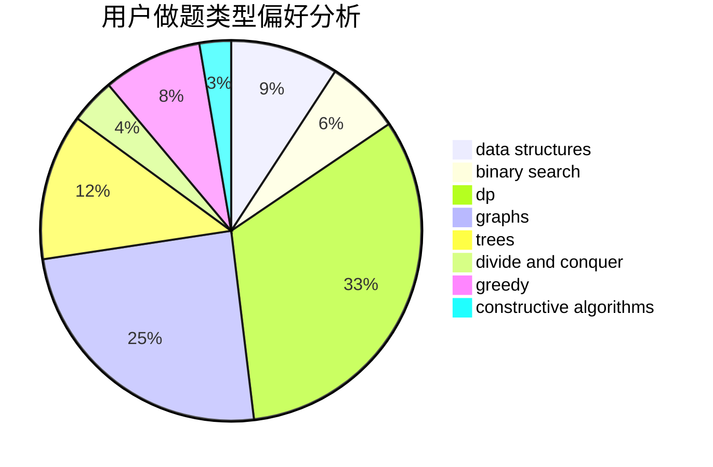
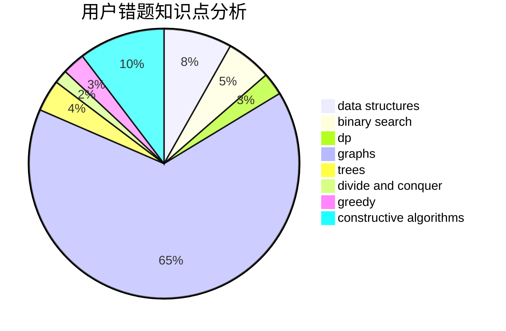

# TiorK

<!-- tabs:start -->

#### **用户提交结果分析**

#### **用户做题类型偏好分析**

#### **用户错题知识点分析**

<!-- tabs:end -->
# 推荐题目
[985G](https://codeforces.com/contest/985/problem/G)		combinatorics		  
[704E](https://codeforces.com/contest/704/problem/E)		data structures,
                        geometry,
                        trees		  
[467A](https://codeforces.com/contest/467/problem/A)		implementation		  
[888F](https://codeforces.com/contest/888/problem/F)		dp,
                        graphs		  
[1295D](https://codeforces.com/contest/1295/problem/D)		math,
                        number theory		  
[1227A](https://codeforces.com/contest/1227/problem/A)		math		  
[651B](https://codeforces.com/contest/651/problem/B)		greedy,
                        sortings		  
[592B](https://codeforces.com/contest/592/problem/B)		math		  
[426B](https://codeforces.com/contest/426/problem/B)		implementation		  
[1066F](https://codeforces.com/contest/1066/problem/F)		dp		  
