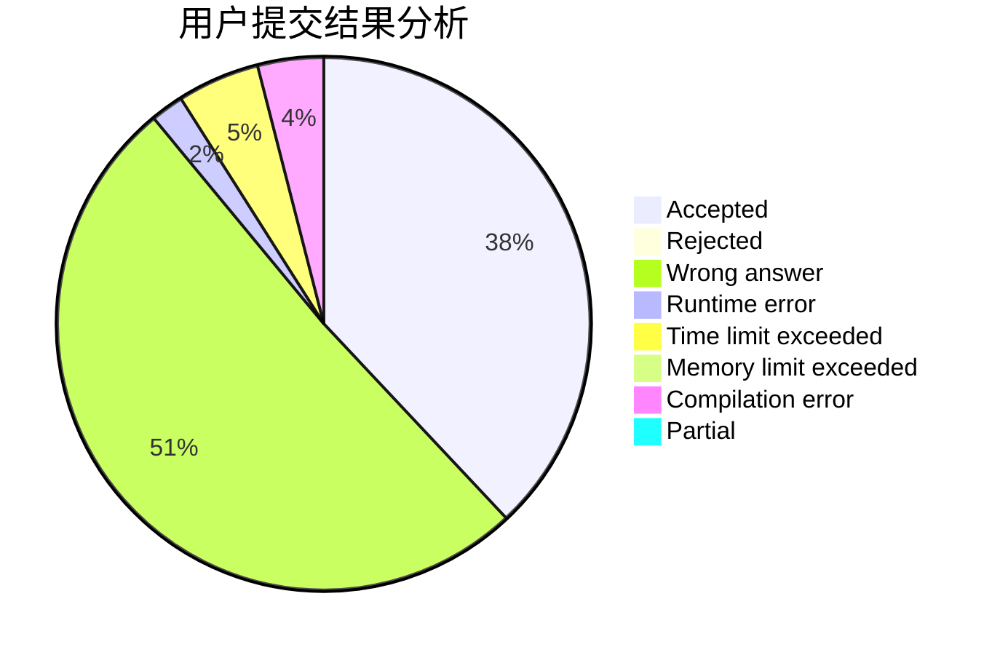
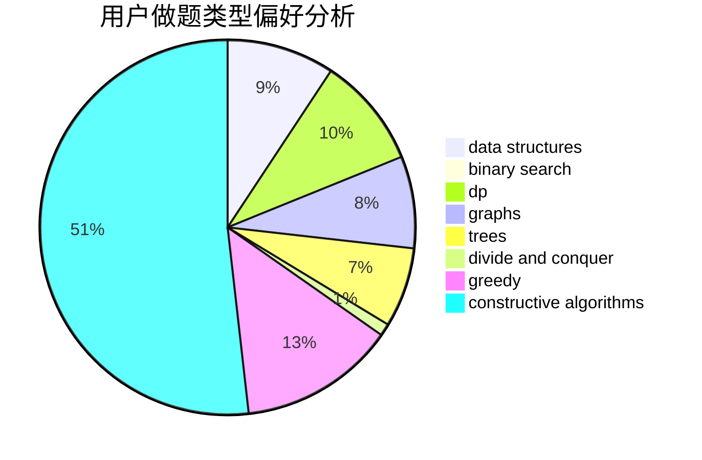
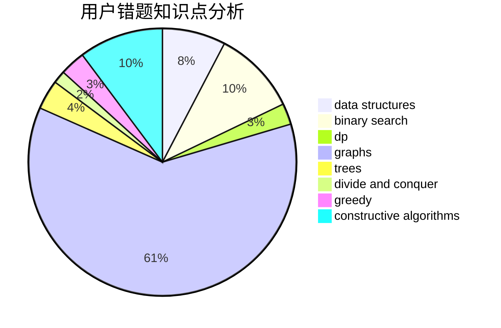

# TiorK

<!-- tabs:start -->

#### **用户提交结果分析**

#### **用户做题类型偏好分析**

#### **用户错题知识点分析**

<!-- tabs:end -->
# 推荐题目
[963B](https://codeforces.com/contest/963/problem/B)		constructive algorithms,
                        dfs and similar,
                        dp,
                        greedy,
                        trees		  
[681A](https://codeforces.com/contest/681/problem/A)		implementation		  
[446E](https://codeforces.com/contest/446/problem/E)		math,
                        matrices		  
[869C](https://codeforces.com/contest/869/problem/C)		combinatorics,
                        dp,
                        math		  
[1288B](https://codeforces.com/contest/1288/problem/B)		math		  
[121C](https://codeforces.com/contest/121/problem/C)		brute force,
                        combinatorics,
                        number theory		  
[623B](https://codeforces.com/contest/623/problem/B)		dp,
                        greedy,
                        number theory		  
[571E](https://codeforces.com/contest/571/problem/E)		math		  
[39D](https://codeforces.com/contest/39/problem/D)		math		  
[1066C](https://codeforces.com/contest/1066/problem/C)		implementation		  
