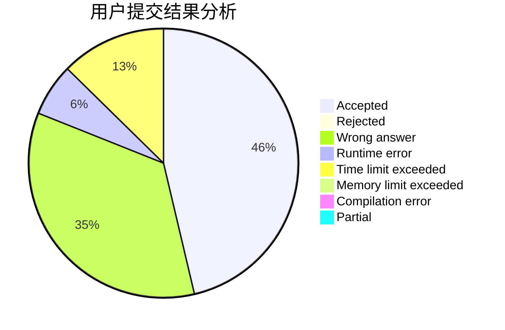
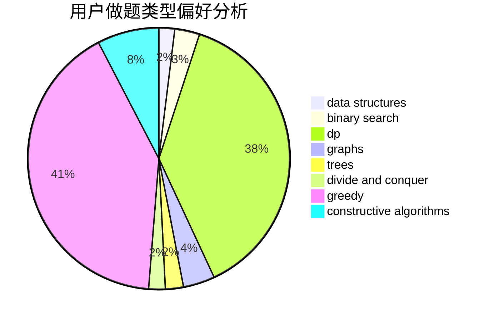
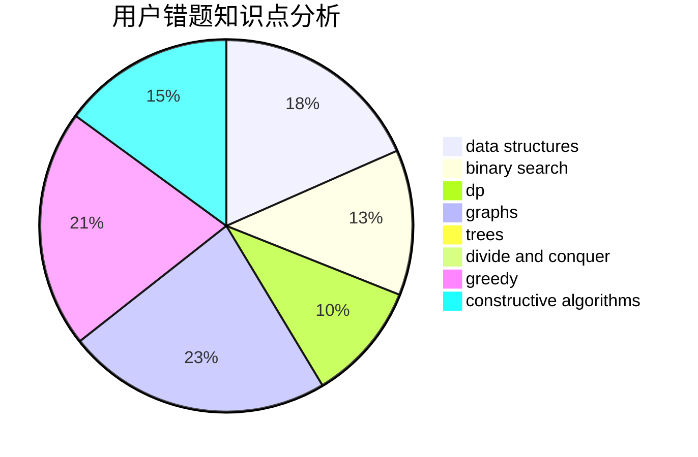

# TiwAirOAO

<!-- tabs:start -->

#### **用户提交结果分析**

#### **用户做题类型偏好分析**

#### **用户错题知识点分析**

<!-- tabs:end -->
# 推荐题目
[767D](https://codeforces.com/contest/767/problem/D)		binary search,
                        data structures,
                        greedy,
                        sortings,
                        two pointers		  
[404A](https://codeforces.com/contest/404/problem/A)		implementation		  
[1362F](https://codeforces.com/contest/1362/problem/F)		dsu,graphs,sortings,trees		  
[455E](https://codeforces.com/contest/455/problem/E)		data structures		  
[180D](https://codeforces.com/contest/180/problem/D)		greedy,
                        strings		  
[1417C](https://codeforces.com/contest/1417/problem/C)		dsu,graphs,sortings,trees		  
[963C](https://codeforces.com/contest/963/problem/C)		brute force,
                        math,
                        number theory		  
[883C](https://codeforces.com/contest/883/problem/C)		binary search,
                        implementation		  
[1307D](https://codeforces.com/contest/1307/problem/D)		binary search,
                        data structures,
                        dfs and similar,
                        graphs,
                        greedy,
                        shortest paths,
                        sortings		  
[612B](https://codeforces.com/contest/612/problem/B)		implementation,
                        math		  
