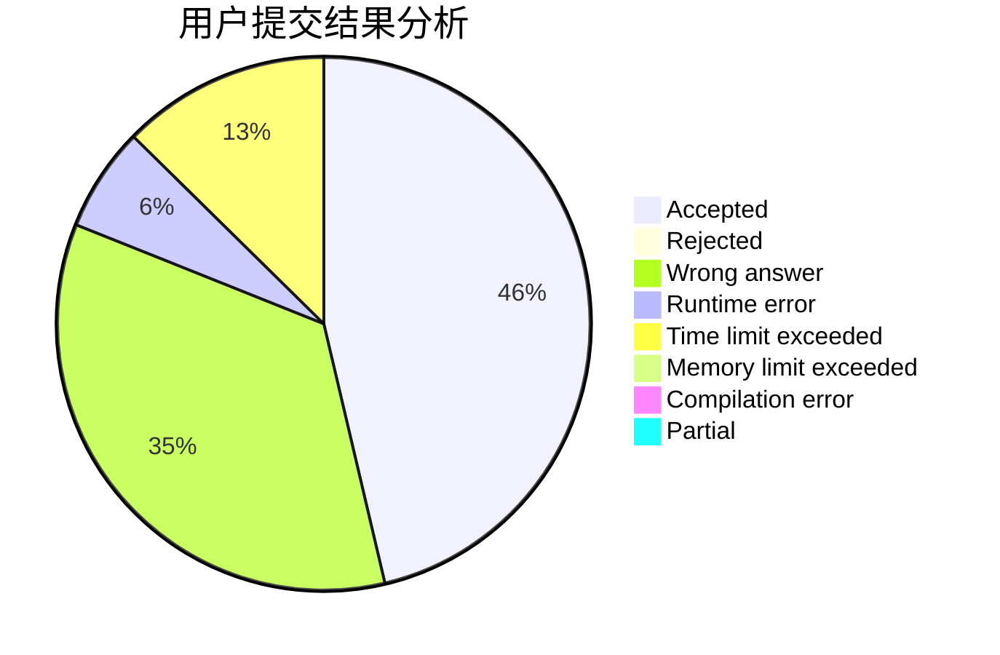
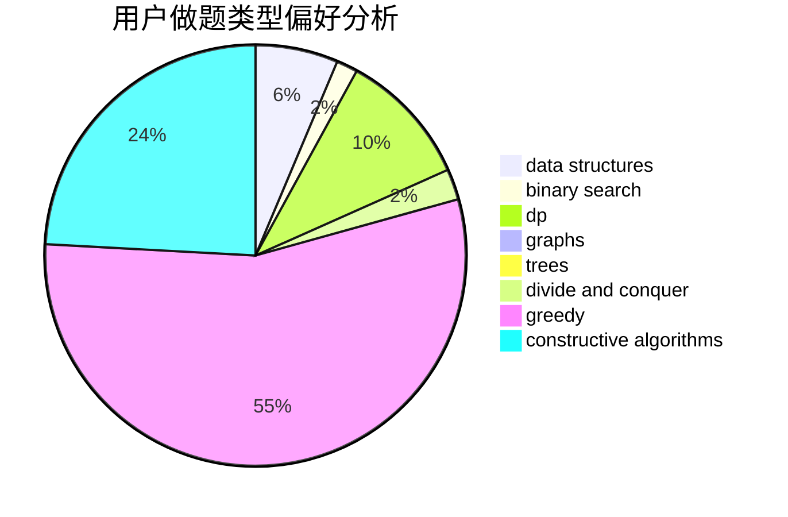
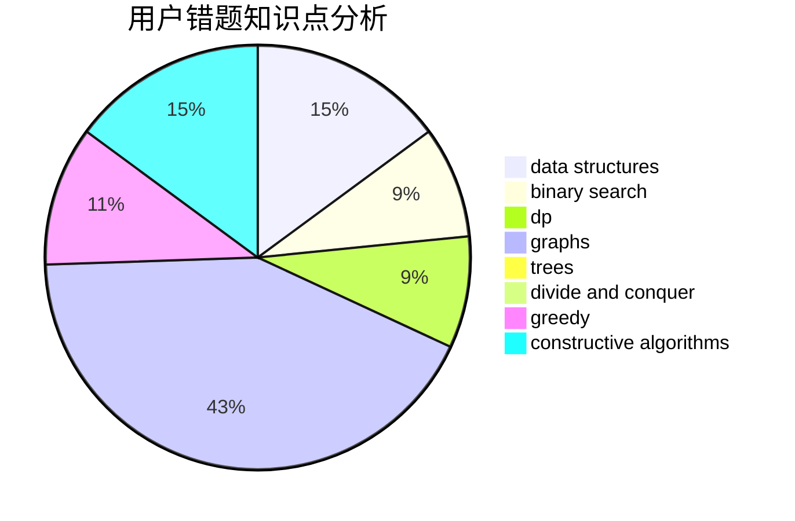

# TiwAirOAO

<!-- tabs:start -->

#### **用户提交结果分析**

#### **用户做题类型偏好分析**

#### **用户错题知识点分析**

<!-- tabs:end -->
# 推荐题目
[787A](https://codeforces.com/contest/787/problem/A)		brute force,
                        math,
                        number theory		  
[432D](https://codeforces.com/contest/432/problem/D)		dp,
                        string suffix structures,
                        strings,
                        two pointers		  
[13701](https://codeforces.com/contest/1370/problem/1)		dsu,graphs,sortings,trees		  
[477A](https://codeforces.com/contest/477/problem/A)		dsu,graphs,sortings,trees		  
[208A](https://codeforces.com/contest/208/problem/A)		strings		  
[1424M](https://codeforces.com/contest/1424/problem/M)		graphs,
                        sortings		  
[986A](https://codeforces.com/contest/986/problem/A)		graphs,
                        greedy,
                        number theory,
                        shortest paths		  
[900B](https://codeforces.com/contest/900/problem/B)		math,
                        number theory		  
[1315F](https://codeforces.com/contest/1315/problem/F)		dsu,graphs,sortings,trees		  
[631D](https://codeforces.com/contest/631/problem/D)		data structures,
                        hashing,
                        implementation,
                        string suffix structures,
                        strings		  
