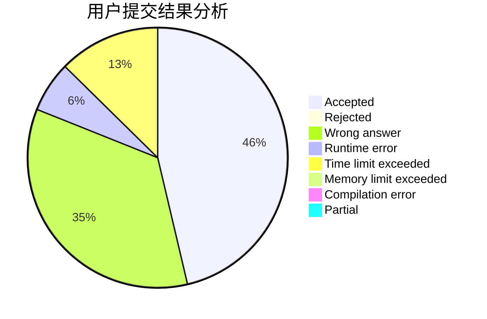
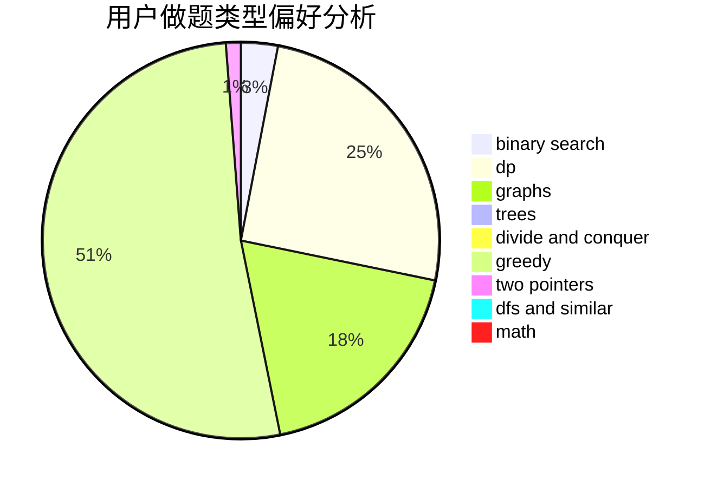

# TiwAirOAO

<!-- tabs:start -->

#### **用户提交结果分析**

#### **用户做题类型偏好分析**

<!-- tabs:end -->
# 推荐题目
[787A](https://codeforces.com/contest/787/problem/A)
[432D](https://codeforces.com/contest/432/problem/D)
[13701](https://codeforces.com/contest/1370/problem/1)
[477A](https://codeforces.com/contest/477/problem/A)
[208A](https://codeforces.com/contest/208/problem/A)
[1424M](https://codeforces.com/contest/1424/problem/M)
[986A](https://codeforces.com/contest/986/problem/A)
[900B](https://codeforces.com/contest/900/problem/B)
[1315F](https://codeforces.com/contest/1315/problem/F)
[631D](https://codeforces.com/contest/631/problem/D)
