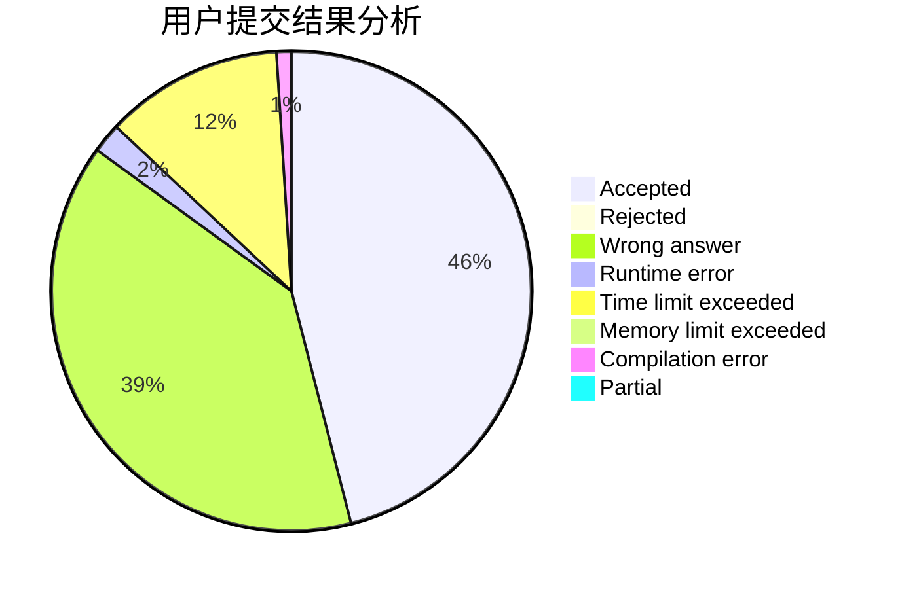
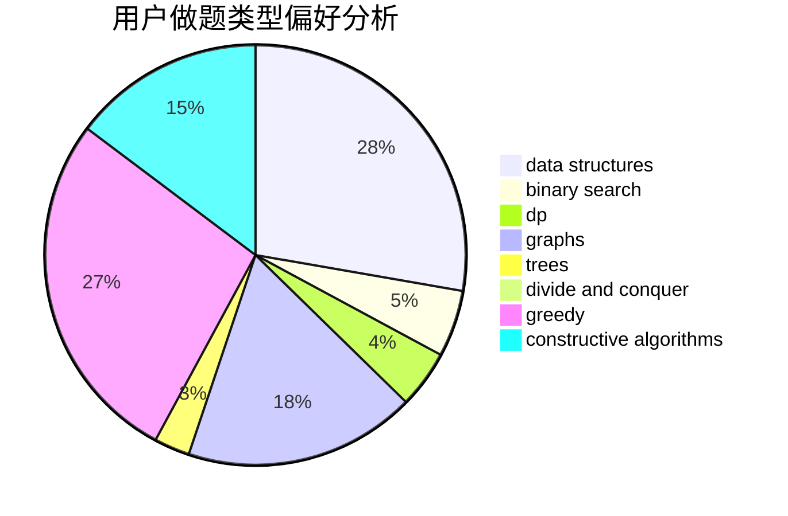
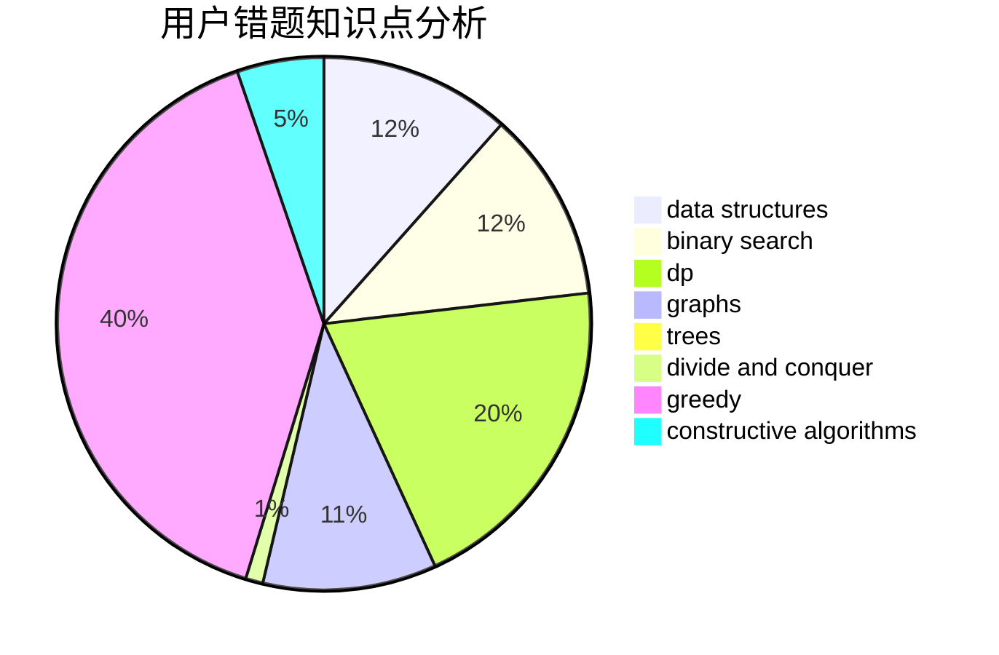

# TkFox_wa

<!-- tabs:start -->

#### **用户提交结果分析**

#### **用户做题类型偏好分析**

#### **用户错题知识点分析**

<!-- tabs:end -->
# 推荐题目
[795D](https://codeforces.com/contest/795/problem/D)		dsu,graphs,sortings,trees		  
[434A](https://codeforces.com/contest/434/problem/A)		dsu,graphs,sortings,trees		  
[1030G](https://codeforces.com/contest/1030/problem/G)		number theory		  
[171D](https://codeforces.com/contest/171/problem/D)		*special problem,
                        brute force		  
[1070F](https://codeforces.com/contest/1070/problem/F)		greedy		  
[1217F](https://codeforces.com/contest/1217/problem/F)		data structures,
                        divide and conquer,
                        dsu,
                        graphs,
                        trees		  
[288B](https://codeforces.com/contest/288/problem/B)		combinatorics		  
[1002A1](https://codeforces.com/contest/1002A/problem/1)		nan		  
[1185G2](https://codeforces.com/contest/1185G/problem/2)		combinatorics,
                        dp		  
[1198A](https://codeforces.com/contest/1198/problem/A)		sortings,
                        two pointers		  
