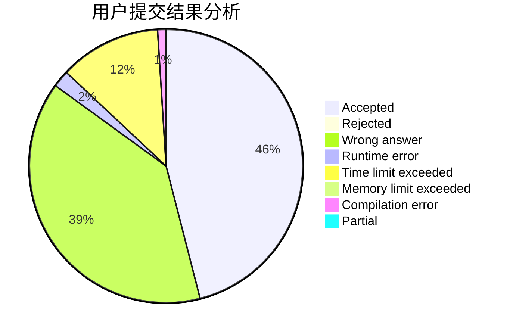
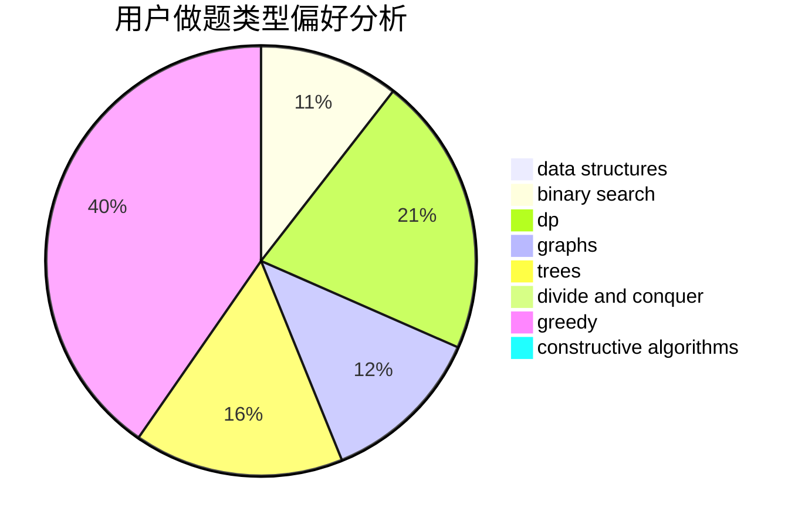
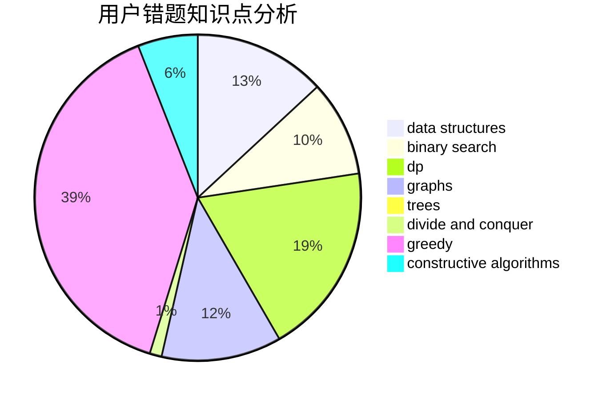

# TkFox_wa

<!-- tabs:start -->

#### **用户提交结果分析**

#### **用户做题类型偏好分析**

#### **用户错题知识点分析**

<!-- tabs:end -->
# 推荐题目
[80B](https://codeforces.com/contest/80/problem/B)		geometry,
                        math		  
[454A](https://codeforces.com/contest/454/problem/A)		implementation		  
[1031C](https://codeforces.com/contest/1031/problem/C)		greedy		  
[198E](https://codeforces.com/contest/198/problem/E)		binary search,
                        data structures,
                        sortings		  
[1070I](https://codeforces.com/contest/1070/problem/I)		flows,
                        graph matchings,
                        graphs		  
[1225D](https://codeforces.com/contest/1225/problem/D)		hashing,
                        math,
                        number theory		  
[301C](https://codeforces.com/contest/301/problem/C)		constructive algorithms		  
[10021](https://codeforces.com/contest/1002/problem/1)		dsu,graphs,sortings,trees		  
[118C](https://codeforces.com/contest/118/problem/C)		brute force,
                        greedy,
                        sortings,
                        strings		  
[1201C](https://codeforces.com/contest/1201/problem/C)		binary search,
                        greedy,
                        math,
                        sortings		  
