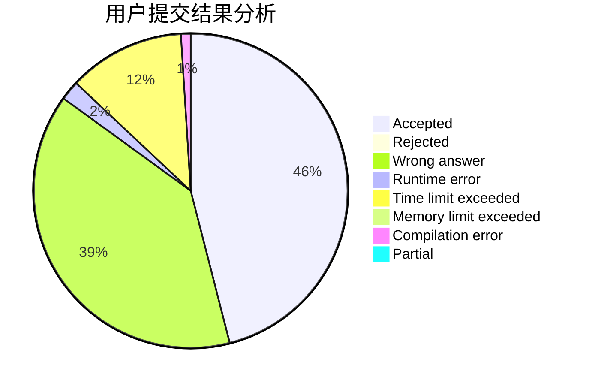
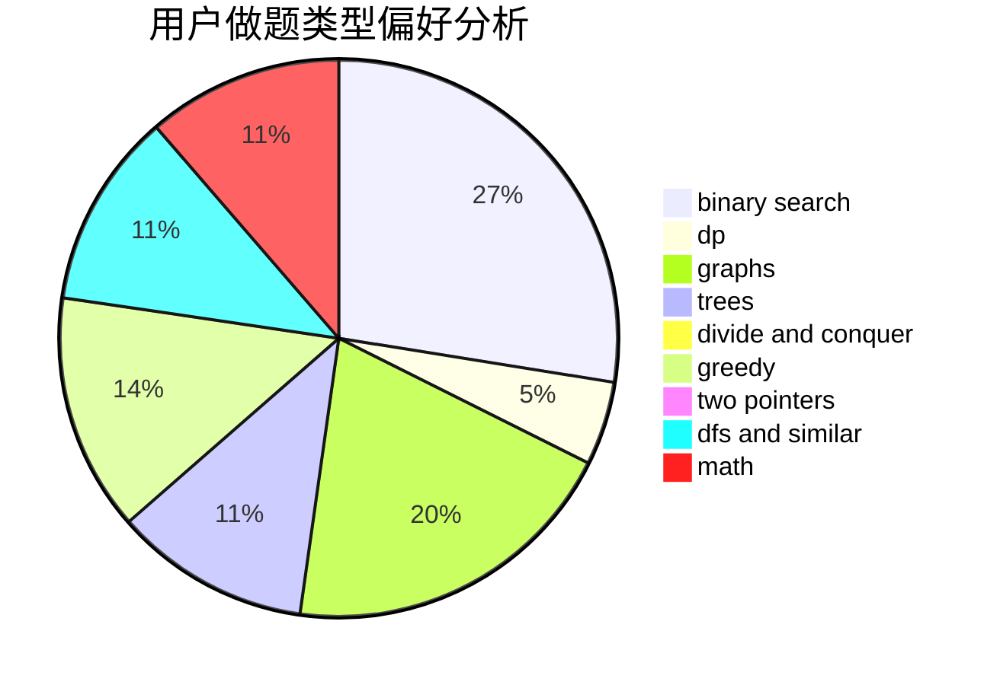

# TkFox_wa

<!-- tabs:start -->

#### **用户提交结果分析**

#### **用户做题类型偏好分析**

<!-- tabs:end -->
# 推荐题目
[80B](https://codeforces.com/contest/80/problem/B)
[454A](https://codeforces.com/contest/454/problem/A)
[1031C](https://codeforces.com/contest/1031/problem/C)
[198E](https://codeforces.com/contest/198/problem/E)
[1070I](https://codeforces.com/contest/1070/problem/I)
[1225D](https://codeforces.com/contest/1225/problem/D)
[301C](https://codeforces.com/contest/301/problem/C)
[10021](https://codeforces.com/contest/1002/problem/1)
[118C](https://codeforces.com/contest/118/problem/C)
[1201C](https://codeforces.com/contest/1201/problem/C)
