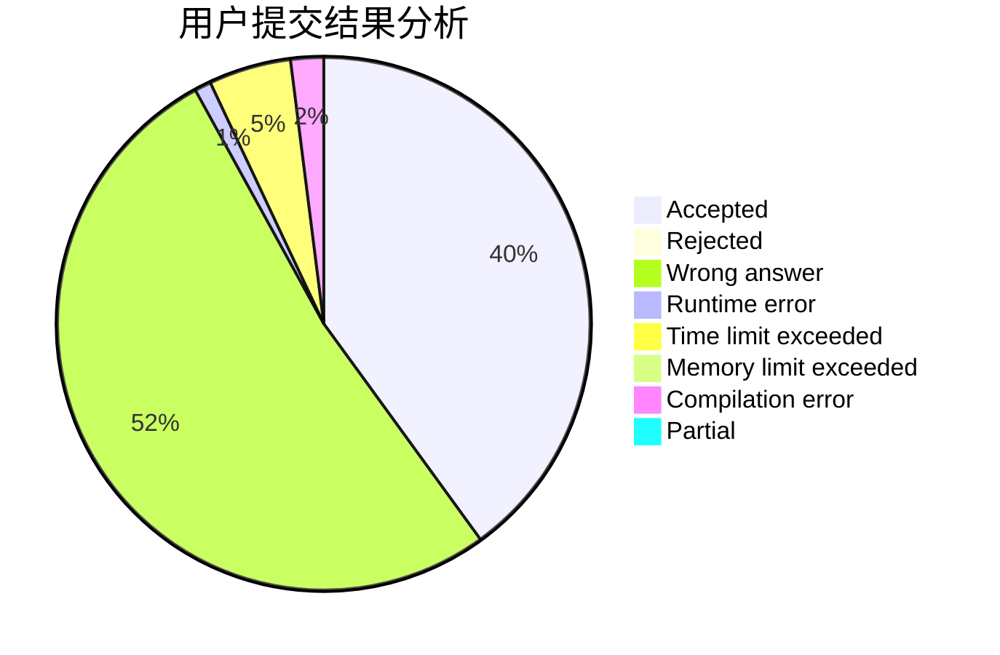
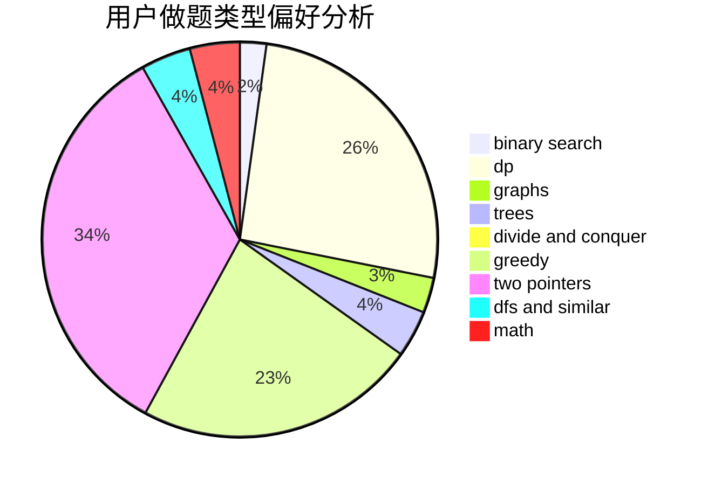

# Tlopex

<!-- tabs:start -->

#### **用户提交结果分析**

#### **用户做题类型偏好分析**

<!-- tabs:end -->
# 推荐题目
[14461](https://codeforces.com/contest/1446/problem/1)
[1469E](https://codeforces.com/contest/1469/problem/E)
[421B](https://codeforces.com/contest/421/problem/B)
[1482B](https://codeforces.com/contest/1482/problem/B)
[1297C](https://codeforces.com/contest/1297/problem/C)
[888B](https://codeforces.com/contest/888/problem/B)
[946E](https://codeforces.com/contest/946/problem/E)
[1477E](https://codeforces.com/contest/1477/problem/E)
[377A](https://codeforces.com/contest/377/problem/A)
[1466I](https://codeforces.com/contest/1466/problem/I)
