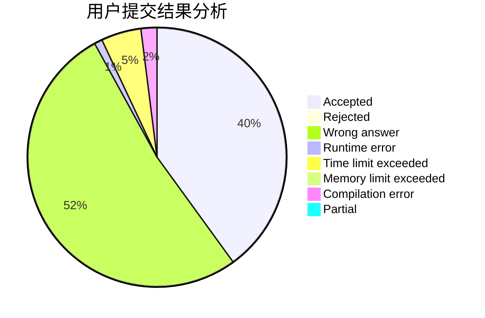
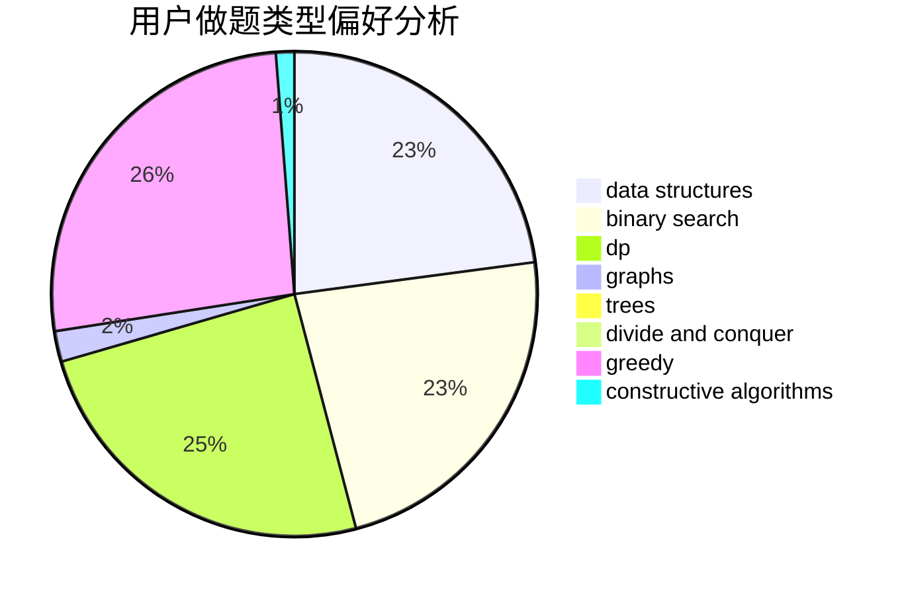
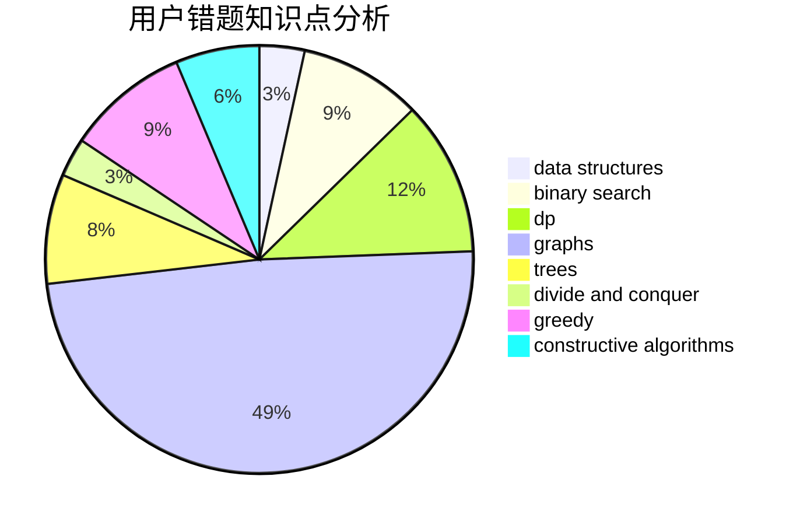

# Tlopex

<!-- tabs:start -->

#### **用户提交结果分析**

#### **用户做题类型偏好分析**

#### **用户错题知识点分析**

<!-- tabs:end -->
# 推荐题目
[1436A](https://codeforces.com/contest/1436/problem/A)		math		  
[1462C](https://codeforces.com/contest/1462/problem/C)		brute force,
                        greedy,
                        math		  
[393C](https://codeforces.com/contest/393/problem/C)		dsu,graphs,sortings,trees		  
[1473E](https://codeforces.com/contest/1473/problem/E)		graphs,
                        shortest paths		  
[1290F](https://codeforces.com/contest/1290/problem/F)		dp		  
[868F](https://codeforces.com/contest/868/problem/F)		divide and conquer,
                        dp		  
[922E](https://codeforces.com/contest/922/problem/E)		dp		  
[1469D](https://codeforces.com/contest/1469/problem/D)		brute force,
                        constructive algorithms,
                        math,
                        number theory		  
[34C](https://codeforces.com/contest/34/problem/C)		expression parsing,
                        implementation,
                        sortings,
                        strings		  
[1458A](https://codeforces.com/contest/1458/problem/A)		math,
                        number theory		  
