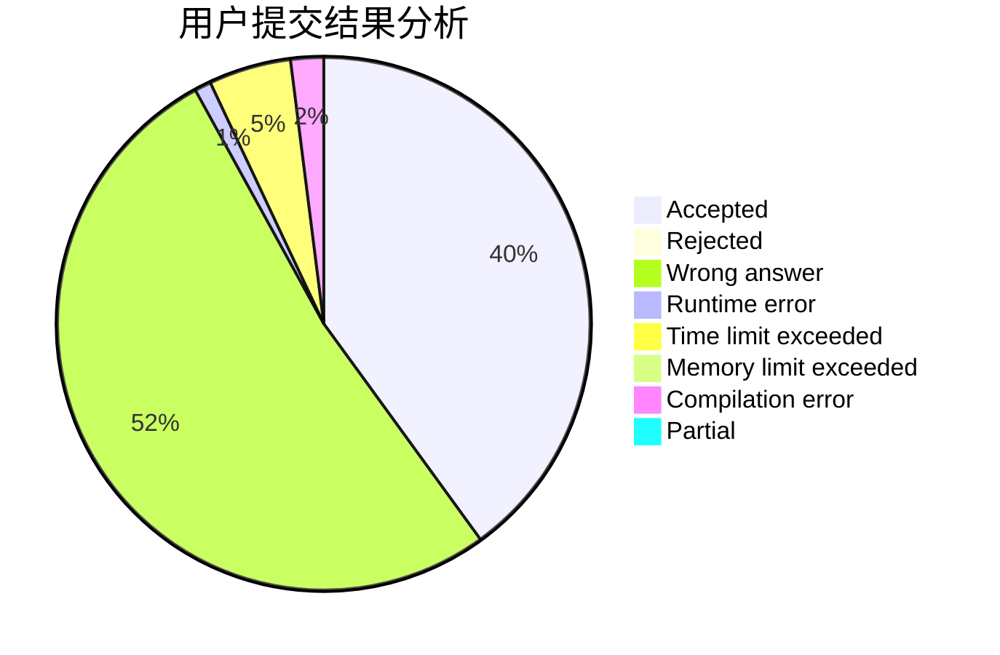
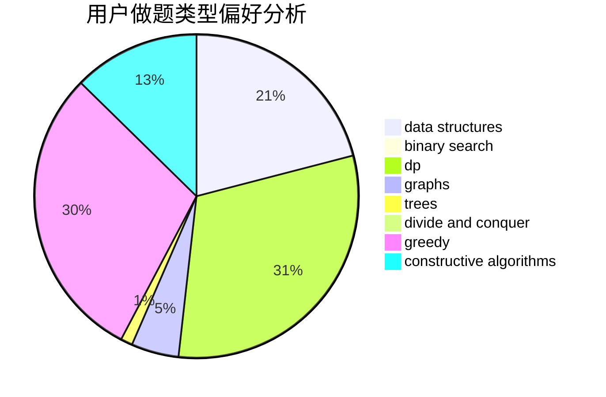
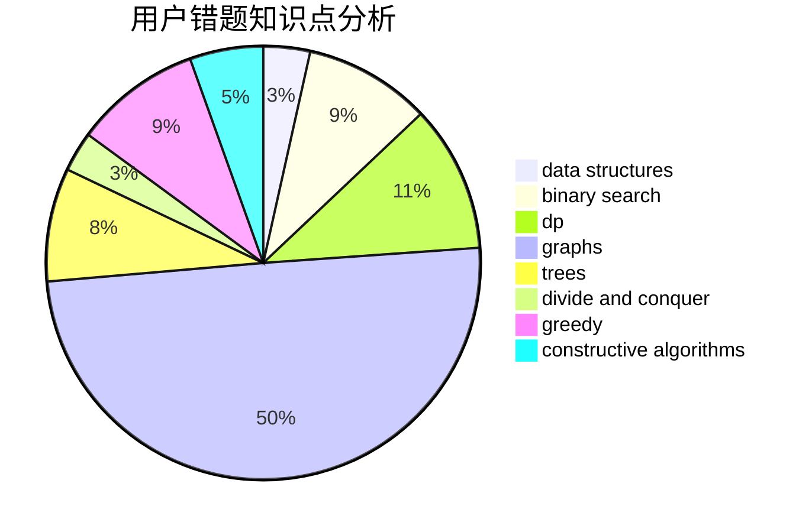

# Tlopex

<!-- tabs:start -->

#### **用户提交结果分析**

#### **用户做题类型偏好分析**

#### **用户错题知识点分析**

<!-- tabs:end -->
# 推荐题目
[14461](https://codeforces.com/contest/1446/problem/1)		dsu,graphs,sortings,trees		  
[1469E](https://codeforces.com/contest/1469/problem/E)		bitmasks,
                        brute force,
                        hashing,
                        string suffix structures,
                        strings,
                        two pointers		  
[421B](https://codeforces.com/contest/421/problem/B)		dsu,graphs,sortings,trees		  
[1482B](https://codeforces.com/contest/1482/problem/B)		implementation,
                        math		  
[1297C](https://codeforces.com/contest/1297/problem/C)		*special problem,
                        greedy		  
[888B](https://codeforces.com/contest/888/problem/B)		greedy		  
[946E](https://codeforces.com/contest/946/problem/E)		greedy,
                        implementation		  
[1477E](https://codeforces.com/contest/1477/problem/E)		data structures,
                        greedy		  
[377A](https://codeforces.com/contest/377/problem/A)		dfs and similar		  
[1466I](https://codeforces.com/contest/1466/problem/I)		binary search,
                        data structures,
                        data structures,
                        interactive		  
