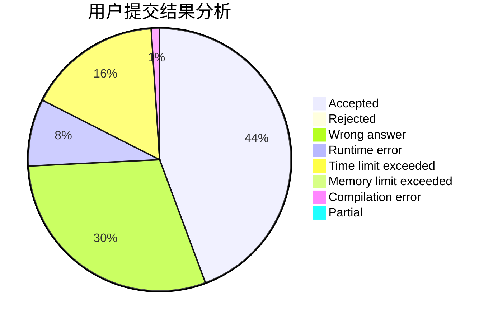
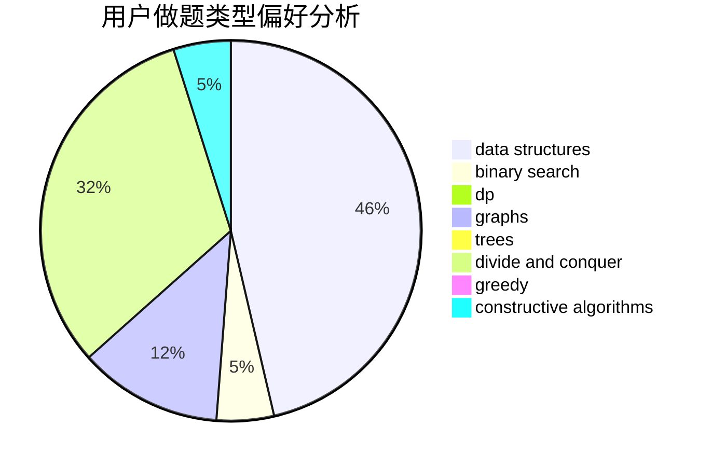
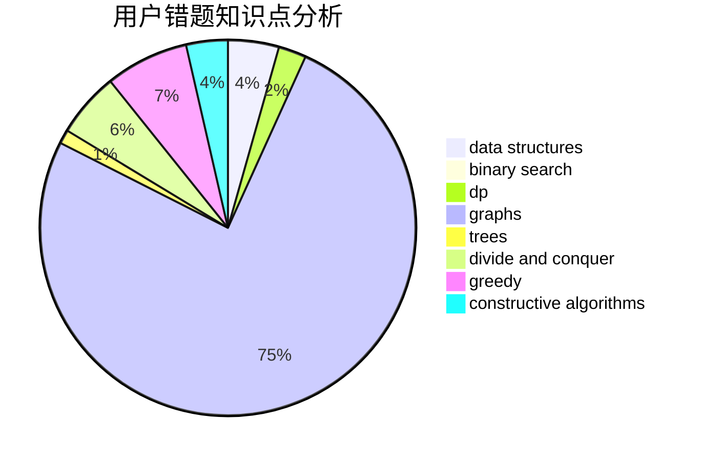

# ToToMI

<!-- tabs:start -->

#### **用户提交结果分析**

#### **用户做题类型偏好分析**

#### **用户错题知识点分析**

<!-- tabs:end -->
# 推荐题目
[301D](https://codeforces.com/contest/301/problem/D)		data structures		  
[1459E](https://codeforces.com/contest/1459/problem/E)		dsu,graphs,sortings,trees		  
[1283E](https://codeforces.com/contest/1283/problem/E)		dp,
                        greedy		  
[1293A](https://codeforces.com/contest/1293/problem/A)		binary search,
                        brute force,
                        implementation		  
[956C](https://codeforces.com/contest/956/problem/C)		dsu,graphs,sortings,trees		  
[57A](https://codeforces.com/contest/57/problem/A)		dfs and similar,
                        greedy,
                        implementation		  
[946F](https://codeforces.com/contest/946/problem/F)		combinatorics,
                        dp,
                        matrices		  
[906C](https://codeforces.com/contest/906/problem/C)		bitmasks,
                        brute force,
                        dp,
                        graphs		  
[1089E](https://codeforces.com/contest/1089/problem/E)		constructive algorithms		  
[1490C](https://codeforces.com/contest/1490/problem/C)		binary search,
                        brute force,
                        brute force,
                        math		  
