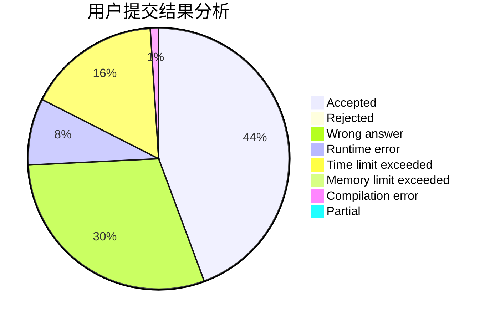
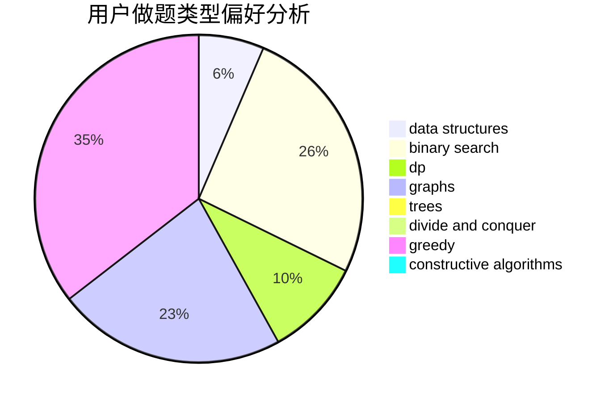
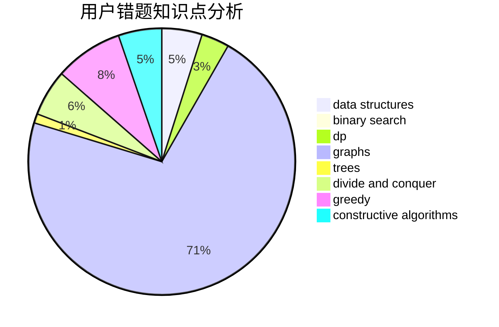

# ToToMI

<!-- tabs:start -->

#### **用户提交结果分析**

#### **用户做题类型偏好分析**

#### **用户错题知识点分析**

<!-- tabs:end -->
# 推荐题目
[288C](https://codeforces.com/contest/288/problem/C)		implementation,
                        math		  
[1450H1](https://codeforces.com/contest/1450H/problem/1)		combinatorics,
                        fft,
                        math		  
[1277C](https://codeforces.com/contest/1277/problem/C)		dsu,graphs,sortings,trees		  
[1285F](https://codeforces.com/contest/1285/problem/F)		binary search,
                        combinatorics,
                        number theory		  
[934D](https://codeforces.com/contest/934/problem/D)		dsu,graphs,sortings,trees		  
[554A](https://codeforces.com/contest/554/problem/A)		brute force,
                        math,
                        strings		  
[923A](https://codeforces.com/contest/923/problem/A)		math,
                        number theory		  
[887B](https://codeforces.com/contest/887/problem/B)		brute force,
                        implementation		  
[1088F](https://codeforces.com/contest/1088/problem/F)		data structures,
                        trees		  
[1482E](https://codeforces.com/contest/1482/problem/E)		data structures,
                        divide and conquer,
                        dp		  
