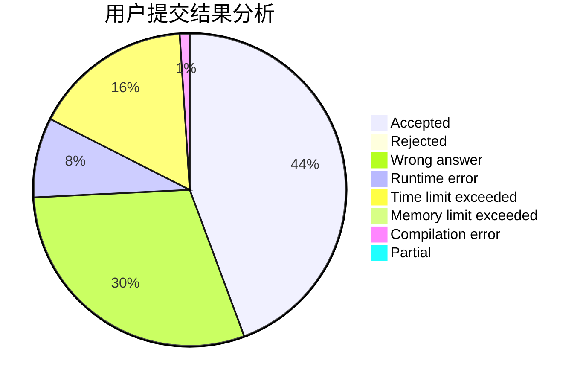
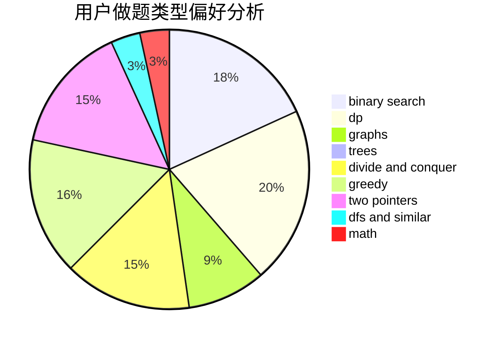

# ToToMI

<!-- tabs:start -->

#### **用户提交结果分析**

#### **用户做题类型偏好分析**

<!-- tabs:end -->
# 推荐题目
[301D](https://codeforces.com/contest/301/problem/D)
[1459E](https://codeforces.com/contest/1459/problem/E)
[1283E](https://codeforces.com/contest/1283/problem/E)
[1293A](https://codeforces.com/contest/1293/problem/A)
[956C](https://codeforces.com/contest/956/problem/C)
[57A](https://codeforces.com/contest/57/problem/A)
[946F](https://codeforces.com/contest/946/problem/F)
[906C](https://codeforces.com/contest/906/problem/C)
[1089E](https://codeforces.com/contest/1089/problem/E)
[1490C](https://codeforces.com/contest/1490/problem/C)
