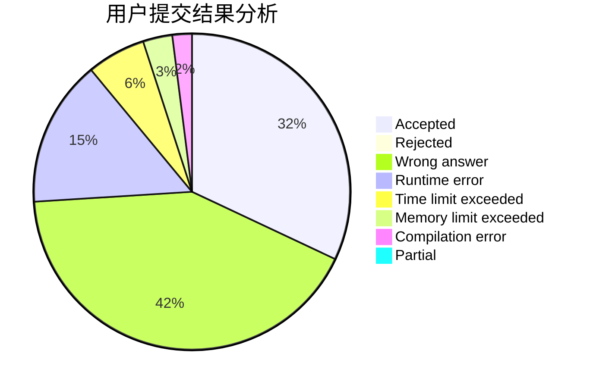
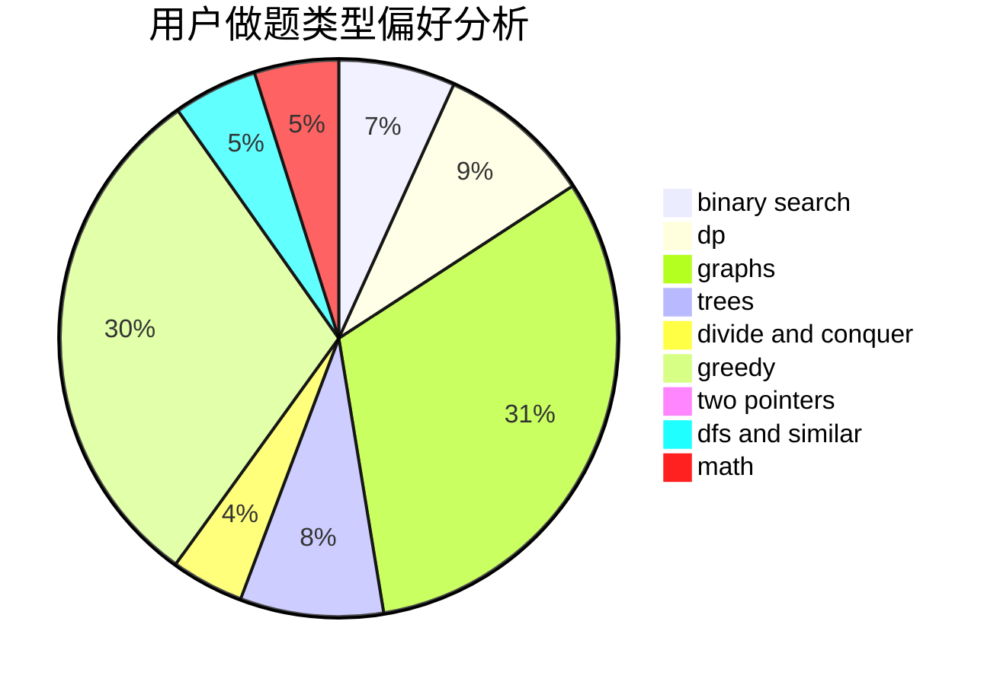

# Tohsaka_Sakura

<!-- tabs:start -->

#### **用户提交结果分析**

#### **用户做题类型偏好分析**

<!-- tabs:end -->
# 推荐题目
[1119B](https://codeforces.com/contest/1119/problem/B)
[291A](https://codeforces.com/contest/291/problem/A)
[1341E](https://codeforces.com/contest/1341/problem/E)
[842C](https://codeforces.com/contest/842/problem/C)
[1194E](https://codeforces.com/contest/1194/problem/E)
[622C](https://codeforces.com/contest/622/problem/C)
[555D](https://codeforces.com/contest/555/problem/D)
[1179D](https://codeforces.com/contest/1179/problem/D)
[512C](https://codeforces.com/contest/512/problem/C)
[142B](https://codeforces.com/contest/142/problem/B)
