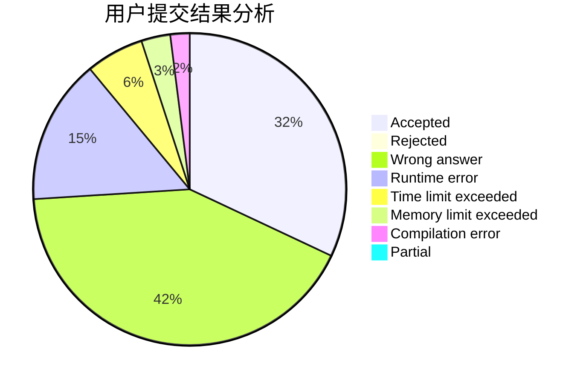
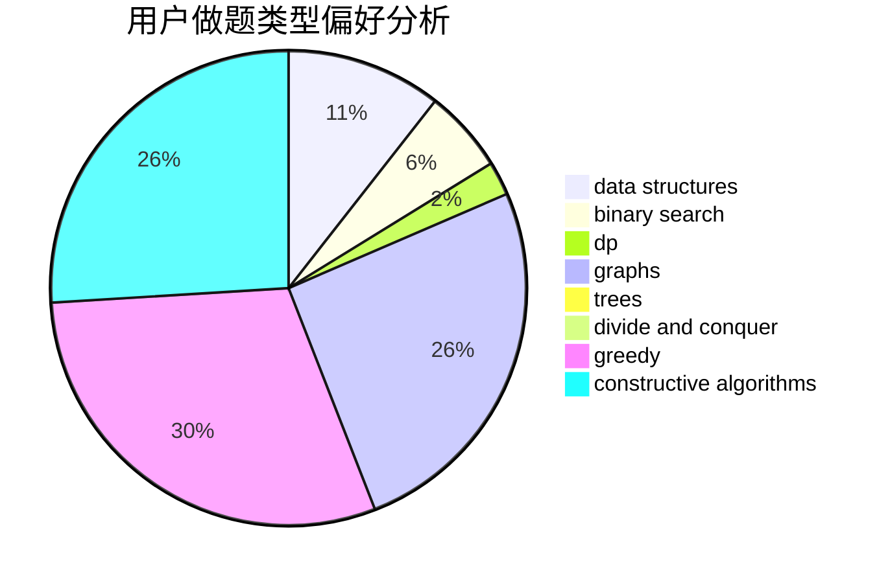
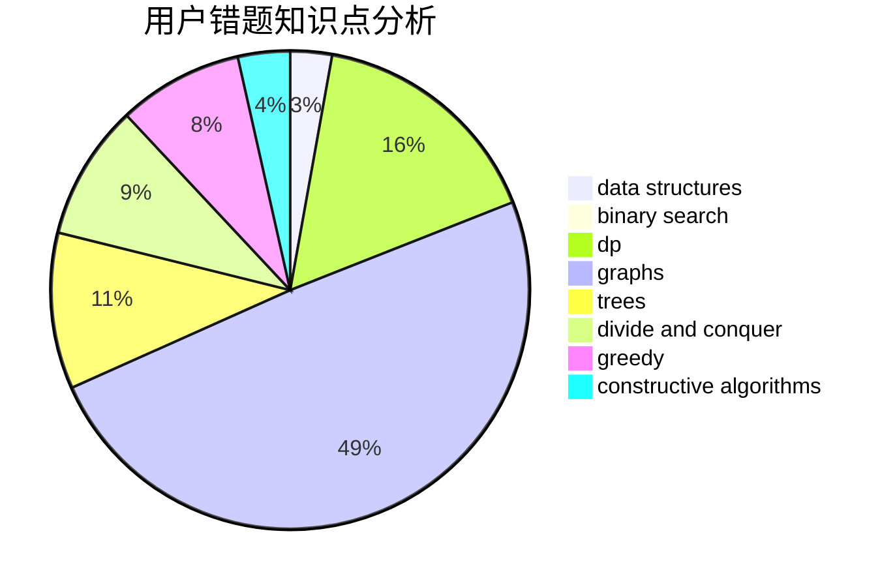

# Tohsaka_Sakura

<!-- tabs:start -->

#### **用户提交结果分析**

#### **用户做题类型偏好分析**

#### **用户错题知识点分析**

<!-- tabs:end -->
# 推荐题目
[1117C](https://codeforces.com/contest/1117/problem/C)		binary search		  
[276D](https://codeforces.com/contest/276/problem/D)		bitmasks,
                        dp,
                        greedy,
                        implementation,
                        math		  
[1334F](https://codeforces.com/contest/1334/problem/F)		binary search,
                        data structures,
                        dp,
                        greedy		  
[822D](https://codeforces.com/contest/822/problem/D)		brute force,
                        dp,
                        greedy,
                        math,
                        number theory		  
[1189C](https://codeforces.com/contest/1189/problem/C)		data structures,
                        dp,
                        implementation,
                        math		  
[604A](https://codeforces.com/contest/604/problem/A)		implementation		  
[533F](https://codeforces.com/contest/533/problem/F)		hashing,
                        string suffix structures,
                        strings		  
[1176C](https://codeforces.com/contest/1176/problem/C)		dp,
                        greedy,
                        implementation		  
[492A](https://codeforces.com/contest/492/problem/A)		implementation		  
[1421E](https://codeforces.com/contest/1421/problem/E)		brute force,
                        dp,
                        implementation		  
